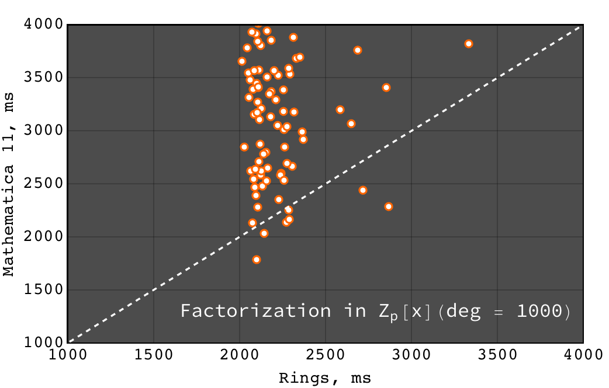

[](https://circleci.com/gh/PoslavskySV/rings)
[](http://www.javadoc.io/doc/cc.redberry/rings)
[](http://www.javadoc.io/doc/cc.redberry/rings.scaladsl_2.12)
[](https://search.maven.org/#artifactdetails%7Ccc.redberry%7Crings%7C2.0%7Cjar)
[](https://search.maven.org/#artifactdetails%7Ccc.redberry%7Crings.scaladsl_2.12%7C2.0%7Cjar)
[](https://opensource.org/licenses/Apache-2.0)

Rings: efficient Java/Scala library for polynomial rings
========================================================

Rings is an efficient implementation of univariate and multivariate polynomial algebra over arbitrary coefficient rings. It makes use of asymptotically fast algorithms for basic algebraic operations as well as for advanced methods like GCDs and polynomial factorization. Performance achieved in Rings is comparable to well known solutions like Singular/NTL/FLINT/Maple/Mathematica.

The key features of Rings include:

> -   [Polynomials →](http://rings.readthedocs.io/en/latest/guide.html#ref-basics-polynomials) Univariate and multivariate polynomials over arbitrary coefficient rings
> -   [Polynomial GCD →](http://rings.readthedocs.io/en/latest/guide.html#ref-polynomial-methods) Polynomial GCD over arbitrary coefficient domains
> -   [Univariate factorization →](http://rings.readthedocs.io/en/latest/guide.html#ref-univariate-factorization) Univariate polynomial factorization over arbitrary finite fields, *Z* and *Q*
> -   [Multivariate factorization →](http://rings.readthedocs.io/en/latest/guide.html#ref-multivariate-factorization) Multivariate polynomial factorization over arbitrary finite fields, *Z* and *Q*
> -   [Algebra →](http://rings.readthedocs.io/en/latest/guide.html#ref-rings) Arbitrary rings, Galois fields etc
> -   [Scala DSL →](http://rings.readthedocs.io/en/latest/guide.html#ref-scala-dsl) Powerful domain specific language in Scala
> -   [Fast →](http://rings.readthedocs.io/en/latest/quickstart.html#ref-some-benchamrks) Really fast library suitable for real-world computational challenges

The full documentation is available at [<http://rings.readthedocs.io>](https://rings.readthedocs.io).

Set up
------

### Interactive Rings shell

To taste what Rings can do, one can try interactive session with [Ammonite REPL](http://ammonite.io). Type the following commands at the prompt to install Rings<i>.repl</i>:

``` scala
$ sudo curl -L -o /usr/local/bin/amm https://git.io/v5Tct && sudo chmod +x /usr/local/bin/amm
$ sudo curl -L -o /usr/local/bin/rings.repl https://git.io/vd7EY && chmod +x /usr/local/bin/rings.repl
```

and run:

``` scala
$ rings.repl
Loading...
Rings 2.0: efficient Java/Scala library for polynomial rings

@ implicit val ring = MultivariateRing(Z, Array("x", "y", "z"))
ring: MultivariateRing[IntZ] = MultivariateRing(Z, Array("x", "y", "z"), LEX)

@ val poly1 = ring("x + y - z").pow(8) 
poly1: MultivariatePolynomial[IntZ] = z^8-8*y*z^7+28*y^2*z^6-56*y^3*z^5+70*y^4*z^4-56...

@ val poly2 = ring("x - y + z").pow(8) 
poly1: MultivariatePolynomial[IntZ] = z^8-8*y*z^7+28*y^2*z^6-56*y^3*z^5+70*y^4*z^4-56...

@ Factor(poly1 - poly2)
res13: FactorDecomposition[MultivariatePolynomial[IntZ]] = 16*x*(-z+y)*(z^2-2*y*z+y^2+x^2)*(z^4-4*y*z^3+6*y^2*z^2-4*y^3*z+y^4+6*x^2*z^2-12*x^2*y*z+6*x^2*y^2+x^4)
```

### Java/Scala library

Rings are currently available for Java and Scala. To get started with Scala SBT, simply add the following dependence to your `build.sbt` file:

``` scala
libraryDependencies += "cc.redberry" % "rings.scaladsl" % "2.0"
```

For using Rings solely in Java there is Maven artifact:

``` scala
<dependency>
    <groupId>cc.redberry</groupId>
    <artifactId>rings</artifactId>
    <version>2.0</version>
</dependency>
```

Examples: algebra, GCDs, factorization
--------------------------------------

Below examples can be evaluated directly in the Rings<i>.repl</i>. If using Rings in Scala, the following preambula will import all required things from Rings library:

``` scala
import cc.redberry.rings

import rings.poly.PolynomialMethods._
import rings.scaladsl._
import syntax._
```

Java examples can be found in the [complete documentation pages](https://rings.readthedocs.io).

------------------------------------------------------------------------

Do some algebra in Galois field *GF(17^9)*:

``` scala
// GF(17^9) (irreducible poly in Z/17[x] will be generated automaticaly)
implicit val ring = GF(17, 9, "x")

// some random element from ring
val a = ring.randomElement()
val b = a.pow(1000)
val c = 1 / b

assert ( b * c === 1)

// explicitly parse ring element from string
val d = ring("1 + x + x^2 + x^3 + 15*x^999")
// do some math ops
val some = a / (b + c) + a.pow(6) - a * b * c * d
```

------------------------------------------------------------------------

Some math with multivariate polynomials from *Z\[x, y, z\]*:

``` scala
// Z[x, y, z]
implicit val ring = MultivariateRing(Z, Array("x", "y", "z")) 

val (x, y, z) = ring("x", "y", "z") 

// do some math
val a = (x + y + z).pow(2) - 1 
val b = (x - y - z - 1).pow(2) + x + y + z - 1 
val c = (a + b + 1).pow(9) - a - b - 1

// reduce c modulo a and b (multivariate division with remainder)
val (div1, div2, rem) = c /%/% (a, b)
```

------------------------------------------------------------------------

Univariate extended GCD in *Z_{17}\[x\]*:

``` scala
// ring Z/17[x]
implicit val ring = UnivariateRingZp64(17, "x")

val x = ring("x")

val poly1 = 1 + x + x.pow(2) + x.pow(3)
val poly2 = 1 + 2 * x + 9 * x.pow(2)
val (gcd, s, t) = PolynomialExtendedGCD(poly1, poly2).tuple3

println((gcd, s, t))
```

------------------------------------------------------------------------

Multivariate GCD in *Z\[a, b, c\]*:

``` scala
// ring Z[a, b, c]
implicit val ring = MultivariateRing(Z, Array("a", "b", "c"))

val poly1 = ring("-b-b*c-b^2+a+a*c+a^2")
val poly2 = ring("b^2+b^2*c+b^3+a*b^2+a^2+a^2*c+a^2*b+a^3")

val gcd   = PolynomialGCD(poly1, poly2)

println(s"gcd: ${ring show gcd}")
```

------------------------------------------------------------------------

Factor polynomial in *Z_{17}\[x\]*:

``` scala
// ring Z/17[x]
implicit val ring = UnivariateRingZp64(17, "x")x

val poly = ring("4 + 8*x + 12*x^2 + 5*x^5 - x^6 + 10*x^7 + x^8")

// factorize poly
val factors = Factor(poly)

println(factors)
```

Coefficient rings with arbitrary large characteristic are available:

``` scala
// coefficient ring Z/1237940039285380274899124357 (the next prime to 2^100)
val modulus = Z("1267650600228229401496703205653")
val cfRing  = Zp(modulus)

// ring Z/1237940039285380274899124357[x]
implicit val ring = UnivariateRing(cfRing, "x")

val poly = ring("4 + 8*x + 12*x^2 + 5*x^5 + 16*x^6 + 27*x^7 + 18*x^8")

println(Factor(poly))
```

(large primes can be generated with `BigPrimes.nextPrime` method, see [Prime numbers](http://rings.readthedocs.io/en/latest/guide.html#ref-primes)).

------------------------------------------------------------------------

Factor polynomial in *Z_2\[x, y, z\]*:

``` scala
// ring Z/2[x, y, z]
implicit val ring = MultivariateRingZp64(2, Array("x", "y", "z"))

val (x, y, z) = ring("x", "y", "z")

val factors = Factor(1 + (1 + x + y + z).pow(2) + (x + y + z).pow(4))

println(factors)
```

------------------------------------------------------------------------

Factor polynomial in *Z\[a, b, c\]*:

``` scala
// ring Z[a, b, c]
implicit val ring = MultivariateRing(Z, Array("a", "b", "c"))

val (a, b, c) = ring("a", "b", "c")

val factors = Factor(1 - (1 + a + b + c).pow(2) - (2 + a + b + c).pow(3))

println(ring show factors)
```

------------------------------------------------------------------------

Factor polynomial in *Q\[x, y, z\]*:

``` scala
// ring Q[x, y, z]
implicit val ring = MultivariateRing(Q, Array("x", "y", "z"))

val poly = ring(
  """
    |(1/6)*y*z + (1/6)*y^3*z^2 - (1/2)*y^6*z^5 - (1/2)*y^8*z^6
    |-(1/3)*x*z - (1/3)*x*y^2*z^2 + x*y^5*z^5 + x*y^7*z^6
    |+(1/9)*x^2*y^2*z - (1/3)*x^2*y^7*z^5 - (2/9)*x^3*y*z
    |+(2/3)*x^3*y^6*z^5 - (1/2)*x^6*y - (1/2)*x^6*y^3*z
    |+x^7 + x^7*y^2*z - (1/3)*x^8*y^2 + (2/3)*x^9*y
  """.stripMargin)

val factors = Factor(poly)

println(factors)
```

------------------------------------------------------------------------

Polynomial rings over *Z* and *Q*:

``` scala
// Ring Z[x]
UnivariateRing(Z, "x")
// Ring Z[x, y, z]
MultivariateRing(Z, Array("x", "y", "z"))
// Ring Q[a, b, c]
MultivariateRing(Q, Array("a", "b", "c"))
```

Polynomial rings over *Z_p*:

``` scala
// Ring Z/3[x]
UnivariateRingZp64(3, "x")
// Ring Z/3[x, y, z]
MultivariateRingZp64(3, Array("x", "y", "z"))
// Ring Z/p[x, y, z] with p = 2^107 - 1 (Mersenne prime)
MultivariateRing(Zp(Z(2).pow(107) - 1), Array("x", "y", "z"))
```

Galois fields:

``` scala
// Galois field with cardinality 7^10 
// (irreducible polynomial will be generated automatically)
GF(7, 10, "x")
// GF(7^3) generated by irreducible polynomial "1 + 3*z + z^2 + z^3"
GF(UnivariateRingZp64(7, "z")("1 + 3*z + z^2 + z^3"), "z")
```

Fractional fields:

``` scala
// Field of fractions of univariate polynomials Z[x]
Frac(UnivariateRing(Z, "x"))
// Field of fractions of multivariate polynomials Z/19[x, y, z]
Frac(MultivariateRingZp64(19, Array("x", "y", "z")))
```

------------------------------------------------------------------------

Ring of univariate polynomials over elements of Galois field *GF(7^3)\[x\]*:

``` scala
// Elements of GF(7^3) are represented as polynomials
// over "z" modulo irreducible polynomial "1 + 3*z + z^2 + z^3"
val cfRing = GF(UnivariateRingZp64(7, "z")("1 + 3*z + z^2 + z^3"), "z")

assert(cfRing.characteristic().intValue() == 7)
assert(cfRing.cardinality().intValue() == 343)

// Ring GF(7^3)[x]
implicit val ring = UnivariateRing(cfRing, "x")

// Coefficients of polynomials in GF(7^3)[x] are elements of GF(7^3)
val poly = ring("1 - (1 - z^3) * x^6 + (1 - 2*z) * x^33 + x^66")

// factorize poly (in this examples there will be 9 factors)
val factors = Factor(poly)
println(s"${ring show factors}")
```

------------------------------------------------------------------------

Ring of multivariate polynomials over elements of Galois field *GF(7^3)\[x, y, z\]*:

``` scala
// Elements of GF(7^3) are represented as polynomials
// over "z" modulo irreducible polynomial "1 + 3*z + z^2 + z^3"
val cfRing = GF(UnivariateRingZp64(7, "z")("1 + 3*z + z^2 + z^3"), "z")
// Ring GF(7^3)[x]
implicit val ring = MultivariateRing(cfRing, Array("a", "b", "c"))

// Coefficients of polynomials in GF(7^3)[x] are elements of GF(7^3)
val poly = ring("1 - (1 - z^3) * a^6*b + (1 - 2*z) * c^33 + a^66")
```

Some benchmarks
---------------

In the following plots performance of Rings is compared to Wolfram Mathematica 11. All tests were performed on MacBook Pro (15-inch, 2017), 3,1 GHz Intel Core i7, 16 GB 2133 MHz LPDDR3. The code of benchmarks can be found at [GitHub](https://github.com/PoslavskySV/rings/tree/develop/rings.benchmarks). In all benchamrks random polynomials were used.


Polynomial GCD performance on random sparse multivariate polynomials in *Z\[x, y, z\]* with about 100 terms, and degree equal to 20 in each variable. Rings are about 3 times faster.


Polynomial GCD performance on random sparse multivariate polynomials in *Z_2\[x, y, z\]* with about 100 terms, and degree equal to 20 in each variable. Points marked with red color are those where Mathematica failed to obtain result in less than 3 minutes. Rings are about 100 times faster.


Univariate factorization performance on random polynomials in *Z_{32771}\[x\]* of degree 250. Rings are about 15% slower.



Univariate factorization performance on random polynomials in *Z_{32771}\[x\]* of degree 1000. Rings are about 50% faster.


Multivariate factorization performance on random sparse polynomials in *Z\[x_1, x_2, x_3, x_4\]* with at least 2 factors with size 100 and degree 10 in each variable. Rings are about 9 times faster.


Index of algorithms implemented in Rings
----------------------------------------

### Univariate polynomials

1.  *Karatsuba multiplication*   (Sec. 8.1 in \[GaGe03\]) used with some adaptations for multiplication of univariate polynomials:

> -   [UnivariatePolynomial.multiply](https://github.com/PoslavskySV/rings/tree/develop/rings/src/main/java/cc/redberry/rings/poly/univar/UnivariatePolynomial.java)
> -   [UnivariatePolynomialZp64.multiply](https://github.com/PoslavskySV/rings/tree/develop/rings/src/main/java/cc/redberry/rings/poly/univar/UnivariatePolynomialZp64.java)

2.  *Half-GCD and Extended Half-GCD*   (Sec. 11 in \[GaGe03\]) used with adaptations inspired by \[ShoNTL\] implementation for univariate GCD:

> -   [UnivariateGCD.HalfGCD](https://github.com/PoslavskySV/rings/tree/develop/rings/src/main/java/cc/redberry/rings/poly/univar/UnivariateGCD.java)
> -   [UnivariateGCD.ExtendedHalfGCD](https://github.com/PoslavskySV/rings/tree/develop/rings/src/main/java/cc/redberry/rings/poly/univar/UnivariateGCD.java)

3.  *Subresultant polynomial remainder sequences*   (Sec. 7.3 in \[GeCL92\]):

> -   [UnivariateGCD.SubresultantRemainders](https://github.com/PoslavskySV/rings/tree/develop/rings/src/main/java/cc/redberry/rings/poly/univar/UnivariateGCD.java)

4.  *Modular GCD in* *Z*\[*x*\] *and* *Q*\[*x*\]   (Sec. 6.7 in \[GaGe03\], small primes version):

> -   [UnivariateGCD.ModularGCD](https://github.com/PoslavskySV/rings/tree/develop/rings/src/main/java/cc/redberry/rings/poly/univar/UnivariateGCD.java)

5.  *Fast univariate division with Newton iteration*   (Sec. 9.1 in \[GaGe03\]) used everywhere where multiple divisions (remainders) by the same divider are performed:

> -   [UnivariateDivision.fastDivisionPreConditioning](https://github.com/PoslavskySV/rings/tree/develop/rings/src/main/java/cc/redberry/rings/poly/univar/UnivariateDivision.java)
> -   [UnivariateDivision.divideAndRemainderFast](https://github.com/PoslavskySV/rings/tree/develop/rings/src/main/java/cc/redberry/rings/poly/univar/UnivariateDivision.java)

6.  *Univariate square-free factorization in zero characteristic (Yun's algorithm)*   (Sec. 14.6 in \[GaGe03\]):

> -   [UnivariateSquareFreeFactorization.SquareFreeFactorizationYunZeroCharacteristics](https://github.com/PoslavskySV/rings/tree/develop/rings/src/main/java/cc/redberry/rings/poly/univar/UnivariateSquareFreeFactorization.java)

7.  *Univariate square-free factorization in non-zero characteristic (Musser's algorithm)*   (Sec. 8.3 in \[GeCL92\], \[Muss71\]):

> -   [UnivariateSquareFreeFactorization.SquareFreeFactorizationMusser](https://github.com/PoslavskySV/rings/tree/develop/rings/src/main/java/cc/redberry/rings/poly/univar/UnivariateSquareFreeFactorization.java)
> -   [UnivariateSquareFreeFactorization.SquareFreeFactorizationMusserZeroCharacteristics](https://github.com/PoslavskySV/rings/tree/develop/rings/src/main/java/cc/redberry/rings/poly/univar/UnivariateSquareFreeFactorization.java)

8.  *Distinct-degree factorization*   (Sec. 14.2 in \[GaGe03\]) plain version and adapted version with precomputed *x*-powers (used by default):

> -   [DistinctDegreeFactorization.DistinctDegreeFactorizationPlain](https://github.com/PoslavskySV/rings/tree/develop/rings/src/main/java/cc/redberry/rings/poly/univar/DistinctDegreeFactorization.java)
> -   [DistinctDegreeFactorization.DistinctDegreeFactorizationPrecomputedExponents](https://github.com/PoslavskySV/rings/tree/develop/rings/src/main/java/cc/redberry/rings/poly/univar/DistinctDegreeFactorization.java)

9.  *Shoup's baby-step giant-step algorithm for distinct-degree factorization*   (\[Shou95\]) used for factorization over fields with large cardinality:

> -   [DistinctDegreeFactorization.DistinctDegreeFactorizationShoup](https://github.com/PoslavskySV/rings/tree/develop/rings/src/main/java/cc/redberry/rings/poly/univar/DistinctDegreeFactorization.java)

10.  *Univariate modular composition* plain algorithm with Horner schema:

> -   [ModularComposition.compositionHorner](https://github.com/PoslavskySV/rings/tree/develop/rings/src/main/java/cc/redberry/rings/poly/univar/ModularComposition.java)

11.  *Brent-Kung univariate modular composition*   (\[BreK98\], \[Shou95\]):

> -   [ModularComposition.compositionBrentKung](https://github.com/PoslavskySV/rings/tree/develop/rings/src/main/java/cc/redberry/rings/poly/univar/ModularComposition.java)

12.  *Cantor-Zassenhaus algorithm (equal-degree splitting)*   (Sec. 14.3 in \[GaGe03\]) both for odd and even characteristic:

> -   [EqualDegreeFactorization.CantorZassenhaus](https://github.com/PoslavskySV/rings/tree/develop/rings/src/main/java/cc/redberry/rings/poly/univar/EqualDegreeFactorization.java)

13.  *Univaraite linear p-adic Hensel lifting*   (Sec. 6.5 in \[GeCL92\]):

> -   [univar.HenselLifting.createLinearLift](https://github.com/PoslavskySV/rings/tree/develop/rings/src/main/java/cc/redberry/rings/poly/univar/HenselLifting.java)
> -   [univar.HenselLifting.liftFactorization](https://github.com/PoslavskySV/rings/tree/develop/rings/src/main/java/cc/redberry/rings/poly/univar/HenselLifting.java)

14.  *Univaraite quadratic p-adic Hensel lifting*   (Sec. 15.4-15.5 in \[GaGe03\]):

> -   [univar.HenselLifting.createQuadraticLift](https://github.com/PoslavskySV/rings/tree/develop/rings/src/main/java/cc/redberry/rings/poly/univar/HenselLifting.java)
> -   [univar.HenselLifting.liftFactorization](https://github.com/PoslavskySV/rings/tree/develop/rings/src/main/java/cc/redberry/rings/poly/univar/HenselLifting.java)

15.  *Univariate polynomial factorization over finite fields* uses Musser's square free factorization followed by distinct-degree factorization (either *x*-powers or Shoup's algorithm) followed by Cantor-Zassenhaus equal-degree factorization:

> -   [UnivariateFactorization.FactorInGF](https://github.com/PoslavskySV/rings/tree/develop/rings/src/main/java/cc/redberry/rings/poly/univar/UnivariateFactorization.java)

16.  *Univariate polynomial factorization over Z and Q* uses factorization modulo small prime followed by Hensel lifting (adaptive linear/quadratic) and naive recombination:

> -   [UnivariateFactorization.FactorInZ](https://github.com/PoslavskySV/rings/tree/develop/rings/src/main/java/cc/redberry/rings/poly/univar/UnivariateFactorization.java)
> -   [UnivariateFactorization.FactorInQ](https://github.com/PoslavskySV/rings/tree/develop/rings/src/main/java/cc/redberry/rings/poly/univar/UnivariateFactorization.java)

17.  *Univariate irreducibility test*   (Sec. 14.9 in \[GaGe03\]):

> -   [IrreduciblePolynomials.irreducibleQ](https://github.com/PoslavskySV/rings/tree/develop/rings/src/main/java/cc/redberry/rings/poly/univar/IrreduciblePolynomials.java)

18.  *Ben-Or’s generation of irreducible polynomials*   (Sec. 14.9 in \[GaGe03\]):

> -   [IrreduciblePolynomials.randomIrreduciblePolynomial](https://github.com/PoslavskySV/rings/tree/develop/rings/src/main/java/cc/redberry/rings/poly/univar/IrreduciblePolynomials.java)

19.  *Univariate polynomial interpolation* Lagrange and Newton methods:

> -   [UnivariateInterpolation](https://github.com/PoslavskySV/rings/tree/develop/rings/src/main/java/cc/redberry/rings/poly/univar/UnivariateInterpolation.java)

### Multivariate polynomials

20.  *Brown GCD over finite fields*   (\[Brow71\], Sec. 7.4 in \[GeCL92\], \[Yang09\]):

> -   [MultivariateGCD.BrownGCD](https://github.com/PoslavskySV/rings/tree/develop/rings/src/main/java/cc/redberry/rings/poly/multivar/MultivariateGCD.java)

21.  *Zippel's sparse GCD over finite fields*   (\[Zipp79\], \[Zipp93\], \[dKMW05\], \[Yang09\]) both for monic (with fast Vandermonde systems) and non-monic (LINZIP) cases:

> -   [MultivariateGCD.ZippelGCD](https://github.com/PoslavskySV/rings/tree/develop/rings/src/main/java/cc/redberry/rings/poly/multivar/MultivariateGCD.java)

22.  *Extended Zassenhaus GCD (EZ-GCD) over finite fields*   (Sec. 7.6 in \[GeCL92\], \[MosY73\]):

> -   [MultivariateGCD.EZGCD](https://github.com/PoslavskySV/rings/tree/develop/rings/src/main/java/cc/redberry/rings/poly/multivar/MultivariateGCD.java)

23.  *Enhanced Extended Zassenhaus GCD (EEZ-GCD) over finite fields*   (\[Wang80\]):

> -   [MultivariateGCD.EEZGCD](https://github.com/PoslavskySV/rings/tree/develop/rings/src/main/java/cc/redberry/rings/poly/multivar/MultivariateGCD.java)

24.  *Modular GCD over Z with sparse interpolation*   (\[Zipp79\], \[Zipp93\], \[dKMW05\]) (the same interpolation techniques as in ZippelGCD is used):

> -   [MultivariateGCD.ModularGCD](https://github.com/PoslavskySV/rings/tree/develop/rings/src/main/java/cc/redberry/rings/poly/multivar/MultivariateGCD.java)

25.  *Kaltofen's & Monagan's generic modular GCD*   (\[KalM99\]) used for computing multivariate GCD over finite fields of very small cardinality:

> -   [MultivariateGCD.ModularGCDInGF](https://github.com/PoslavskySV/rings/tree/develop/rings/src/main/java/cc/redberry/rings/poly/multivar/MultivariateGCD.java)

26.  *Multivariate square-free factorization in zero characteristic (Yun's algorithm)*   (\[LeeM13\]):

> -   [MultivariateSquareFreeFactorization.SquareFreeFactorizationYunZeroCharacteristics](https://github.com/PoslavskySV/rings/tree/develop/rings/src/main/java/cc/redberry/rings/poly/multivar/MultivariateSquareFreeFactorization.java)

27.  *Multivariate square-free factorization in non-zero characteristic (Musser's algorithm)*   (\[Muss71\], Sec. 8.3 in \[GeCL92\]):

> -   [MultivariateSquareFreeFactorization.SquareFreeFactorizationMusser](https://github.com/PoslavskySV/rings/tree/develop/rings/src/main/java/cc/redberry/rings/poly/multivar/MultivariateSquareFreeFactorization.java)
> -   [MultivariateSquareFreeFactorization.SquareFreeFactorizationMusserZeroCharacteristics](https://github.com/PoslavskySV/rings/tree/develop/rings/src/main/java/cc/redberry/rings/poly/multivar/MultivariateSquareFreeFactorization.java)

28.  *Bernardin's fast dense multivariate Hensel lifting*   (\[Bern99\], \[LeeM13\]) both for bivariate case (original Bernardin's paper) and multivariate case (Lee thesis) and both with and without precomputed leading coefficients:

> -   [multivar.HenselLifting](https://github.com/PoslavskySV/rings/tree/develop/rings/src/main/java/cc/redberry/rings/poly/multivar/HenselLifting.java)

29.  *Fast dense bivariate factorization with recombination*   (\[Bern99\], \[LeeM13\]):

> -   [MultivariateFactorization.bivariateDenseFactorSquareFreeInGF](https://github.com/PoslavskySV/rings/tree/develop/rings/src/main/java/cc/redberry/rings/poly/multivar/MultivariateFactorization.java)
> -   [MultivariateFactorization.bivariateDenseFactorSquareFreeInZ](https://github.com/PoslavskySV/rings/tree/develop/rings/src/main/java/cc/redberry/rings/poly/multivar/MultivariateFactorization.java)

30.  *Kaltofen's multivariate factorization in finite fields*   (\[Kalt85\], \[LeeM13\]) modified version of original Kaltofen's algorithm for leading coefficient precomputation with square-free decomposition (instead of distinct variables decomposition) due to Lee is used; further adaptations are made to work in finite fields of very small cardinality; the resulting algorithm is close to \[LeeM13\], but at the same time has many differences in details:

> -   [MultivariateFactorization.factorInGF](https://github.com/PoslavskySV/rings/tree/develop/rings/src/main/java/cc/redberry/rings/poly/multivar/MultivariateFactorization.java)

31.  *Kaltofen's multivariate factorization Z*   (\[Kalt85\], \[LeeM13\]) (with the same modifications as for algorithm for finite fields):

> -   [MultivariateFactorization.factorInZ](https://github.com/PoslavskySV/rings/tree/develop/rings/src/main/java/cc/redberry/rings/poly/multivar/MultivariateFactorization.java)

32.  *Multivariate polynomial interpolation with Newton method*:

> -   [MultivariateInterpolation](https://github.com/PoslavskySV/rings/tree/develop/rings/src/main/java/cc/redberry/rings/poly/multivar/MultivariateInterpolation.java)

### References

 * `[GaGe03]` J von zur Gathen and J Gerhard. Modern computer algebra (2 ed.). Cambridge University Press, 2003.
 * `[ShoNTL]` V Shoup. NTL: A library for doing number theory. www.shoup.net/ntl
 * `[GeCL92]` K O Geddes, S R Czapor, G Labahn. Algorithms for Computer Algebra. 1992.
 * `[Muss71]` D R Musser. Algorithms for polynomial factorization, Ph.D. Thesis, University of Wisconsin, 1971.
 * `[Shou95]` V Shoup. A new polynomial factorization algorithm and its implementation. J. Symb. Comput., 20(4):363–397, 1995.
 * `[BreK98]` R P Brent and H T Kung. Fast algorithms for manipulating formal power series. J. Assoc. Comput. Math. 25:581-595, 1978
 * `[Brow71]` W S Brown. On Euclid’s algorithm and the computation of polynomial greatest common divisors. J. ACM, 18(4):478–504, 1971.
 * `[Zipp79]` R E Zippel. Probabilistic algorithms for sparse polynomials. In Proceedings of the International Symposiumon on Symbolic and Algebraic Computation, EUROSAM ’79, pages 216–226, London, UK, UK, 1979. ringer-Verlag. 
 * `[Zipp93]` R E Zippel. Effective Polynomial Computation. Kluwer International Series in Engineering and Computer Science. Kluwer Academic Publishers, 1993.
 * `[dKMW05]` J de Kleine, M B Monagan, A D Wittkopf. Algorithms for the Non-monic Case of the Sparse Modular GCD Algorithm. Proceeding of ISSAC ’05, ACM Press, pp. 124-131 , 2005.
 * `[Yang09]` S Yang. Computing the greatest common divisor of multivariate polynomials over finite fields. Master’s thesis, Simon Fraser University, 2009.
 * `[MosY73]` J Moses and D Y Y Yun, "The EZGCD Algorithm," pp. 159-166 in Proc. ACM Annual Conference, (1973).
 * `[Wang80]` P S Wang, "The EEZ-GCD Algorithm," ACM SIGSAMBull., 14 pp. 50-60 (1980).
 * `[KalM99]` E Kaltofen, M. B. Monagan. On the Genericity of the Modular Polynomial GCD Algorithm. Proceeding of ISSAC ’99, ACM Press, 59-66, 1999.
 * `[Bern99]` L Bernardin. Factorization of Multivariate Polynomials over Finite Fields. PhD thesis, ETH Zurich, 1999.
 * `[LeeM13]` M M-D Lee, Factorization of multivariate polynomials,  Ph.D. thesis, University of Kaiserslautern, 2013
 * `[Kalt85]` E Kaltofen. Sparse Hensel lifting. In EUROCAL 85 European Conf. Comput. Algebra Proc. Vol. 2, pages 4–17, 1985.

------------------------------------------------------------------------

License
-------

Apache License, Version 2.0 <http://www.apache.org/licenses/LICENSE-2>.
