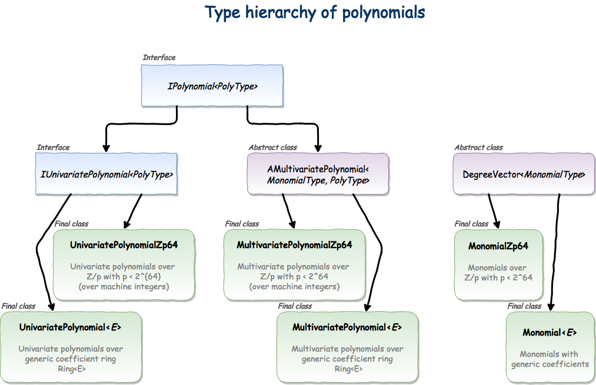

.. |br| raw:: html

    

.. _ref-basicconcepts:

==========
User guide
==========

Integers
========

There are two basic types of integer numbers that we have to deal with when doing algebra in computer: machine integers and arbitrary-precision integers. For the machine integers the Java's primitive 64-bit ``long`` type is used (since most modern CPUs are 64-bit). Internally |Rings| use machine numbers for representation of integers modulo prime numbers less than :math:`2^{64}` which is done for performance reasons (see :ref:`ref-machine-arithmetic`). For the arbitrary-precision integers |Rings| use improved ``BigInteger`` class `github.com/tbuktu/bigint <https://github.com/tbuktu/bigint>`_ (`rings.bigint.BigInteger`_) instead of built-in ``java.math.BigInteger``. The improved `BigInteger`_ has Schönhage-Strassen multiplication and Barrett division algorithms for large integers which is a significant performance improvement in comparison to native Java's implementation.

.. tip:: 
    In order to avoid confusing of ``BigInteger`` used in |Rings| and ``java.math.BigInteger`` it is convenient to instantiate arbitrary-precision integers via methods provided in ring ``Z``. 

    In Java:

    .. code-block:: java

    	BigInteger fromString = Z.parse("12345689");
    	BigInteger fromInt    = Z.valueOf(12345689);
    	BigInteger fromLong   = Z.valueOf(1234568987654321L);

    In Scala:

    .. code-block:: scala

    	val fromString : IntZ = Z("12345689")
    	val fromInt    : IntZ = Z(12345689)
    	val fromLong   : IntZ = Z(1234568987654321L)

    (the type definition ``type IntZ = ring.bigint.BigInteger`` is introduced in Scala DSL)

.. _rings.bigint.BigInteger: https://github.com/PoslavskySV/rings/blob/develop/rings/src/main/java/cc/redberry/rings/bigint/BigInteger.java
.. _BigInteger: https://github.com/PoslavskySV/rings/blob/develop/rings/src/main/java/cc/redberry/rings/bigint/BigInteger.java

Prime numbers
"""""""""""""

In many applications it is necessary to test primality of integer number (``isPrime(number)``) or to generate some prime numbers (``nextPrime(number)``). This is realized in the following two classes:

 - `SmallPrimes`_ for numbers less than :math:`2^{32}`. It uses *Miller-Rabin* probabilistic primality test for int type in such a way that result is always guaranteed (code is adapted from `Apache Commons Math <http://commons.apache.org/proper/commons-math/>`_).
 - `BigPrimes`_ for arbitrary large numbers. It switches between *Pollard-Rho*, *Pollard-P1* and *Quadratic Sieve* algorithms for prime factorization and also uses probabilistic *Miller-Rabin test* and strong *Lucas test* for primality testing.

The following code snippet gives some illustrations:

.. tabs::

   .. code-tab:: java

		int intNumber = 1234567;
		// false
		boolean primeQ = SmallPrimes.isPrime(intNumber);
		// 1234577
		int intPrime = SmallPrimes.nextPrime(intNumber);
		// [127, 9721]
		int[] intFactors = SmallPrimes.primeFactors(intNumber);

		long longNumber = 12345671234567123L;
		// false
		primeQ = BigPrimes.isPrime(longNumber);
		// 12345671234567149
		long longPrime = BigPrimes.nextPrime(longNumber);
		// [1323599, 9327350077]
		long[] longFactors = BigPrimes.primeFactors(longNumber);

		BigInteger bigNumber = Z.parse("321536584276145124691487234561832756183746531874567");
		// false
		primeQ = BigPrimes.isPrime(bigNumber);
		// 321536584276145124691487234561832756183746531874827
		BigInteger bigPrime = BigPrimes.nextPrime(bigNumber);
		// [3, 29, 191, 797359, 1579057, 14916359, 1030298906727233717673336103]
		List<BigInteger> bigFactors = BigPrimes.primeFactors(bigNumber);

.. _SmallPrimes: https://github.com/PoslavskySV/rings/blob/develop/rings/src/main/java/cc/redberry/rings/primes/SmallPrimes.java
.. _BigPrimes: https://github.com/PoslavskySV/rings/blob/develop/rings/src/main/java/cc/redberry/rings/primes/BigPrimes.java

.. _ref-machine-arithmetic:

Modular arithmetic with machine integers
========================================

There is one special ring --- ring :math:`Z_p` of integers modulo prime number :math:`p < 2^{64}` --- which is used in the basis of many fundamental algorithms. In contrast to :math:`Z_p` with arbitrary large characteristic, for characteristic that fits into 64-bit word one can use machine integers to significantly speed up basic math operations. Operations in :math:`Z_p` require applying ``mod`` operation which in turn implies integer division. Integer division is a very slow CPU instruction; and what is more important is that it breaks CPU pipelining. On the other hand, operations in :math:`Z_p` imply taking ``mod`` with a fixed modulus :math:`p` and one can do some precomputation beforehand and then reduce integer divisions to multiplications that are over a magnitude times faster. The details of this trick can be found in `Hacker's Delight <http://www.hackersdelight.org>`_. |Rings| use `libdivide4j`_ library for fast integer division with precomputation which is ported from the well known C/C++ `libdivide`_ library. With this precomputation the ``mod`` operation becomes several times faster than the native CPU instruction, which boosts the overall performance of many of |Rings| algorithms in more than 3 times.

.. _libdivide4j: https://github.com/PoslavskySV/libdivide4j/

.. _libdivide: https://libdivide.com

The ring :math:`Z_p` with :math:`p < 2^{64}` is implemented in `IntegersZp64`_ class (while `IntegersZp`_ implements :math:`Z_p` with arbitrary large characteristic). `IntegersZp64`_ defines all arithmetic operations in :math:`Z_p`:

.. tabs::

   .. code-tab:: java

		// Z/p with p = 2^7 - 1 (Mersenne prime)
		IntegersZp64 field = new IntegersZp64(127);
		//     1000 = 111 mod 127
		assert field.modulus(1000) == 111;
		// 100 + 100 = 73 mod 127
		assert field.add(100, 100) == 73;
		//  12 - 100 = 39 mod 127
		assert field.subtract(12, 100) == 39;
		//  55 * 78  = 73 mod 127
		assert field.multiply(55, 78) == 99;
		//   1 / 43  = 65 mod 127
		assert field.reciprocal(43) == 65;

It is worst to mention, that multiplication defined in `IntegersZp64`_ is especially fast when characteristic is less than :math:`2^{32}`: in this case multiplication of two numbers fits the machine 64-bit word (no ``long`` overflow), while in the opposite case Montgomery reduction will be used:

.. tabs::

   .. code-tab:: java

   		// Z/p with p = 2^31 - 1 (Mersenne prime) - fits 32-bit word
		IntegersZp64 field32 = new IntegersZp64((1L << 31) - 1L);
		// does not cause long overflow - fast 
		assert field32.multiply(0xabcdef12, 0x12345678) == 0x7e86a4d6;

		// Z/p with p = 2^61 - 1 (Mersenne prime) - doesn't fit 32-bit word
		IntegersZp64 field64 = new IntegersZp64((1L << 61) - 1L);
		// cause long overflow - Montgomery reduction will be used - not so fast 
		assert field64.multiply(0x0bcdef1234567890L, 0x0234567890abcdefL) == 0xf667077306fd7a8L;

.. note::
	
	`IntegersZp64`_ is used in order to achieve the best possible performance of many fundamental algorithms which underlie in the basis of many high-level features such as GCD and factorization in arbitrary polynomial rings. Since `IntegersZp64`_ operates with primitive ``longs`` and Java doesn't support generics with primitives, `IntegersZp64`_ stands separately from the elegant type hierarchy of generic rings implemented in |Rings| (see :ref:`ref-rings`). For the same reason some of the algorithms have two implementations: one for rings over generic elements and one for `IntegersZp64`_. This internal complication is hidden from the user, and the switch between generic and primitive types is done automatically in the internals of |Rings| when it can really make gain in the performance.

.. _IntegersZp64: https://github.com/PoslavskySV/rings/blob/develop/rings/src/main/java/cc/redberry/rings/IntegersZp64.java
.. _IntegersZp: https://github.com/PoslavskySV/rings/blob/develop/rings/src/main/java/cc/redberry/rings/IntegersZp.java

.. _ref-rings:

Rings
=====

The concept of mathematical ring is implemented in the generic interface `Ring<E>`_ which defines all basic algebraic operations over the elements of type ``E``. The simplest example is the ring of integers :math:`Z` (`Z`_), which operates with |Rings| `BigInteger`_ instances and simply delegates all operations like ``+`` or ``*`` to methods of class `BigInteger`_. A little bit more complicated ring is a ring of integers modulo some number (:math:`Z_p`):

.. tabs::

   .. code-tab:: java

		// The ring Z/17
		Ring<BigInteger> ring = Zp(Z.valueOf(17));
		
		//     103 = 1 mod 17 
		BigInteger el  = ring.valueOf(Z.valueOf(103));
		assert  el.intValue() == 1;
		
		// 99 + 88 = 0 mod 17
		BigInteger add = ring.add(Z.valueOf(99),
		                          Z.valueOf(88));
		assert add.intValue() == 0;

		// 99 * 77 = 7 mod 17
		BigInteger mul = ring.multiply(Z.valueOf(99),
		                               Z.valueOf(77));
		assert mul.intValue() == 7;

		// 1  / 99 = 11 mod 17
		BigInteger inv = ring.reciprocal(Z.valueOf(99));
		assert inv.intValue() == 11;

The interface `Ring<E>`_ additionally defines algebraic operations inherent to more specialized types of rings:

 - **GCD domains** |br| rings that support GCD operation
 - **Euclidean rings** |br| rings that support division with remainder
 - **Fields** |br| rings that support exact division

These operations can be summarized in the following methods from `Ring<E>`_ interface:

.. tabs::

   .. code-tab:: java

		// Methods from Ring<E> interface:

		// GCD domain operation:
		E gcd(E a, E b);

		// Euclidean ring operation:
		E[] divideAndRemainder(E dividend, E divider);

		// Field operation:
		E reciprocal(E element);

One can check whether the ring ``R`` is a field or a Euclidean ring using ``R.isField()`` and ``R.isEuclideanRing()`` methods.

.. important::

    If one invoke field method like ``reciprocal(el)`` on a ring which is not a field, the ``UnsupportedOperationException`` will be thrown:

    .. code-block:: java

		// ring Z
		Ring<BigInteger> notField = Z;
		// it is not a fielf
		assert !notField.isField();
		// this is OK (1/1 = 1)
		assert notField.reciprocal(Z.getOne()).isOne();
		// this will throw UnsupportedOperationException
		notField.reciprocal(Z.valueOf(10)); // <- error

Each `Ring<E>`_ implementation provides the information about its mathematical nature and its properties like cardinality, characteristic etc. Another important method defined in `Ring<E>`_ is ``parse(String)`` which converts string into ring element. Illustrations:

.. tabs::

   .. code-tab:: java

		// Z is not a field
		assert  Z.isEuclideanRing();
		assert !Z.isField();
		assert !Z.isFinite();

		// Q is an infinite field
		assert  Q.isField();
		assert !Q.isFinite();
		assert  Q.parse("2/3").equals(
			   new Rational<>(Z, Z.valueOf(2), Z.valueOf(3)));

		// GF(2^10) is a finite field
		FiniteField<UnivariatePolynomialZp64> gf = GF(2, 10);
		assert gf.isField();
		assert gf.isFinite();
		assert gf.characteristic().intValue() == 2;
		assert gf.cardinality().intValue() == 1 << 10;
		System.out.println(gf.parse("1 + z + z^10"));

		// Z/3[x] is Euclidean ring but not a field
		UnivariateRing<UnivariatePolynomialZp64> zp3x = UnivariateRingZp64(3);
		assert  zp3x.isEuclideanRing();
		assert !zp3x.isField();
		assert !zp3x.isFinite();
		assert  zp3x.characteristic().intValue() == 3;
		assert  zp3x.parse("1 + 14*x + 15*x^10").equals(
			   UnivariatePolynomialZ64.create(1, 2).modulus(3));

Examples of rings
"""""""""""""""""

Some predefined common rings and convenient methods for instantiation of new rings are placed in `Rings`_ class or directly in `scaladsl`_ package object in Scala DSL. Below is the list of what is available by default in |Rings|:

+----------------------------------------+---------------------------------------------------------------------+-------------------------------------------------------------------------------------+
| Ring                                   | Description                                                         | Method in ``Rings`` / ``scaladsl``                                                  |
+========================================+=====================================================================+=====================================================================================+
| :math:`Z`                              | Ring of integers                                                    | ``Z``                                                                               |
+----------------------------------------+---------------------------------------------------------------------+-------------------------------------------------------------------------------------+
| :math:`Q`                              | Field of rationals                                                  | ``Q``                                                                               |
+----------------------------------------+---------------------------------------------------------------------+-------------------------------------------------------------------------------------+
| :math:`Z_p`                            | Integers modulo :math:`p`                                           | ``Zp(p)``                                                                           |
+----------------------------------------+---------------------------------------------------------------------+-------------------------------------------------------------------------------------+
| :math:`Z_p` with :math:`p < 2^{64}`    | Integers modulo :math:`p < 2^{64}`                                  | ``Zp64(p)`` [*]_                                                                    |
+----------------------------------------+---------------------------------------------------------------------+-------------------------------------------------------------------------------------+
| :math:`GF(p^q)`                        | Galois field with cardinality :math:`p^q`                           | ``GF(p, q)`` and ``GF(irred)`` or ``GF(p, q, var)`` and ``GF(irred, var)`` in Scala |
+----------------------------------------+---------------------------------------------------------------------+-------------------------------------------------------------------------------------+
| :math:`Frac(R)`                        | Field of fractions of an integral domain :math:`R`                  | ``Frac(R)``                                                                         |
+----------------------------------------+---------------------------------------------------------------------+-------------------------------------------------------------------------------------+
| :math:`R[x]`                           | Univariate polynomial ring over                                     | ``UnivariateRing(R)`` or ``UnivariateRing(R, var)`` in Scala                        |
|                                        | coefficient ring :math:`R`                                          |                                                                                     |
+----------------------------------------+---------------------------------------------------------------------+-------------------------------------------------------------------------------------+
| :math:`Z_p[x]` with :math:`p < 2^{64}` | Univariate polynomial ring over                                     | ``UnivariateRingZp64(p)`` or ``UnivariateRingZp64(p, var)`` in Scala                |
|                                        | coefficient ring :math:`Z_p` with :math:`p < 2^{64}`                |                                                                                     |
+----------------------------------------+---------------------------------------------------------------------+-------------------------------------------------------------------------------------+
| :math:`R[x_1, \dots, x_N]`             | Multivariate polynomial ring with exactly :math:`N`                 | ``MultivariateRing(N, R)`` or ``MultivariateRing(R, vars)`` in Scala                |
|                                        | variables over coefficient ring :math:`R`                           |                                                                                     |
+----------------------------------------+---------------------------------------------------------------------+-------------------------------------------------------------------------------------+
| :math:`Z_p[x_1, \dots, x_N]`           | Multivariate polynomial ring with exactly :math:`N`                 | ``MultivariateRingZp64(N, p)`` or ``MultivariateRingZp64(p, vars)`` in Scala        |
| with :math:`p < 2^{64}`                | variables over coefficient ring :math:`Z_p` with :math:`p < 2^{64}` |                                                                                     |
+----------------------------------------+---------------------------------------------------------------------+-------------------------------------------------------------------------------------+

.. [*] Class `IntegersZp64`_ which represents :math:`Z_p` with :math:`p < 2^{64}` does not inherit `Ring<E>`_ interface (see :ref:`ref-machine-arithmetic`)

.. _Rings: https://github.com/PoslavskySV/rings/blob/develop/rings/src/main/java/cc/redberry/rings/Rings.java
.. _scaladsl: https://github.com/PoslavskySV/rings/blob/develop/rings.scaladsl/src/main/scala/cc/redberry/rings/scaladsl/package.scala

Galois fields
^^^^^^^^^^^^^

Galois field :math:`GF(p^q)` with prime characteristic :math:`p` and cardinality :math:`p^q` can be created by specifying :math:`p` and :math:`q` in which case the irreducible polynomial will be generated automatically or by explicitly specifying the irreducible:

.. tabs::

   .. code-tab:: scala

		// Galois field GF(7^10) represented by univariate polynomials
		// in variable "z" over Z/7 modulo some irreducible polynomial
		// (irreducible polynomial will be generated automatically)
		val gf7_10 = GF(7, 10, "z")
		assert(gf7_10.characteristic == Z(7))
		assert(gf7_10.cardinality == Z(7).pow(10))

		// GF(7^3) generated by irreducible polynomial "1 + 3*z + z^2 + z^3"
		val gf7_3 = GF(UnivariateRingZp64(7, "z")("1 + 3*z + z^2 + z^3"), "z")
		assert(gf7_3.characteristic == Z(7))
		assert(gf7_3.cardinality == Z(7 * 7 * 7))

   .. code-tab:: java

		// Galois field GF(7^10)
		// (irreducible polynomial will be generated automatically)
		FiniteField<UnivariatePolynomialZp64> gf7_10 = GF(7, 10);
		assert gf7_10.characteristic().intValue() == 7;
		assert gf7_10.cardinality().equals(Z.valueOf(7).pow(10));

		// GF(7^3) generated by irreducible polynomial "1 + 3*z + z^2 + z^3"
		FiniteField<UnivariatePolynomialZp64> gf7_3 = GF(UnivariatePolynomialZ64.create(1, 3, 1, 1).modulus(7));
		assert gf7_3.characteristic().intValue() == 7;
		assert gf7_3.cardinality().intValue() == 7 * 7 * 7;

Galois fields with arbitrary large characteristic are available:

.. tabs::

	.. code-tab:: scala

		// Mersenne prime 2^107 - 1
		val characteristic = Z(2).pow(107) - 1
		// Galois field GF((2^107 - 1) ^ 16)
		implicit val field = GF(characteristic, 16, "z")
		
		assert(field.cardinality() == characteristic.pow(16))
		

	.. code-tab:: java

		// Mersenne prime 2^107 - 1
		BigInteger characteristic = Z.getOne().shiftLeft(107).decrement();
		// Galois field GF((2^107 - 1) ^ 16)
		FiniteField<UnivariatePolynomial<BigInteger>> field = GF(characteristic, 16);

		assert(field.cardinality().equals(characteristic.pow(16)));

Implementation of Galois fields uses assymptotically fast algorithm for polynomial division with precomputed inverses via Newton iterations (see :ref:`ref-univariate-divison`).

Fields of fractions
^^^^^^^^^^^^^^^^^^^

Field of fractions can be defined over any GCD ring :math:`R`. The simplest example is the field :math:`Q` of fractions over :math:`Z`:

.. tabs::

	.. code-tab:: scala

		implicit val field = Frac(Z) // the same as Q

		assert( field("13/6") == field("2/3") + field("3/2") )
		assert( field("5/6")  == field("2/3") + field("1/6") )
		

	.. code-tab:: java

		Rationals<BigInteger> field = Frac(Z); // the same as Q

		assert field.parse("13/6")
		        .equals(field.add(field.parse("2/3"),
		                field.parse("3/2")));

		assert field.parse("5/6")
		        .equals(field.add(
		                field.parse("2/3"),
		                field.parse("1/6")));

The common GCD is automatically canceled in the numerator and denominator. Another illustration: field :math:`Frac(Z[x, y, z])` of rational functions over :math:`x`, :math:`y` and :math:`z`:

.. tabs::

	.. code-tab:: scala

		val ring = MultivariateRing(Z, Array("x", "y", "z"))
		implicit val field = Frac(ring)

		val a = field("(x + y + z)/(1 - x - y)")
		val b = field("(x^2 - y^2 + z^2)/(1 - x^2 - 2*x*y - y^2)")

		println(a + b)		

	.. code-tab:: java

		Ring<MultivariatePolynomial<BigInteger>> ring = MultivariateRing(3, Z);
		Ring<Rational<MultivariatePolynomial<BigInteger>>> field = Frac(ring);

		Rational<MultivariatePolynomial<BigInteger>> 
				a = field.parse("(x + y + z)/(1 - x - y)"),
				b = field.parse("(x^2 - y^2 + z^2)/(1 - x^2 - 2*x*y - y^2)");

		System.out.println(field.add(a, b));

Univariate polynomial rings
^^^^^^^^^^^^^^^^^^^^^^^^^^^

Polynomial ring :math:`R[x]` can be defined over arbitrary coefficient ring :math:`R`. There are two separate implementations of univariate rings:

 - ``UnivariateRingZp64(p)`` |br| Ring of univariate polynomials over :math:`Z_p` with :math:`p < 2^{64}`.  Implementation of this ring uses specifically optimized data structures and efficient algorithms for arithmetic in :math:`Z_p` (see :ref:`ref-machine-arithmetic`).
 - ``UnivariateRing(R)`` |br| Ring of univariate polynomials over generic coefficient domain :math:`R`.

Illustrations:

.. tabs::

	.. code-tab:: scala

		// Ring Z/3[x]
		val zp3x = UnivariateRingZp64(3, "x")
		// parse univariate poly from string
		val p1 = zp3x("4 + 8*x + 13*x^2")
		val p2 = zp3x("4 - 8*x + 13*x^2")
		assert (p1 + p2 == zp3x("2 - x^2") )

		// GF(7^3)
		val cfRing = GF(UnivariateRingZp64(7, "z")("1 + 3*z + z^2 + z^3"), "z")
		// GF(7^3)[x]
		val gfx = UnivariateRing(cfRing, "x")
		// parse univariate poly from string
		val r1 = gfx("4 + (8 + z)*x + (13 - z^43)*x^2")
		val r2 = gfx("4 - (8 + z)*x + (13 + z^43)*x^2")
		assert(r1 + r2 == gfx("1 - 2*x^2"))
		val (div, rem) = r1 /% r2
		assert(r1 == r2 * div + rem)
		
	.. code-tab:: java

		// Ring Z/3[x]
		UnivariateRing<UnivariatePolynomialZp64> zp3x = UnivariateRingZp64(3);
		// parse univariate poly from string
		UnivariatePolynomialZp64
		        p1 = zp3x.parse("4 + 8*x + 13*x^2"),
		        p2 = zp3x.parse("4 - 8*x + 13*x^2");
		assert zp3x.add(p1, p2).equals(zp3x.parse("2 - x^2"));

		// GF(7^3)
		FiniteField<UnivariatePolynomialZp64> cfRing = GF(UnivariateRingZp64(7).parse("1 + 3*z + z^2 + z^3"));
		// GF(7^3)[x]
		UnivariateRing<UnivariatePolynomial<UnivariatePolynomialZp64>> gfx = UnivariateRing(cfRing);
		// parse univariate poly from string
		UnivariatePolynomial<UnivariatePolynomialZp64>
		        r1 = gfx.parse("4 + (8 + z)*x + (13 - z^43)*x^2"),
		        r2 = gfx.parse("4 - (8 + z)*x + (13 + z^43)*x^2");
		assert gfx.add(r1, r2).equals(gfx.parse("1 - 2*x^2"));
		UnivariatePolynomial<UnivariatePolynomialZp64>
		        divRem[] = divideAndRemainder(r1, r2),
		        div = divRem[0],
		        rem = divRem[1];
		assert r1.equals(gfx.add(gfx.multiply(r2, div), rem));

.. tip::
	
	For univariate polynomial rings over :math:`Z_p` with :math:`p < 2^{64}` it is always preferred to use ``UnivariateRingZp64(p, "x")`` instead of generic ``UnivariateRing(Zp(p), "x")``. In the latter case the generic data structures will be used (arbitrary precision integers etc.), while in the former the specialized implementation and algorithms will be used (see :ref:`ref-machine-arithmetic`) which are in several times faster than the generic ones. For example, from the mathematical point of view the following two lines define the same ring :math:`Z_{3}[x]`:

	.. code-block:: scala

		val ringA = UnivariateRingZp64(3, "x")
		val ringB = UnivariateRing(Zp(3), "x")

	Though the math meaning is the same, ``ringA`` uses optimized polynomials `UnivariatePolynomialZp64`_ while ``ringB`` uses generic `UnivariatePolynomial<E>`_; as result, operations in ``ringA`` are in several times faster than in ``ringB``.

Further details about univariate polynomials are in :ref:`ref-univariate-polynomials` section.

Multivariate polynomial rings
^^^^^^^^^^^^^^^^^^^^^^^^^^^^^

Polynomial ring :math:`R[x_1, \dots, x_N]` can be defined over arbitrary coefficient ring :math:`R`. There are two separate implementations of multivariate rings:

 - ``MultivariateRingZp64(N, p)`` |br| Ring of multivariate polynomials with exactly :math:`N` variables over :math:`Z_p` with :math:`p < 2^{64}`.  Implementation of this ring uses specifically optimized data structures and efficient algorithms for arithmetic in :math:`Z_p` (see :ref:`ref-machine-arithmetic`).
 - ``MultivariateRing(N, R)`` |br| Ring of multivariate polynomials with exactly :math:`N` variables over generic coefficient domain :math:`R`.

Illustrations:

.. tabs::

	.. code-tab:: scala

		// Ring Z/3[x, y, z]
		val zp3xyz = MultivariateRingZp64(3, Array("x", "y", "z"))
		// parse univariate poly from string
		val p1 = zp3xyz("4 + 8*x*y + 13*x^2*z^5")
		val p2 = zp3xyz("4 - 8*x*y + 13*x^2*z^5")
		assert (p1 + p2 == zp3xyz("2 - x^2*z^5") )

		// GF(7^3)
		val cfRing = GF(UnivariateRingZp64(7, "t")("1 + 3*t + t^2 + t^3"), "t")
		// GF(7^3)[x, y, z]
		val gfx = MultivariateRing(cfRing, Array("x", "y", "z"))
		// parse univariate poly from string
		val r1 = gfx("4 + (8 + t)*x*y + (13 - t^43)*x^2*z^5")
		val r2 = gfx("4 - (8 + t)*x*y + (13 + t^43)*x^2*z^5")
		assert(r1 + r2 == gfx("1 - 2*x^2*z^5"))
		val (div, rem) = r1 /% r2
		assert(r1 == r2 * div + rem)
		
	.. code-tab:: java

		String[] vars = {"x", "y", "z"};
		// Ring Z/3[x, y, z]
		MultivariateRing<MultivariatePolynomialZp64> zp3xyz = MultivariateRingZp64(3, 3);
		// parse univariate poly from string
		MultivariatePolynomialZp64
		        p1 = zp3xyz.parse("4 + 8*x*y + 13*x^2*z^5", vars),
		        p2 = zp3xyz.parse("4 - 8*x*y + 13*x^2*z^5", vars);
		assert zp3xyz.add(p1, p2).equals(zp3xyz.parse("2 - x^2*z^5", vars));

		// GF(7^3)
		FiniteField<UnivariatePolynomialZp64> cfRing = GF(UnivariateRingZp64(7).parse("1 + 3*z + z^2 + z^3"));
		// GF(7^3)[x, y, z]
		MultivariateRing<MultivariatePolynomial<UnivariatePolynomialZp64>> gfxyz = MultivariateRing(3, cfRing);
		// parse univariate poly from string
		MultivariatePolynomial<UnivariatePolynomialZp64>
		        r1 = gfxyz.parse("4 + (8 + z)*x*y + (13 - z^43)*x^2*z^5", vars),
		        r2 = gfxyz.parse("4 - (8 + z)*x*y + (13 + z^43)*x^2*z^5", vars);
		assert gfxyz.add(r1, r2).equals(gfxyz.parse("1 - 2*x^2*z^5", vars));
		MultivariatePolynomial<UnivariatePolynomialZp64>
		        divRem[] = divideAndRemainder(r1, r2),
		        div = divRem[0],
		        rem = divRem[1];
		assert r1.equals(gfxyz.add(gfxyz.multiply(r2, div), rem));

.. tip::
	
	For multivariate polynomial rings over :math:`Z_p` with :math:`p < 2^{64}` one should always prefer to use ``MultivariateRingZp64(p, vars)`` instead of generic ``MultivariateRing(Zp(p), vars)``. In the latter case the generic data structures will be used (arbitrary precision integers etc.), while in the former the specialized implementation and algorithms will be used (see :ref:`ref-machine-arithmetic`) which are in several times faster than the generic ones. For example, from the mathematical point of view the following two lines define the same ring :math:`Z_{3}[x, y, z]`:

	.. code-block:: scala

		val ringA = MultivariateRingZp64(3, Array("x", "y", "z"))
		val ringB = MultivariateRing(Zp(3), Array("x", "y", "z"))

	Though the math meaning is the same, ``ringA`` uses optimized polynomials `MultivariatePolynomialZp64`_ while ``ringB`` uses generic `MultivariatePolynomial<E>`_; as result, operations in ``ringA`` are in several times faster than in ``ringB``.

Further details about multivariate polynomials are in :ref:`ref-multivariate-polynomials` section.

Scala DSL
=========

Scala DSL allows to use standard mathematical operators for elements of arbitrary rings:

.. tabs::

	.. code-tab:: scala

		implicit val ring = UnivariateRing(Zp(3), "x")
		val (a, b) = ring("1 + 2*x^2", "1 - x")

		// compiles to ring.add(a, b)
		val add = a + b
		// compiles to ring.subtract(a, b)
		val sub = a - b
		// compiles to ring.multiply(a, b)
		val mul = a * b
		// compiles to ring.divideExact(a, b)
		val div = a / b
		// compiles to ring.divideAndRemainder(a, b)
		val divRem = a /% b
		// compiles to ring.increment(a, b)
		val inc = a ++
		// compiles to ring.decrement(a, b)
		val dec = a --
		// compiles to ring.negate(a, b)
		val neg = -a

Note that in the above example the ring instance is defined as ``implicit``. In this case all mathematical operations are delegated directly to the ring defined in the scope: e.g. ``a + b`` compiles to ``ring.add(a, b)``. Without the ``implicit`` keyword the behaviour may be different:

.. tabs::

	.. code-tab:: scala

		val a: IntZ = 10
		val b: IntZ = 11

		// no any implicit Ring[IntZ] instance in the scope
		// compiles to a.add(b) (integer addition)
		assert(a + b === 21)

		implicit val ring = Zp(13)
		// compiles to ring.add(a, b) (addition mod 13)
		assert(a + b === 8)

As a general rule, if there is no any appropriate implicit ring instance in the scope (like in the first assertion in the above example), some default ring will be used. This default ring just delegates all mathematical operations to those defined by the corresponding type: e.g. ``a + b`` compiles to ``a.add(b)`` (or something equivalent). The default rings are available for integers (:math:`Z`), polynomials (instantiated via ``rings.Rings.PolynomialRing(evidence)``) and rationals (instantiated via ``rings.Rings.Frac(evidence)``).

General mathematical operators
""""""""""""""""""""""""""""""

Operators defined on elements of arbitrary rings:

+----------------+---------------------------------------------+
| Scala DSL      | Java equivalent                             |
+================+=============================================+
| ``a + b``      | ``ring.add(a, b)``                          |
+----------------+---------------------------------------------+
| ``a + b``      | ``ring.add(a, b)``                          |
+----------------+---------------------------------------------+
| ``a - b``      | ``ring.subtract(a, b)``                     |
+----------------+---------------------------------------------+
| ``a * b``      | ``ring.multiply(a, b)``                     |
+----------------+---------------------------------------------+
| ``a / b``      | ``ring.divideExact(a, b)``                  |
+----------------+---------------------------------------------+
| ``a /% b``     | ``ring.divideAndRemainder(a, b)``           |
+----------------+---------------------------------------------+
| ``a % b``      | ``ring.remainder(a, b)``                    |
+----------------+---------------------------------------------+
| ``a.pow(exp)`` | ``ring.pow(a, exp)``                        |
+----------------+---------------------------------------------+
| ``-a``         | ``ring.negate(a)``                          |
+----------------+---------------------------------------------+
| ``a++``        | ``ring.increment(a)``                       |
+----------------+---------------------------------------------+
| ``a--``        | ``ring.decrement(a)``                       |
+----------------+---------------------------------------------+
| ``a.gcd(b)``   | ``ring.gcd(a, b)``                          |
+----------------+---------------------------------------------+
| ``a < b``      | ``ring.compare(a, b) < 0``                  |
+----------------+---------------------------------------------+
| ``a <= b``     | ``ring.compare(a, b) <= 0``                 |
+----------------+---------------------------------------------+
| ``a > b``      | ``ring.compare(a, b) > 0``                  |
+----------------+---------------------------------------------+
| ``a >= b``     | ``ring.compare(a, b) >= 0``                 |
+----------------+---------------------------------------------+
| ``a === any``  | ``ring.compare(a, ring.valueOf(any)) == 0`` |
+----------------+---------------------------------------------+
| ``a =!= any``  | ``ring.compare(a, ring.valueOf(any)) != 0`` |
+----------------+---------------------------------------------+

.. important::
    Operators are available for any type ``E`` if there is an implicit ring ``Ring[E]`` in the scope. If there is no implicit ring, operators will work only on integers, rationals and polynomials (the appropriate default ring will be instantiated).

Polynomial operators
""""""""""""""""""""

Operators defined on generic polynomials:

+------------+------------------------------------------------+
| Scala DSL  | Java equivalent                                |
+============+================================================+
| ``a := b`` | ``a.set(b)`` (set ``a`` to the value of ``b``) |
+------------+------------------------------------------------+

Univariate polynomial operators
"""""""""""""""""""""""""""""""

Operators defined on univariate polynomials:

+-------------------------------+-----------------------------------------------------------------------+
| Scala DSL                     | Java equivalent                                                       |
+===============================+=======================================================================+
| ``a << shift``                | ``a.shiftLeft(shift)``                                                |
+-------------------------------+-----------------------------------------------------------------------+
| ``a >> shift``                | ``a.shiftRight(shift)``                                               |
+-------------------------------+-----------------------------------------------------------------------+
| ``a(from, to)``               | ``a.getRange(from, to)``                                              |
+-------------------------------+-----------------------------------------------------------------------+
| ``a.at(index)``               | ``a.get(index)``                                                      |
+-------------------------------+-----------------------------------------------------------------------+
| ``a.eval(point)``             | ``a.evaluate(point)``                                                 |
+-------------------------------+-----------------------------------------------------------------------+
| ``a @@ index``                | ``a.getAsPoly(index)``                                                |
+-------------------------------+-----------------------------------------------------------------------+
| ``a /%% b``                   | ``UnivariateDivision.divideAndRemainderFast(a, b, inverse, true)``    |
+-------------------------------+-----------------------------------------------------------------------+
| ``a %% b``                    | ``UnivariateDivision.remainderFast(a, b, inverse, true)``             |
+-------------------------------+-----------------------------------------------------------------------+
| ``a.precomputedInverses``     | ``UnivariateDivision.fastDivisionPreConditioningWithLCCorrection(a)`` |
+-------------------------------+-----------------------------------------------------------------------+

.. note::
    The implicit ``IUnivariateRing[Poly, Coefficient]`` must be in the scope.

Multivariate polynomial operators
"""""""""""""""""""""""""""""""""

Operators defined on multivariate polynomials:

+-------------------------------+-----------------------------------------------------------------------+
| Scala DSL                     | Java equivalent                                                       |
+===============================+=======================================================================+
| ``a(variable -> value)``      | ``a.evaluate(variable, value)``                                       |
+-------------------------------+-----------------------------------------------------------------------+
| ``a.eval(variable -> value)`` | ``a.evaluate(variable, value)``                                       |
+-------------------------------+-----------------------------------------------------------------------+
| ``a.swapVariables(i, j)``     | ``AMultivariatePolynomial.swapVariables(a, i, j)``                    |
+-------------------------------+-----------------------------------------------------------------------+
| ``a /%/% (tuple)``            | ``MultivariateDivision.divideAndRemainder(a, tuple: _*)``             |
+-------------------------------+-----------------------------------------------------------------------+
| ``a /%/%* (dividers*)``       | ``MultivariateDivision.divideAndRemainder(a, dividers: _*)``          |
+-------------------------------+-----------------------------------------------------------------------+

.. note::
    The implicit ``IMultivariateRing[Term, Poly, Coefficient]`` must be in the scope.

Ring methods
""""""""""""

Methods added to `Ring[E]`_ interface:

+----------------------+----------------------------------------------------+
| Scala DSL            | Java equivalent                                    |
+======================+====================================================+
| ``ring("string")``   | ``ring.parse(string)``                             |
+----------------------+----------------------------------------------------+
| ``ring(integer)``    | ``ring.valueOf(integer)``                          |
+----------------------+----------------------------------------------------+
| ``ring show obj``    | gives appropriate string representation of ``obj`` |
+----------------------+----------------------------------------------------+
| ``ring.ElementType`` | type of elements of ``ring``                       |
+----------------------+----------------------------------------------------+

Polynomial ring methods
"""""""""""""""""""""""

Methods added to `PolynomialRing[Poly, E]`_  class (``Poly`` is polynomial type, ``E`` is a type of coefficients):

+------------------------------+--------------------------------------------------------------------------------------------------+
| Scala DSL                    | Description                                                                                      |
+==============================+==================================================================================================+
| ``ring.CoefficientType``     | type of coefficients                                                                             |
+------------------------------+--------------------------------------------------------------------------------------------------+
| ``ring.cfRing``              | coefficient ring                                                                                 |
+------------------------------+--------------------------------------------------------------------------------------------------+
| ``ring.index(stringVar)``    | gives the index of variable represented as string                                                |
| or                           | (used in the internal polynomial representation, see :ref:`ref-basics-polynomials`); for example |
| ``ring.variable(stringVar)`` | if ``ring = MultivariateRing(Z, Array("x", "y", "z"))``, than ``ring.index("x") == 0``,          |
|                              | ``ring.index("y") == 1`` and  ``ring.index("z") == 2``                                           |
+------------------------------+--------------------------------------------------------------------------------------------------+

For more details see `PolynomialRing[Poly, E]`_.

.. _Ring<E>: https://github.com/PoslavskySV/rings/blob/develop/rings/src/main/java/cc/redberry/rings/Ring.java

.. _Ring[E]: https://github.com/PoslavskySV/rings/blob/develop/rings.scaladsl/src/main/scala/cc/redberry/rings/scaladsl/Rings.scala

.. _PolynomialRing[Poly, E]: https://github.com/PoslavskySV/rings/blob/develop/rings.scaladsl/src/main/scala/cc/redberry/rings/scaladsl/Rings.scala

.. _Z: https://github.com/PoslavskySV/rings/blob/develop/rings/src/main/java/cc/redberry/rings/Rings.java#L30

.. _Rings: https://github.com/PoslavskySV/rings/blob/develop/rings/src/main/java/cc/redberry/rings/Rings.java

.. _cc.redberry.rings.scaladsl.Rings: https://github.com/PoslavskySV/rings/blob/develop/rings.scaladsl/src/main/scala/cc/redberry/rings/scaladsl/Rings.scala

.. _cc.redberry.rings.scaladsl: https://github.com/PoslavskySV/rings/blob/develop/rings.scaladsl/src/main/scala/cc/redberry/rings/scaladsl/package.scala

.. _UnivariateDivision: https://github.com/PoslavskySV/rings/blob/develop/rings/src/main/java/cc/redberry/rings/poly/univar/UnivariateDivision.java

.. _ref-basics-polynomials:

Polynomials
===========

|Rings| have separate implementation of univariate (dense) and multivariate (sparse) polynomials. Polynomials over :math:`Z_p` with :math:`p < 2^{64}` are also implemented separately and specifically optimized (coefficients are represented as primitive machine integers instead of generic templatized objects and fast modular arithmetic is used, see :ref:`ref-machine-arithmetic`). Below the type hierarchy of polynomial classes is shown:

----

The first thing about the internal representation of polynomials is that polynomial instances do not store the information about particular string names of variables. Variables are treated just as "the first variable", "the second variable" and so on without specifying particular names ("x" or "y"). As result string names of variables should be specifically stored somewhere. Some illusrtations:

.. tabs::

	.. code-tab:: scala

		// when parsing "x" will be considered as the "first variable"
		// and "y" as "the second", then in the result the particular
		// names "x" and "y" are erased
		val poly1 = MultivariatePolynomial.parse("x^2 + x*y", "x", "y")
		// parse the same polynomial but using "a" and "b" instead of "x" and "y"
		val poly2 = MultivariatePolynomial.parse("a^2 + a*b", "a", "b")
		// polynomials are equal (no matter which variable names were used when parsing)
		assert(poly1 == poly2)
		// degree in the first variable
		assert(poly1.degree(0) == 2)
		// degree in the second variable
		assert(poly1.degree(1) == 1)

		// this poly differs from poly2 since now "a" is "the second"
		// variable and "b" is "the first"
		val poly3 = MultivariatePolynomial.parse("a^2 + a*b", "b", "a")
		assert(poly3 != poly2)
		// swap the first and the second variables and the result is equal to poly2
		assert(poly3.swapVariables(0, 1) == poly2)

		// the default toString() will use the default
		// variables "a", "b", "c"  and so on (alphabetical)
		// the result will be "a*b + a^2"
		println(poly1)
		// specify which variable names use for printing
		// the result will be "x*y + x^2"
		println(poly1.toString(Array("x", "y")))
		// the result will be "y*x + y^2"
		println(poly1.toString(Array("y", "x")))

	.. code-tab:: java

		// when parsing "x" will be considered as the "first variable"
		// and "y" as "the second" => in the result the particular
		// names "x" and "y" are erased
		MultivariatePolynomial<BigInteger> poly1 = MultivariatePolynomial.parse("x^2 + x*y", "x", "y");
		// parse the same polynomial but using "a" and "b" instead of "x" and "y"
		MultivariatePolynomial<BigInteger> poly2 = MultivariatePolynomial.parse("a^2 + a*b", "a", "b");
		// polynomials are equal (no matter which variable names were used when parsing)
		assert poly1.equals(poly2);
		// degree in the first variable
		assert poly1.degree(0) == 2;
		// degree in the second variable
		assert poly1.degree(1) == 1;

		// this poly differs from poly2 since now "a" is "the second"
		// variable and "b" is "the first"
		MultivariatePolynomial<BigInteger> poly3 = MultivariatePolynomial.parse("a^2 + a*b", "b", "a");
		assert !poly3.equals(poly2);
		// swap the first and the second variables and the result is equal to poly2
		assert AMultivariatePolynomial.swapVariables(poly3, 0, 1).equals(poly2);

		// the default toString() will use the default
		// variables "a", "b", "c"  and so on (alphabetical)
		// the result will be "a*b + a^2"
		System.out.println(poly1);
		// specify which variable names use for printing
		// the result will be "x*y + x^2"
		System.out.println(poly1.toString(new String[]{"x", "y"}));
		// the result will be "y*x + y^2"
		System.out.println(poly1.toString(new String[]{"y", "x"}));

With Scala DSL the information about string names of variables may be stored in the ring instance. In Scala DSL, when parsing polynomial via ``ring(string)`` it is allowed to use only those variables that were specified when instantiating the ring. To get the internally used integer index of variable there is ``ring.index("stringVar")`` method; to print polynomial using the stored strings for variables there is ``ring.show(object)`` method. Illustration:

.. tabs::

	.. code-tab:: scala

	    // "x" is the first variable "y" is the second
	    val ring = MultivariateRing(Z, Array("x", "y"))
	    assert (ring.index("x") == 0)
	    assert (ring.index("y") == 1)
	    // parse polynomial
	    val poly = ring("x^2 + x*y")
	    // stringify poly using "x" and "y" for variables
	    println(ring show poly)

	    // this is forbidden (IllegalArgumentException will be thrown):
	    // (can't use "a" and "b" instead of "x" and "y")
	    val poly = ring("a^2 + b*c") // <- error!

----

The second important note about internal implementation of polynomials is that polynomial instances are in general mutable. Methods which may modify the instance are available in Java API, while all mathematical operations applied using Scala DSL (with operators ``+``, ``-`` etc.) are not modifier:

.. tabs::

	.. code-tab:: scala

		val ring = UnivariateRing(Z, "x")
		val (p1, p2, p3) = ring("x", "x^2", "x^3")

		// this WILL modify p1
		p1.add(p2)
		// this will NOT modify p2
		p2.copy().add(p3)
		// this will NOT modify p2
		ring.add(p2, p3)
		// this will NOT modify p2
		p2 + p3

	.. code-tab:: java

		UnivariatePolynomial
		        p1 = UnivariatePolynomial.parse("x", Z),
		        p2 = UnivariatePolynomial.parse("x^2", Z),
		        p3 = UnivariatePolynomial.parse("x^3", Z);

		// this WILL modify p1
		p1.add(p2);
		// this will NOT modify p2
		p2.copy().add(p3);

There are strong reasons to use mutable data structures internally for implementation of polynomial algebra. However, it may be confusing when just using the API. So it is always preffered to use ring instance for mathematical operations: use ``ring.add(a, b)`` instead of ``a.add(b)`` and so on.

.. warning::
    Polynomial instances are mutable. One should call Java API methods on polynomial instances with attention, since they will modify the instance. E.g. ``a.add(b)`` will add ``b`` directly to the instance ``a`` instead of creating a new instance.

.. important::
    When using |Rings| with Scala it is strongly suggested always to define and use ring instance directly to perform mathematical operations on polynomials. E.g. use ``ring.add(a, b)`` or just ``a + b``  instead of ``a.add(b)``.

----

The parent interface for all polynomials is `IPolynomial<PolyType>`_. The following example gives a template for implementing generic function which may operate with arbitrary polynomial types:

.. tabs::

	.. code-tab:: scala

		/**
		 * @tparam Poly type of polynomials
		 */
		def genericFunc[Poly <: IPolynomial[Poly]](poly: Poly): Poly = {
		    poly.pow(2) * 3 + poly * 2 + 1
		}

		// univariate polynomials over Zp64
		val uRing = UnivariateRingZp64(17, "x")
		println(uRing show genericFunc(uRing("1 + 2*x + 3*x^2")))

		// multivariate polynomials over Z
		val mRing = MultivariateRing(Z, Array("x", "y", "z"))
		println(mRing show genericFunc(mRing("1 + x + y + z")))

	.. code-tab:: java

		/**
		 * @param <Poly> polynomial type
		 */
		static <Poly extends IPolynomial<Poly>> Poly genericFunc(Poly poly) {
		return poly.createOne().add(
		        poly.copy().multiply(2),
		        polyPow(poly, 2).multiply(3));
		}

		// univariate polynomials over Zp64
		System.out.println(genericFunc(UnivariatePolynomialZ64.create(1, 2, 3).modulus(17)));
		// multivariate polynomials over Z
		System.out.println(genericFunc(MultivariatePolynomial.parse("1 + x + y + z")));

Note that there is no any specific polynomial ring used in the ``genericFunc`` and mathematical operations are delegated to the polynomial instances (plain polynomial addition/multiplication is used). Compare it to the following almost identical example, where the polynomial ring is specified directly and all math operations are delegated to the `Ring<E>`_ instance:

.. tabs::

	.. code-tab:: scala

		/**
		  * @tparam Poly type of polynomials
		  * @tparam E    type of polynomial coefficients
		  */
		def genericFuncWithRing[Poly <: IPolynomial[Poly], E](poly: Poly)
		    (implicit ring: PolynomialRing[Poly, E]): Poly = {
		  poly.pow(2) * 3 + poly * 2 + 1
		}

		// univariate polynomials over Zp64
		val uRing = UnivariateRingZp64(17, "x")
		println(uRing show genericFuncWithRing(uRing("1 + 2*x + 3*x^2"))(uRing))

		// multivariate polynomials over Z
		val mRing = MultivariateRing(Z, Array("x", "y", "z"))
		println(mRing show genericFuncWithRing(mRing("1 + x + y + z"))(mRing))

	.. code-tab:: java

		/**
		 * @param <Poly> polynomial type
		 */
		static <Poly extends IPolynomial<Poly>> Poly genericFuncWithRing(Poly poly, PolynomialRing<Poly> ring) {
		    return ring.add(
		            ring.getOne(),
		            ring.multiply(poly, ring.valueOf(2)),
		            ring.multiply(ring.pow(poly, 2), ring.valueOf(3)));
		}

		// univariate polynomials over Zp64
		UnivariateRing<UnivariatePolynomialZp64> uRing = UnivariateRingZp64(17);
		System.out.println(genericFuncWithRing(uRing.parse("1 + 2*x + 3*x^2"), uRing));

		// multivariate polynomials over Z
		MultivariateRing<MultivariatePolynomial<BigInteger>> mRing = MultivariateRing(3, Z);
		System.out.println(genericFuncWithRing(mRing.parse("1 + x + y + z"), mRing));

While in case of ``UnivariateRingZp64`` or ``MultivariateRing`` both ``genericFunc``  and ``genericFuncWithRing`` give the same result, in the case of e.g. Galois field the results will be different, since mathematical operations in Galois field are performed modulo the irreducible polynomial:

.. tabs::

	.. code-tab:: scala

		// GF(13^4)
		implicit val gf = GF(13, 4, "z")
		// some element of GF(13^4)
		val poly = gf("1 + z + z^2 + z^3 + z^4").pow(10)

		val noRing = genericFunc(poly)
		println(noRing)

		val withRing = genericFuncWithRing(poly)
		println(withRing)

		assert(noRing != withRing)

	.. code-tab:: java

		// GF(13^4)
		FiniteField<UnivariatePolynomialZp64> gf = GF(13, 4);
		// some element of GF(13^4)
		UnivariatePolynomialZp64 poly = gf.pow(gf.parse("1 + z + z^2 + z^3 + z^4"), 10);

		UnivariatePolynomialZp64 noRing = genericFunc(poly);
		System.out.println(noRing);

		UnivariatePolynomialZp64 withRing = genericFuncWithRing(poly, gf);
		System.out.println(withRing);

		assert !noRing.equals(withRing);

.. _IPolynomial<PolyType>: https://github.com/PoslavskySV/rings/blob/develop/rings/src/main/java/cc/redberry/rings/poly/IPolynomial.java

Polynomial GCD, factorization and division with remainder
"""""""""""""""""""""""""""""""""""""""""""""""""""""""""

For convenience, the high-level useful methods such as polynomial GCD and factorization are collected in `PolynomialMethods`_ class. `PolynomialMethods`_ is just a facade which delegates method call to specialized implementation depending on the type of input (univariate or multivariate). The following methods are collected in `PolynomialMethods`_:

 - ``FactorSquareFree(poly)`` |br| Gives square-free factor decomposition of given polynomial.
 - ``Factor(poly)`` |br| Gives complete factor decomposition of polynomial.
 - ``PolynomialGCD(a, b, c, ...)`` |br| Gives greatest common divisor of given polynomials.
 - ``divideAndRemainder(dividend, divider)`` |br| Gives quotient and remainder of the input.
 - ``remainder(dividend, divider)`` |br| Gives the remainder of ``dividend`` and ``divider``.
 - ``coprimeQ(a, b, c, ...)`` |br| Tests whether specified polynomials are pairwise coprime.
 - ``polyPow(poly, exponent)`` |br| Gives polynomials in a power of specified exponent.

The examples of polynomial factorization and GCD are given in the below sections and in the :ref:`ref-quickstart`.

.. _PolynomialMethods: https://github.com/PoslavskySV/rings/blob/develop/rings/src/main/java/cc/redberry/rings/poly/PolynomialMethods.java

.. _ref-univariate-polynomials:

Univariate polynomials
""""""""""""""""""""""

|Rings| have two separate implementations of univariate polynomials:

 - `UnivariatePolynomialZp64`_  --- univariate polynomials over :math:`Z_p` with :math:`p < 2^{64}`. Implementation of `UnivariatePolynomialZp64`_ uses specifically optimized data structure and efficient algorithms for arithmetic in :math:`Z_p` (see :ref:`ref-machine-arithmetic`).
 - `UnivariatePolynomial<E>`_ --- univariate polynomials over generic coefficient ring `Ring<E>`_.

Internally both implementations use dense data structure (array of coefficients) and Karatsuba's algrotithm for multiplication (Sec. 8.1 in [GaGe03]_). Generic interface `IUnivariatePolynomial`_ unifies methods of these two implementations. The following template shows how to write generic function which works with both types of univariate polynomials:

.. tabs::

	.. code-tab:: scala

		/**
		  * @tparam Poly type of univariate polynomials
		  */
		def genericFunc[Poly <: IUnivariatePolynomial[Poly]](poly: Poly) = ???

		/**
		  * @tparam Poly type of univariate polynomials
		  * @tparam E    type of polynomial coefficients
		  */
		def genericFuncWithRing[Poly <: IUnivariatePolynomial[Poly], E](poly: Poly)
		    (implicit ring: IUnivariateRing[Poly, E]) =  ???

	.. code-tab:: java

 		/**
		 * @param <Poly> univariate polynomial type
		 */
		static <Poly extends IUnivariatePolynomial<Poly>>
		Poly genericFunc(Poly poly) { return null; }

		/**
		 * @param <Poly> univariate polynomial type
		 */
		static <Poly extends IUnivariatePolynomial<Poly>>
		Poly genericFuncWithRing(Poly poly, PolynomialRing<Poly> ring) { return null; }

.. _ref-univariate-divison:

Univariate division with remainder
^^^^^^^^^^^^^^^^^^^^^^^^^^^^^^^^^^

There are several algorithms for division with remainder of univariate polynomials implemented in |Rings|:

 - ``UnivariateDivision.divideAndRemainderClassic`` |br| Plain division
 - ``UnivariateDivision.pseudoDivideAndRemainder`` |br| Plain pseudo division of polynomials over non-fields
 - ``UnivariateDivision.divideAndRemainderFast`` |br| Fast division via Newton iterations (Sec. 11 in [GaGe03]_)

The upper-level method ``UnivariateDivision.divideAndRemainder`` switches between plain and fast division depending on the input. The algorithm with Newton iterations allows to precompute Newton inverses for the divider and then use it for divisions by that divider. This allows to achieve considerable performance boost when need to do several divisions with a fixed divider (e.g. for implementation of Galois fields). Examples:

.. tabs::

	.. code-tab:: scala

		implicit val ring = UnivariateRingZp64(17, "x")
		// some random divider
		val divider = ring.randomElement()
		// some random dividend
		val dividend = 1 + 2 * divider + 3 * divider.pow(2)

		// quotient and remainder using built-in methods
		val (divPlain, remPlain) = dividend /% divider

		// precomputed Newton inverses, need to calculate it only once
		implicit val invMod = divider.precomputedInverses
		// quotient and remainder computed using fast
		// algorithm with precomputed Newton inverses
		val (divFast, remFast) = dividend /%% divider

		// results are the same
		assert((divPlain, remPlain) == (divFast, remFast))

	.. code-tab:: java

		UnivariateRing<UnivariatePolynomialZp64> ring = UnivariateRingZp64(17);
		// some random divider
		UnivariatePolynomialZp64 divider = ring.randomElement();
		// some random dividend
		UnivariatePolynomialZp64 dividend = ring.add(
		        ring.valueOf(1),
		        ring.multiply(ring.valueOf(2), divider),
		        ring.multiply(ring.valueOf(3), ring.pow(divider, 2)));

		// quotient and remainder using built-in methods
		UnivariatePolynomialZp64[] divRemPlain
		        = UnivariateDivision.divideAndRemainder(dividend, divider, true);

		// precomputed Newton inverses, need to calculate it only once
		UnivariateDivision.InverseModMonomial<UnivariatePolynomialZp64> invMod
		        = UnivariateDivision.fastDivisionPreConditioning(divider);
		// quotient and remainder computed using fast
		// algorithm with precomputed Newton inverses
		UnivariatePolynomialZp64[] divRemFast
		        = UnivariateDivision.divideAndRemainderFast(dividend, divider, invMod, true);

		// results are the same
		assert Arrays.equals(divRemPlain, divRemFast);

Details of implementation can be found in `UnivariateDivision`_.

Univariate GCD
^^^^^^^^^^^^^^

|Rings| have several algorithms for univariate GCD:

 - ``UnivariateGCD.EuclidGCD`` and ``UnivariateGCD.ExtedndedEuclidGCD`` |br|  Euclidean algorithm (and its extended version)
 - ``UnivariateGCD.HalfGCD`` and ``UnivariateGCD.ExtedndedHalfGCD`` |br|  Half-GCD (and its extended version) (Sec. 11 [GaGe03]_)
 - ``UnivariateGCD.SubresultantRemainders`` |br|  Subresultant sequences (Sec. 7.3 in [GeCL92]_)
 - ``UnivariateGCD.ModularGCD`` |br|  Modular GCD (Sec. 6.7 in [GaGe03]_, small primes version)

The upper-level method ``UnivariateGCD.PolynomialGCD`` switches between Euclidean algorithm and Half-GCD for polynomials in :math:`F[x]` where :math:`F` is a finite field. For polynomials in :math:`Z[x]` and :math:`Q[x]` the modular algorithm is used (small primes version). In other cases algorithm with subresultant sequences is used. Examples:

.. tabs::

	.. code-tab:: scala

		import poly.univar.UnivariateGCD._

		// Polynomials over field
		val ringZp = UnivariateRingZp64(17, "x")
		val a = ringZp("1 + 3*x + 2*x^2")
		val b = ringZp("1 - x^2")
		// Euclid and Half-GCD algorithms for polynomials over field
		assert(EuclidGCD(a, b) == HalfGCD(a, b))
		// Extended Euclidean algorithm
		val (gcd, s, t) = ExtendedEuclidGCD(a, b) match {case Array(gcd, s, t) => (gcd, s, t)}
		assert(a * s + b * t == gcd)
		// Extended Half-GCD algorithm
		val (gcd1, s1, t1) = ExtendedHalfGCD(a, b) match {case Array(gcd, s, t) => (gcd, s, t)}
		assert((gcd1, s1, t1) == (gcd, s, t))

		// Polynomials over Z
		val ringZ = UnivariateRing(Z, "x")
		val aZ = ringZ("1 + 3*x + 2*x^2")
		val bZ = ringZ("1 - x^2")
		// GCD for polynomials over Z
		assert(ModularGCD(aZ, bZ) == ringZ("1 + x"))

		// Bivariate polynomials represented as Z[y][x]
		val ringXY = UnivariateRing(UnivariateRing(Z, "y"), "x")
		val aXY = ringXY("(1 + y) + (1 + y^2)*x + (y - y^2)*x^2")
		val bXY = ringXY("(3 + y) + (3 + 2*y + y^2)*x + (3*y - y^2)*x^2")
		// Subresultant sequence
		val subResultants = SubresultantRemainders(aXY, bXY)
		// The GCD
		val gcdXY = subResultants.gcd.primitivePart
		assert(aXY % gcdXY === 0 && bXY % gcdXY === 0)

	.. code-tab:: java

		// Polynomials over field
		UnivariatePolynomialZp64 a = UnivariatePolynomialZ64.create(1, 3, 2).modulus(17);
		UnivariatePolynomialZp64 b = UnivariatePolynomialZ64.create(1, 0, -1).modulus(17);
		// Euclid and Half-GCD algorithms for polynomials over field
		assert EuclidGCD(a, b).equals(HalfGCD(a, b));
		// Extended Euclidean algorithm
		UnivariatePolynomialZp64[] xgcd = ExtendedEuclidGCD(a, b);
		assert a.copy().multiply(xgcd[1]).add(b.copy().multiply(xgcd[2])).equals(xgcd[0]);
		// Extended Half-GCD algorithm
		UnivariatePolynomialZp64[] xgcd1 = ExtendedHalfGCD(a, b);
		assert Arrays.equals(xgcd, xgcd1);

		// Polynomials over Z
		UnivariatePolynomial<BigInteger> aZ = UnivariatePolynomial.create(1, 3, 2);
		UnivariatePolynomial<BigInteger> bZ = UnivariatePolynomial.create(1, 0, -1);
		// GCD for polynomials over Z
		assert ModularGCD(aZ, bZ).equals(UnivariatePolynomial.create(1, 1));

		// Bivariate polynomials represented as Z[y][x]
		UnivariateRing<UnivariatePolynomial<UnivariatePolynomial<BigInteger>>>
		        ringXY = UnivariateRing(UnivariateRing(Z));
		UnivariatePolynomial<UnivariatePolynomial<BigInteger>>
		        aXY = ringXY.parse("(1 + y) + (1 + y^2)*x + (y - y^2)*x^2"),
		        bXY = ringXY.parse("(3 + y) + (3 + 2*y + y^2)*x + (3*y - y^2)*x^2");
		//// Subresultant sequence
		PolynomialRemainders<UnivariatePolynomial<UnivariatePolynomial<BigInteger>>>
		        subResultants = SubresultantRemainders(aXY, bXY);
		// The GCD
		UnivariatePolynomial<UnivariatePolynomial<BigInteger>> gcdXY = subResultants.gcd().primitivePart();
		assert UnivariateDivision.remainder(aXY, gcdXY, true).isZero();
		assert UnivariateDivision.remainder(bXY, gcdXY, true).isZero();

Details of implementation can be found in `UnivariateGCD`_.

Univariate factorization
^^^^^^^^^^^^^^^^^^^^^^^^

Implementation of univariate factorization in |Rings| is distributed over several classes:

 - ``UnivariateSquareFreeFactorization`` |br| Square-free factorization of univariate polynomials. In the case of zero characteristic Yun's algorithm is used (Sec. 14.6 in [GaGe03]_), otherwise Musser's algorithm is used (Sec. 8.3 in [GeCL92]_, [Muss71]_).
 - ``DistinctDegreeFactorization`` |br| Distinct-degree factorization. Internally there are several algorithms: plain (Sec. 14.2 in [GaGe03]_), adapted version with precomputed :math:`x`-powers, and Victor Shoup's baby-step giant-step algorithm [Shou95]_. The upper-level method swithces between these algorithms depending on the input.
 - ``EqualDegreeFactorization`` |br| Equal-degree factorization using Cantor-Zassenhaus algorithm in both odd and even characteristic (Sec. 14.3 in [GaGe03]_).
 - ``UnivariateFactorization`` |br| Defines upper-level methods and implements factorization over :math:`Z`. In the latter case Hensel lifting (combined linear/quadratic) is used to lift factorization modulo some 32-bit prime number to actual factorization over :math:`Z` and naive recombination to reconstruct correct factors. Examples:
   
Univariate factorization is supported for polynomials in :math:`F[x]` where :math:`F` is either finite field or :math:`Z` or :math:`Q`. Examples:

.. tabs::

	.. code-tab:: scala

		// ring GF(13^5)[x] (coefficient domain is finite field)
		val ringF = UnivariateRing(GF(13, 5, "z"), "x")
		// some random polynomial composed from some factors
		val polyF = ringF.randomElement() * ringF.randomElement() * ringF.randomElement().pow(10)
		// perform square-free factorization
		println(ringF show FactorSquareFree(polyF))
		// perform complete factorization
		println(ringF show Factor(polyF))

		// ring Q[x]
		val ringQ = UnivariateRing(Q, "x")
		// some random polynomial composed from some factors
		val polyQ = ringQ.randomElement() * ringQ.randomElement() * ringQ.randomElement().pow(10)
		// perform square-free factorization
		println(ringQ show FactorSquareFree(polyQ))
		// perform complete factorization
		println(ringQ show Factor(polyQ))

	.. code-tab:: java

		// ring GF(13^5)[x] (coefficient domain is finite field)
		UnivariateRing<UnivariatePolynomial<UnivariatePolynomialZp64>> ringF = UnivariateRing(GF(13, 5));
		// some random polynomial composed from some factors
		UnivariatePolynomial<UnivariatePolynomialZp64> polyF = ringF.randomElement().multiply(ringF.randomElement().multiply(polyPow(ringF.randomElement(), 10)));

		// perform square-free factorization
		System.out.println(FactorSquareFree(polyF));
		// perform complete factorization
		System.out.println(Factor(polyF));

		// ring Q[x]
		UnivariateRing<UnivariatePolynomial<Rational<BigInteger>>> ringQ = UnivariateRing(Q);
		// some random polynomial composed from some factors
		UnivariatePolynomial<Rational<BigInteger>> polyQ = ringQ.randomElement().multiply(ringQ.randomElement().multiply(polyPow(ringQ.randomElement(), 10)));
		// perform square-free factorization
		System.out.println(FactorSquareFree(polyQ));
		// perform complete factorization
		System.out.println(Factor(polyQ));

Details of implementation can be found in `UnivariateSquareFreeFactorization`_, `DistinctDegreeFactorization`_, `EqualDegreeFactorization`_ and `UnivariateFactorization`_.

.. _UnivariateSquareFreeFactorization: https://github.com/PoslavskySV/rings/blob/develop/rings/src/main/java/cc/redberry/rings/poly/univar/UnivariateSquareFreeFactorization.java
.. _DistinctDegreeFactorization: https://github.com/PoslavskySV/rings/blob/develop/rings/src/main/java/cc/redberry/rings/poly/univar/DistinctDegreeFactorization.java
.. _EqualDegreeFactorization: https://github.com/PoslavskySV/rings/blob/develop/rings/src/main/java/cc/redberry/rings/poly/univar/EqualDegreeFactorization.java
.. _UnivariateFactorization: https://github.com/PoslavskySV/rings/blob/develop/rings/src/main/java/cc/redberry/rings/poly/univar/UnivariateFactorization.java

Testing irreducibility
^^^^^^^^^^^^^^^^^^^^^^

Irreducibility test and generation of random irreducible polynomials are availble from ``IrreduciblePolynomials``. For irreducibility testing of polynomials over finite fields the algorithm described in Sec. 14.9 in [GaGe03]_ is used. Methods implemented in ``IrreduciblePolynomials`` are used for construction of arbitrary Galois fields. Examples:

.. tabs::

	.. code-tab:: scala

		import rings.poly.univar.IrreduciblePolynomials._
		val random = new Random()

		// random irreducible polynomial in Z/2[x] of degree 10 (UnivariatePolynomialZp64)
		val poly1 = randomIrreduciblePolynomial(2, 10, random)
		assert(poly1.degree() == 10)
		assert(irreducibleQ(poly1))

		// random irreducible polynomial in Z/2[x] of degree 10 (UnivariatePolynomial[Integer])
		val poly2 = randomIrreduciblePolynomial(Zp(2).theRing, 10, random)
		assert(poly2.degree() == 10)
		assert(irreducibleQ(poly2))

		// random irreducible polynomial in GF(11^15)[x] of degree 10 (this may take few seconds)
		val poly3 = randomIrreduciblePolynomial(GF(11, 15).theRing, 10, random)
		assert(poly3.degree() == 10)
		assert(irreducibleQ(poly3))

		// random irreducible polynomial in Z[x] of degree 10
		val poly4 = randomIrreduciblePolynomialOverZ(10, random)
		assert(poly4.degree() == 10)
		assert(irreducibleQ(poly4))

	.. code-tab:: java

		Well44497b random = new Well44497b();

		// random irreducible polynomial in Z/2[x] of degree 10
		UnivariatePolynomialZp64 poly1 = randomIrreduciblePolynomial(2, 10, random);
		assert poly1.degree() == 10;
		assert irreducibleQ(poly1);

		// random irreducible polynomial in Z/2[x] of degree 10
		UnivariatePolynomial<BigInteger> poly2 = randomIrreduciblePolynomial(Zp(2), 10, random);
		assert poly2.degree() == 10;
		assert irreducibleQ(poly2);

		// random irreducible polynomial in GF(11^15)[x] of degree 10 (this may take few seconds)
		UnivariatePolynomial<UnivariatePolynomialZp64> poly3 = randomIrreduciblePolynomial(GF(11, 15), 10, random);
		assert poly3.degree() == 10;
		assert irreducibleQ(poly3);

		// random irreducible polynomial in Z[x] of degree 10
		UnivariatePolynomial<BigInteger> poly4 = randomIrreduciblePolynomialOverZ(10, random);
		assert poly4.degree() == 10;
		assert irreducibleQ(poly4);

The details about implementation can be found in  `IrreduciblePolynomials`_.

.. _IrreduciblePolynomials: https://github.com/PoslavskySV/rings/blob/develop/rings/src/main/java/cc/redberry/rings/poly/univar/IrreduciblePolynomials.java

Univariate interpolation
^^^^^^^^^^^^^^^^^^^^^^^^

Polynomial interpolation via Newton method can be done in the following way:

.. tabs::

	.. code-tab:: scala

		import rings.poly.univar.UnivariateInterpolation._

		// points
		val points = Array(1L, 2L, 3L, 12L)
		// values
		val values = Array(3L, 2L, 1L, 6L)

		// interpolate using Newton method
		val result = new InterpolationZp64(Zp64(17))
		  .update(points, values)
		  .getInterpolatingPolynomial

		// result.evaluate(points(i)) = values(i)
		assert(points.zipWithIndex.forall { case (point, i) => result.evaluate(point) == values(i) })

	.. code-tab:: java

		// points
		long[] points = {1L, 2L, 3L, 12L};
		// values
		long[] values = {3L, 2L, 1L, 6L};

		// interpolate using Newton method
		UnivariatePolynomialZp64 result = new InterpolationZp64(Zp64(17))
		        .update(points, values)
		        .getInterpolatingPolynomial();

		// result.evaluate(points(i)) = values(i)
		assert IntStream.range(0, points.length).allMatch(i -> result.evaluate(points[i]) == values[i]);

With Scala DSL it is quite easy to implement Lagrange interpolation formula:

.. tabs::

	.. code-tab:: scala

		/*  Lagrange interpolation formula */
		def lagrange[Poly <: IUnivariatePolynomial[Poly], E](points: Seq[E], values: Seq[E])(implicit ring: IUnivariateRing[Poly, E]) = {
		  points.indices
		    .foldLeft(ring getZero) { case (sum, i) =>
		      sum + points.indices
		        .filter(_ != i)
		        .foldLeft(ring getConstant values(i)) { case (product, j) =>
		          implicit val cfRing = ring.cfRing
		          val E: E = points(i) - points(j)
		          product * (ring.`x` - points(j)) / E
		        }
		    }
		}

		import rings.poly.univar.UnivariateInterpolation._

		// coefficient ring GF(13, 5)
		implicit val cfRing = GF(13, 5, "z")
		val z = cfRing("z")
		// some points
		val points = Array(1 + z, 2 + z, 3 + z, 12 + z)
		// some values
		val values = Array(3 + z, 2 + z, 1 + z, 6 + z)

		// interpolate with Newton iterations
		val withNewton = new Interpolation(cfRing)
		  .update(points, values)
		  .getInterpolatingPolynomial
		// interpolate using Lagrange formula
		val withLagrange = lagrange(points, values)(UnivariateRing(cfRing, "x"))
		// results are the same
		assert(withNewton == withLagrange)

.. _UnivariatePolynomialZp64: https://github.com/PoslavskySV/rings/blob/develop/rings/src/main/java/cc/redberry/rings/poly/univar/UnivariatePolynomialZp64.java

.. _UnivariatePolynomial<E>: https://github.com/PoslavskySV/rings/blob/develop/rings/src/main/java/cc/redberry/rings/poly/univar/UnivariatePolynomial.java

.. _IUnivariatePolynomial: https://github.com/PoslavskySV/rings/blob/develop/rings/src/main/java/cc/redberry/rings/poly/univar/IUnivariatePolynomial.java

.. _UnivariateDivision: https://github.com/PoslavskySV/rings/blob/develop/rings/src/main/java/cc/redberry/rings/poly/univar/UnivariateDivision.java

.. _UnivariateGCD: https://github.com/PoslavskySV/rings/blob/develop/rings/src/main/java/cc/redberry/rings/poly/univar/UnivariateGCD.java

.. _ref-multivariate-polynomials:

Multivariate polynomials
""""""""""""""""""""""""

|Rings| have two separate implementations of multivariate polynomials:

 - `MultivariatePolynomialZp64`_  --- multivariate polynomials over :math:`Z_p` with :math:`p < 2^{64}`. Implementation of `MultivariatePolynomialZp64`_ uses efficient algorithms for arithmetic in :math:`Z_p` (see :ref:`ref-machine-arithmetic`)
 - `MultivariatePolynomial<E>`_ --- multivariate polynomials over generic coefficient ring `Ring<E>`_

Internally both implementations use sparse data structure --- map (``java.util.TreeMap``) from degree vectors (`DegreeVector`_) to monomials. Monomial type is implemented as just a degree vector which additionally holds a coefficient. So in correspondence with the two implementations of multivariate polynomials there are two implementations of monomials:

 - `MonomialZp64`_ --- monomial that stores machine-number coefficient (``long``) and is used by `MultivariatePolynomialZp64`_ 
 - `Monomial<E>`_ --- monomial that stores generic coefficient of type ``E`` and is used by `MultivariatePolynomial<E>`_

The generic parent class for multivariate polynomials is `AMultivariatePolynomial<MonomialType, PolyType>`_. The following template shows how to write generic function which works with both types of multivariate polynomials:

.. tabs::

	.. code-tab:: scala

		/**
		  * @tparam Monomial    type of monomials
		  * @tparam Poly        type of multivariate polynomials
		  */
		def genericFunc[
				Monomial <: DegreeVector[Monomial], 
				Poly <: AMultivariatePolynomial[Monomial, Poly]
			](poly: Poly) = ???

		/**
		  * @tparam Monomial    type of monomials
		  * @tparam Poly        type of multivariate polynomials
		  * @tparam Coefficient type of polynomial coefficients
		  */
		def genericFuncWithRing[
				Monomial <: DegreeVector[Monomial], 
				Poly <: AMultivariatePolynomial[Monomial, Poly], 
				Coefficient
			](poly: Poly)
			 (implicit ring: IMultivariateRing[Monomial, Poly, Coefficient]) = ???

		implicit val ring = MultivariateRing(Z, Array("x", "y", "z"))
		import ring.{MonomialType, PolyType, CoefficientType}

		val poly = ring.randomElement()

		// call generic func directly
		genericFunc[MonomialType, PolyType, CoefficientType](poly)
		genericFuncWithRing[MonomialType, PolyType, CoefficientType](poly)

		// define shortcuts
		val func = (p: ring.PolyType) => 
			genericFunc[MonomialType, PolyType, CoefficientType](p)
		val funcWithRing = (p: ring.PolyType) => 
			genericFuncWithRing[MonomialType, PolyType, CoefficientType](p)(ring)

		// call with shortcuts
		func(poly)
		funcWithRing(poly)

	.. code-tab:: java

		/**
		 * @param <Monomial> type of monomials
		 * @param <Poly>     type of multivariate polynomials
		 */
		static <Monomial extends DegreeVector<Monomial>,
		        Poly extends AMultivariatePolynomial<Monomial, Poly>>
		Poly genericFunc(Poly poly) { return null; }

		/**
		 * @param <Monomial> type of monomials
		 * @param <Poly>     type of multivariate polynomials
		 */
		static <Monomial extends DegreeVector<Monomial>,
		        Poly extends AMultivariatePolynomial<Monomial, Poly>>
		Poly genericFuncWithRing(Poly poly, PolynomialRing<Poly> ring) { return null; }

		// call generic funcs
		genericFunc(MultivariatePolynomial.parse("a + b"));

		MultivariateRing<MultivariatePolynomial<BigInteger>> ring = MultivariateRing(3, Z);
		genericFuncWithRing(ring.parse("a + b"), ring);		

.. _MultivariatePolynomialZp64: https://github.com/PoslavskySV/rings/blob/develop/rings/src/main/java/cc/redberry/rings/poly/multivar/MultivariatePolynomialZp64.java

.. _MultivariatePolynomial<E>: https://github.com/PoslavskySV/rings/blob/develop/rings/src/main/java/cc/redberry/rings/poly/multivar/MultivariatePolynomial.java

.. _AMultivariatePolynomial<MonomialType, PolyType>: https://github.com/PoslavskySV/rings/blob/develop/rings/src/main/java/cc/redberry/rings/poly/multivar/AMultivariatePolynomial.java

.. _DegreeVector: https://github.com/PoslavskySV/rings/blob/develop/rings/src/main/java/cc/redberry/rings/poly/multivar/DegreeVector.java

.. _MonomialZp64: https://github.com/PoslavskySV/rings/blob/develop/rings/src/main/java/cc/redberry/rings/poly/multivar/MonomialZp64.java

.. _Monomial<E>: https://github.com/PoslavskySV/rings/blob/develop/rings/src/main/java/cc/redberry/rings/poly/multivar/Monomial<E>.java

Monomial order
^^^^^^^^^^^^^^

|Rings| use sparse data structure for multivariate polynomials --- a sorted map (``java.util.TreeMap``) of degree vectors to monomials. Different sort functions of degree vectors correspond to different monomial orders. There are several monomial orders predefined in `MonomialOrder`_:

 - ``LEX`` |br| Lexicographic monomial order.
 - ``ALEX`` |br| Antilexicographic monomial order.
 - ``GRLEX`` |br| Graded lexicographic monomial order.
 - ``GREVLEX`` |br| Graded reverse lexicographic monomial order.
 
By default |Rings| use ``LEX`` order though the monomial order can be changed in many ways. Examples:

.. tabs::

	.. code-tab:: scala

		import MonomialOrder._

		val ring = MultivariateRing(Z, Array("x", "y"), GREVLEX)

		// monomials in GREVLEX order
		val poly = ring("x + x^2*y^2 + x*y")
		assert(poly.ordering == GREVLEX)

		// monomials in LEX order
		val poly2 = poly.setOrdering(LEX)
		assert(poly2.ordering == LEX)

		// monomials in GREVLEX order (lhs ordering is used in binary operations)
		val add = poly + poly2
		assert(add.ordering == GREVLEX)

		// monomials in LEX order (lhs ordering is used in binary operations)
		val add2 = poly2 + poly
		assert(add2.ordering == LEX)

	.. code-tab:: java

		MultivariateRing<MultivariatePolynomial<BigInteger>> ring
		        = MultivariateRing(2, Z, MonomialOrder.GREVLEX);

		// poly in GREVLEX
		MultivariatePolynomial<BigInteger> poly = ring.parse("x + x^2*y^2 + x*y");
		assert poly.ordering == MonomialOrder.GREVLEX;

		// poly in LEX
		MultivariatePolynomial<BigInteger> poly2 = poly.setOrdering(MonomialOrder.LEX);
		assert poly2.ordering == MonomialOrder.LEX;

		// poly in GREVLEX (ordering of lhs is used)
		MultivariatePolynomial<BigInteger> add = ring.add(poly, poly2);
		assert add.ordering == MonomialOrder.GREVLEX;

		// poly in LEX (ordering of lhs is used)
		MultivariatePolynomial<BigInteger> add2 = ring.add(poly2, poly);
		assert add2.ordering == MonomialOrder.LEX;

.. _MonomialOrder: https://github.com/PoslavskySV/rings/blob/develop/rings/src/main/java/cc/redberry/rings/poly/multivar/MonomialOrder.java

Multivariate division with remainder
^^^^^^^^^^^^^^^^^^^^^^^^^^^^^^^^^^^^

Multivariate division with remainder (polynomial reduction) of polynomial :math:`dividend` by the array of :math:`dividers` gives array of :math:`quotients` and :math:`remainder` satisfying the following formula:

.. math::

    dividend = \sum_{i=0}^{N} quotient_{i} \times divider_{i} + remainder

Examples:

.. tabs::

	.. code-tab:: scala

		val ring = MultivariateRing(Z, Array("x", "y", "z"), MonomialOrder.LEX)

		val dividend = ring("x - x^2*y^2 + 2*x*y + 1 - z*y^2*x^2 + z").pow(3)
		val divider1 = ring("x + y")
		val divider2 = ring("x + z")
		val divider3 = ring("y + z")

		{
		  val (quot1, quot2, rem) = dividend /%/% (divider1, divider2)
		  assert(dividend == divider1 * quot1 + divider2 * quot2 + rem)
		}

		{
		  val (quot1, quot2, quot3, rem) = dividend /%/% (divider1, divider2, divider3)
		  assert(dividend == divider1 * quot1 + divider2 * quot2 + divider3 * quot3 + rem)
		}

	.. code-tab:: java

		String[] variables = {"x", "y", "z"};
		MultivariatePolynomial<BigInteger>
		        dividend = MultivariatePolynomial.parse("x - x^2*y^2 + 2*x*y + 1 - z*y^2*x^2 + z", variables),
		        divider1 = MultivariatePolynomial.parse("x + y", variables),
		        divider2 = MultivariatePolynomial.parse("x + z", variables),
		        divider3 = MultivariatePolynomial.parse("y + z", variables);

		dividend = polyPow(dividend, 3);

		{
		    MultivariatePolynomial<BigInteger>[] divRem
		            = MultivariateDivision.divideAndRemainder(dividend, divider1, divider2);

		    MultivariatePolynomial<BigInteger>
		            quot1 = divRem[0], quot2 = divRem[1], rem = divRem[2];

		    assert dividend.equals(rem.copy().add(
		            quot1.copy().multiply(divider1),
		            quot2.copy().multiply(divider2)));
		}

		{
		    MultivariatePolynomial<BigInteger>[] divRem
		            = MultivariateDivision.divideAndRemainder(dividend, divider1, divider2, divider3);

		    MultivariatePolynomial<BigInteger>
		            quot1 = divRem[0], quot2 = divRem[1], quot3 = divRem[2], rem = divRem[3];

		    assert dividend.equals(rem.copy().add(
		            quot1.copy().multiply(divider1),
		            quot2.copy().multiply(divider2),
		            quot3.copy().multiply(divider3)));
		}

.. important::
    The resulting array of :math:`quotients` and :math:`remainder` depend on the order of dividers in the array and on the used monomial order.

Details of implementation can be found in `MultivariateDivision`_.

.. _MultivariateDivision: https://github.com/PoslavskySV/rings/blob/develop/rings/src/main/java/cc/redberry/rings/poly/multivar/MultivariateDivision.java

Multivariate GCD
^^^^^^^^^^^^^^^^

|Rings| have several algorithms for multivariate GCD:

 - ``BrownGCD`` |br| Brown's GCD for multivariate polynomials over finite fields (see [Brow71]_, Sec 7.4 in [GeCL92]_, [Yang09]_).
 - ``ZippelGCD`` |br| Zippel's sparse algorithm for multivariate GCD over fields. Works both in case of monic polynomials with fast Vandermonde linear systems (see [Zipp79]_, [Zipp93]_) and in case of non-monic input (LINZIP, see [dKMW05]_, [Yang09]_).
 - ``ModularGCD`` |br| Modular GCD for multivariate polynomials over Z with sparse interpolation (see [Zipp79]_, [Zipp93]_, [dKMW05]_) (the same interpolation techniques as in ZippelGCD is used).
 - ``ModularGCDInGF`` |br| Kaltofen's & Monagan's generic modular GCD (see [KalM99]_) for multivariate polynomials over finite fields with very small cardinality.
 - ``EZGCD`` |br| Extended Zassenhaus GCD (EZ-GCD) for multivariate polynomials over finite fields (see Sec. 7.6 in [GeCL92]_ and [MosY73]_).
 - ``EEZGCD`` |br| Enhanced Extended Zassenhaus GCD (EEZ-GCD) for multivariate polynomials over finite fields (see [Wang80]_).

The upper-level method ``MultivariateGCD.PolynomialGCD`` uses ``ZippelGCD`` for polynomials over finite fields (it shows the best performance in practice). In case of finite fields of very small cardinality ``ModularGCDInGF`` is used. ``ModularGCD`` is used for polynomials in :math:`Z[x]` and :math:`Q[x]`. Algorithms ``BrownGCD`` and ``ZippelGCD`` automatically switch to ``ModularGCDInGF`` in case if the coefficient domain has insufficiently large cardinality. Examples:

.. tabs::

	.. code-tab:: scala

		import rings.poly.multivar.MultivariateGCD._
		
		// some large finite field
		val modulus = SmallPrimes.nextPrime(1 << 15)
		val ring = MultivariateRingZp64(modulus, Array("x", "y", "z"))

		val a = ring("x^2 - x*y + z^5")
		val b = ring("x^2 + x*y^7 + x*y*z^2")

		val gcd = ring("x + y + z")
		val poly1 = a * gcd
		val poly2 = b * gcd

		// EZGCD in finite field
		val ez = EZGCD(poly1, poly2)
		assert(ez == gcd)

		// EEZGCD in finite field
		val eez = EEZGCD[ring.MonomialType, ring.PolyType](poly1, poly2)
		assert(eez == gcd)

		// ZippelGCD in finite field
		val zippel = ZippelGCD(poly1, poly2)
		assert(zippel == gcd)

		// some very small finite field (Z/2)
		val z2 = Zp64(2)
		val z2GCD = gcd.setRing(z2)
		val z2Poly1 = a.setRing(z2) * z2GCD
		val z2Poly2 = b.setRing(z2) * z2GCD

		// Kaltofen’s & Monagan’s generic modular GCD
		val modGF = ModularGCDInGF(z2Poly1, z2Poly2)
		assert(modGF == z2GCD)

		// Z
		val zGCD = gcd.setRing[IntZ](Z)
		val zPoly1 = a.setRing[IntZ](Z) * zGCD
		val zPoly2 = b.setRing[IntZ](Z) * zGCD

		// Modular GCD in Z with sparse interpolation
		val mod = ModularGCD(zPoly1, zPoly2)
		assert(mod == zGCD)

	.. code-tab:: java

		// some large finite field
		IntegersZp64 zpRing = Zp64(SmallPrimes.nextPrime(1 << 15));
		MultivariatePolynomialZp64
		        a = MultivariatePolynomialZp64.parse("x^2 - x*y + z^5", zpRing),
		        b = MultivariatePolynomialZp64.parse("x^2 + x*y^7 + x*y*z^2", zpRing);

		MultivariatePolynomialZp64
		        gcd = MultivariatePolynomialZp64.parse("x + y + z", zpRing),
		        poly1 = a.copy().multiply(gcd),
		        poly2 = b.copy().multiply(gcd);

		// EZGCD in finite field
		MultivariatePolynomialZp64 ez = EZGCD(poly1, poly2);
		assert ez.equals(gcd);

		// EEZGCD in finite field
		MultivariatePolynomialZp64 eez = EEZGCD(poly1, poly2);
		assert eez.equals(gcd);

		// ZippelGCD in finite field
		MultivariatePolynomialZp64 zippel = ZippelGCD(poly1, poly2);
		assert zippel.equals(gcd);

		// some very small finite field (Z/2)
		IntegersZp64 z2 = Zp64(2);
		MultivariatePolynomialZp64
		        z2GCD = gcd.setRing(z2),
		        z2Poly1 = a.setRing(z2).multiply(z2GCD),
		        z2Poly2 = b.setRing(z2).multiply(z2GCD);

		// Kaltofen’s & Monagan’s generic modular GCD
		MultivariatePolynomialZp64 modGF = ModularGCDInGF(z2Poly1, z2Poly2);
		assert modGF.equals(z2GCD);

		// Z
		MultivariatePolynomial<BigInteger>
		        zGCD = gcd.setRing(Z),
		        zPoly1 = a.setRing(Z).multiply(zGCD),
		        zPoly2 = b.setRing(Z).multiply(zGCD);

		// Modular GCD in Z with sparse interpolation
		MultivariatePolynomial<BigInteger> mod = ModularGCD(zPoly1, zPoly2);
		assert mod.equals(zGCD);
   

If one need to calculate GCD of more than two polynomials, it is better to do with ``PolynomialGCD`` method which uses efficient algorithm for GCD of array of polynomials instead of sequential gcd of each pair of array elements:

.. tabs::

	.. code-tab:: scala

		val ring = MultivariateRing(Z, Array("x", "y", "z"))
		val (rndDegree, rndSize) = (5, 5)

		// some random gcd
		val gcd = ring.randomElement(rndDegree, rndSize)
		// array of random polynomials which have gcd
		val polys = (0 until 10).map(_ => ring.randomElement(rndDegree, rndSize) * gcd)

		// fast algorithm for array of polynomials will be used
		val fastGCD = PolynomialGCD(polys: _*)
		// slow step-by-step gcd calculation
		val slowGCD = polys.foldLeft(ring.getZero)((p1, p2) => PolynomialGCD(p1, p2))
		// result the same
		assert(fastGCD == slowGCD)

	.. code-tab:: java

		MultivariateRing<MultivariatePolynomial<BigInteger>> ring = MultivariateRing(3, Z);
		int rndDegree = 5, rndSize = 5;

		// some random gcd
		MultivariatePolynomial<BigInteger> gcd = ring.randomElement(rndDegree, rndSize);
		// array of random polynomials which have gcd
		MultivariatePolynomial<BigInteger>[] polys = IntStream.range(0, 10)
		        .mapToObj(i -> ring.randomElement(rndDegree, rndSize).multiply(gcd))
		        .toArray(MultivariatePolynomial[]::new);

		// fast algorithm for array of polynomials will be used
		MultivariatePolynomial<BigInteger> fastGCD = PolynomialGCD(polys);
		// slow step-by-step gcd calculation
		MultivariatePolynomial<BigInteger> slowGCD = Arrays.stream(polys)
		        .reduce(ring.getZero(), MultivariateGCD::PolynomialGCD);
		// result the same
		assert fastGCD.equals(slowGCD);

Details of implementation can be found in `MultivariateGCD`_.

.. _MultivariateGCD: https://github.com/PoslavskySV/rings/blob/develop/rings/src/main/java/cc/redberry/rings/poly/multivar/MultivariateGCD.java

Multivariate factorization
^^^^^^^^^^^^^^^^^^^^^^^^^^

Implementation of multivariate factorization in |Rings| is distributed over two classes:

 - ``MultivariateSquareFreeFactorization`` |br| Square-free factorization of multivariate polynomials. In the case of zero characteristic Yun's algorithm is used (Sec. 14.6 in [GaGe03]_), otherwise Musser's algorithm is used (Sec. 8.3 in [GeCL92]_, [Muss71]_).
 - ``MultivariateFactorization`` |br| Implementation of complete factoring algorithms for polynomials over finite fields, :math:`Z` and :math:`Q`. In the case of bivariate polynomials |Rings| use fast dense bivariate factorization with naive recombination (see [Bern99]_, [LeeM13]_) (fast irreducibility tests based on Newton polygons are also performed). Factorization algorithm in case of more than two variables is inspired by Kaltofen (see [Kalt85]_) and its modified version (see [LeeM13]_). Still for multivariate Hensel lifting the fast quasi-dense algorithm due to Bernardin is used (see [Bern99]_ and [LeeM13]_). 
   
Multivariate factorization is supported for polynomials in :math:`F[\mathbf{X}]` where :math:`F` is either finite field or :math:`Z` or :math:`Q`. Examples:

.. tabs::

	.. code-tab:: scala

		// ring GF(13^5)[x, y, z] (coefficient domain is finite field)
		val ringF = MultivariateRing(GF(13, 5), Array("x", "y", "z"))
		// generate random poly of degree 5 and size 5
		def randomPolyF = ringF.randomElement(5, 5) + 1

		// some random polynomial composed from some factors
		val polyF = randomPolyF * randomPolyF * randomPolyF.pow(2)
		// perform square-free factorization
		println(ringF show FactorSquareFree(polyF))
		// perform complete factorization
		println(ringF show Factor(polyF))

		// ring Q[x, y, z]
		val ringQ = MultivariateRing(Q, Array("x", "y", "z"))
		// generate random poly of degree 5 and size 5
		def randomPolyQ = ringQ.randomElement(5, 5) + 1

		// some random polynomial composed from some factors
		val polyQ = randomPolyQ * randomPolyQ * randomPolyQ.pow(2)
		// perform square-free factorization
		println(ringQ show FactorSquareFree(polyQ))
		// perform complete factorization
		println(ringQ show Factor(polyQ))

	.. code-tab:: java

		// ring GF(13^5)[x, y, z] (coefficient domain is finite field)
		MultivariateRing<MultivariatePolynomial<UnivariatePolynomialZp64>>
		    ringF = MultivariateRing(3, GF(13, 5));

		// generate random poly of degree 5 and size 5
		Supplier<MultivariatePolynomial<UnivariatePolynomialZp64>> randomPolyF
		    = () -> ringF.randomElement(5, 5).increment();

		// some random polynomial composed from some factors
		MultivariatePolynomial<UnivariatePolynomialZp64> polyF =
		    randomPolyF.get().multiply(
		            randomPolyF.get(), ringF.pow(randomPolyF.get(), 2));
		// perform square-free factorization
		System.out.println(FactorSquareFree(polyF));
		// perform complete factorization
		System.out.println(Factor(polyF));

		// ring Q[x, y, z]
		MultivariateRing<MultivariatePolynomial<Rational<BigInteger>>> ringQ = MultivariateRing(3, Q);

		Supplier<MultivariatePolynomial<Rational<BigInteger>>> randomPolyQ
		    = () -> ringQ.randomElement(5, 5).increment();
		// some random polynomial composed from some factors
		MultivariatePolynomial<Rational<BigInteger>> polyQ =
		    randomPolyQ.get().multiply(
		            randomPolyQ.get(), ringQ.pow(randomPolyQ.get(), 2));
		// perform square-free factorization
		System.out.println(FactorSquareFree(polyQ));
		// perform complete factorization
		System.out.println(Factor(polyQ));

Details of implementation can be found in `MultivariateSquareFreeFactorization`_, `HenselLifting`_ and `MultivariateFactorization`_.

.. _MultivariateSquareFreeFactorization: https://github.com/PoslavskySV/rings/blob/develop/rings/src/main/java/cc/redberry/rings/poly/multivar/MultivariateSquareFreeFactorization.java
.. _MultivariateFactorization: https://github.com/PoslavskySV/rings/blob/develop/rings/src/main/java/cc/redberry/rings/poly/multivar/MultivariateFactorization.java
.. _HenselLifting: https://github.com/PoslavskySV/rings/blob/develop/rings/src/main/java/cc/redberry/rings/poly/multivar/HenselLifting.java

Multivariate Interpolation
^^^^^^^^^^^^^^^^^^^^^^^^^^

Multivariate polynomial interpolation via Newton method can be done in the following way:

.. tabs::

	.. code-tab:: scala

		import rings.poly.multivar.MultivariateInterpolation._

		// ring GF(13^6)[x, y, z]
		implicit val ring = MultivariateRing(GF(13, 6, "t"), Array("x", "y", "z"))
		val (x, y, z) = ring("x", "y", "z")

		// coefficient ring GF(13^6)
		val cfRing = ring.cfRing
		val t = cfRing("t")
		// some points for interpolation
		val points: Array[ring.CoefficientType] = {
		  // hide implicit ring
		  val ring: Any = null
		  // enable operations in cfRing
		  implicit val _ = cfRing
		  Array(1 + t, 2 + t, 3 + t, 12 + t)
		}

		// some values for interpolation
		val values = Array(x + y, x.pow(2) + y * t, y.pow(3), x.pow(4) * t + y)

		// interpolation polynomial values for variable z
		val result = new Interpolation(ring.variable("z"), ring)
		  .update(points, values)
		  .getInterpolatingPolynomial

		assert(points.zipWithIndex.forall { case (point, i) => result("z" -> point) == values(i) })

	.. code-tab:: java

		// ring GF(13^6)[x, y, z]
		FiniteField<UnivariatePolynomialZp64> cfRing = GF(13, 6);
		MultivariateRing<MultivariatePolynomial<UnivariatePolynomialZp64>> 
			ring = MultivariateRing(3, cfRing);

		UnivariatePolynomialZp64[] points = {
		    cfRing.parse("1 + t"),
		    cfRing.parse("2 + t"),
		    cfRing.parse("3 + t"),
		    cfRing.parse("12 + t")
		};

		String[] vars = {"x", "y", "z"};
		// some values for interpolation
		MultivariatePolynomial[] values = {
		    ring.parse("x + y", vars),
		    ring.parse(" x^2 + (t) * y", vars),
		    ring.parse("y^3", vars),
		    ring.parse("(t) * x^4 + y", vars)
		};

		// interpolation polynomial values for variable z
		MultivariatePolynomial<UnivariatePolynomialZp64> result =
		    new MultivariateInterpolation.Interpolation(2, ring)
		            .update(points, values)
		            .getInterpolatingPolynomial();

		assert IntStream.range(0, points.length)
			.allMatch(i -> result.evaluate(2, points[i]).equals(values[i]));
