.. |br| raw:: html

    

.. _ref-benchmarks:

==========
Benchmarks
==========

All benchmarks presented below were executed on MacBook Pro (15-inch, 2017), 3,1 GHz Intel Core i7, 16 GB 2133 MHz LPDDR3. The complete source code of benchmarks can be found at `GitHub <https://github.com/PoslavskySV/rings/tree/develop/rings.benchmarks>`_. The following software were used:

 - `Mathematica <http://www.wolfram.com/mathematica>`_ (version 11.1.1.0)
 - `Singular <https://www.singular.uni-kl.de>`_ (version 4.1.0)
 - `NTL <http://www.shoup.net/ntl/>`_ (version 10.4.0)
 - `FLINT <http://www.flintlib.org>`_ (version 2.5.2_1)

Multivariate GCD
================

Multivariate GCD performance was tested on random polynomials in the following way. Polynomials :math:`a`, :math:`b` and :math:`g` with 40 terms and degree 20 in each variable were generated at random. Then the GCDs :math:`gcd(a g, b g)` (should result in multiple of :math:`g`) and :math:`gcd(a g + 1, b g)` (usually 1) were calculated. So the input polynomials had about **~1000 terms** and **degree 40** in each variable. Tests were performed for polynomials in 3, 4 and 5 variables over :math:`Z` and :math:`Z_2` ground rings. 

.. admonition:: Brief conclusion

   - for a relatively prime polynomials, all tools show comparable (very good) performace
   - for non trivial GCD problems |Rings| are considerably faster

Multivariate GCD over :math:`Z_2`
^^^^^^^^^^^^^^^^^^^^^^^^^^^^^^^^^

|Mathematica| failed to solve GCD problem for medium-sized polynomials considered in this benchmark in most cases in a reasonable time (minutes), so in this benchmark we compared only |Rings| and |Singular|.

GCD in :math:`Z_2[x,y,z]`
-------------------------

Performance of GCD in :math:`Z_2[x,y,z]`

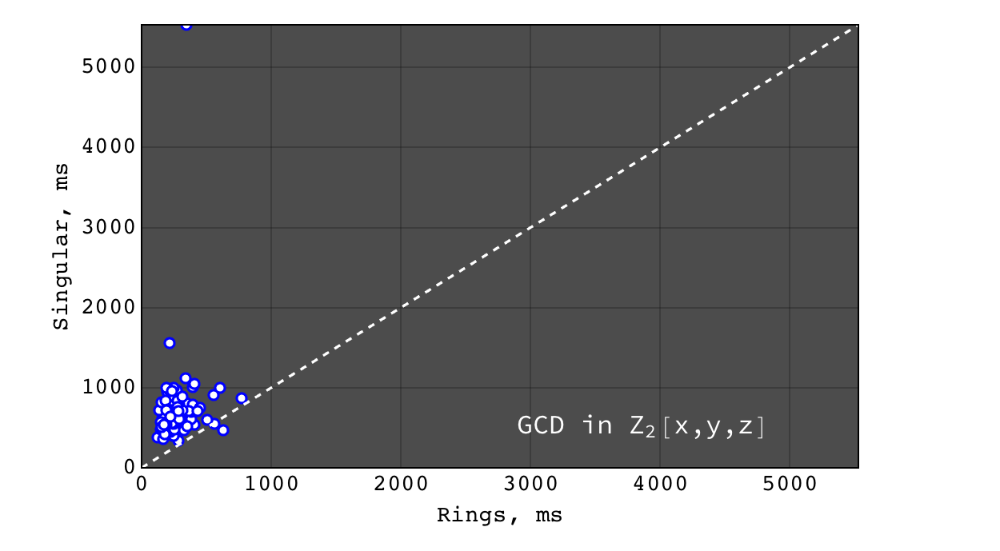

   ..

   |Rings| vs |Singular| performance of :math:`gcd(a g, b g)` for random polynomials :math:`(a, b, g) \in Z_2[x,y,z]` each with 40 terms and degree 20 in each variable

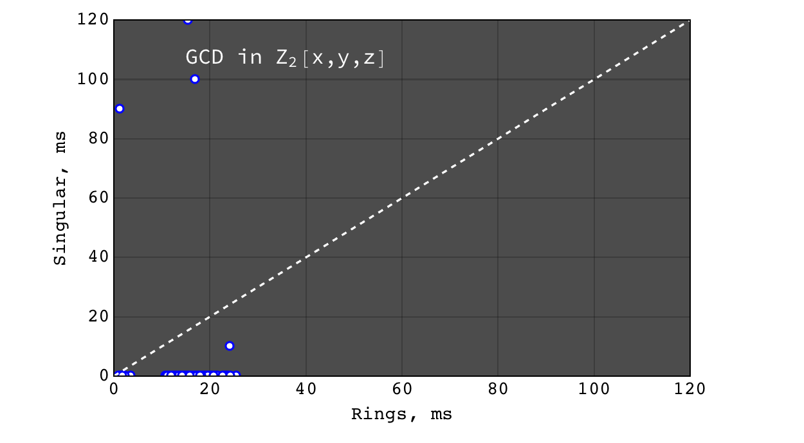

   ..

   |Rings| vs |Singular| performance of :math:`gcd(a g + 1, b g)` (coprime input) for random polynomials :math:`(a, b, g) \in Z_2[x,y,z]` each with 40 terms and degree 20 in each variable

GCD in :math:`Z_2[x_1,x_2,x_3,x_4]`
-----------------------------------

Performance of GCD in :math:`Z_2[x_1,x_2,x_3,x_4]`

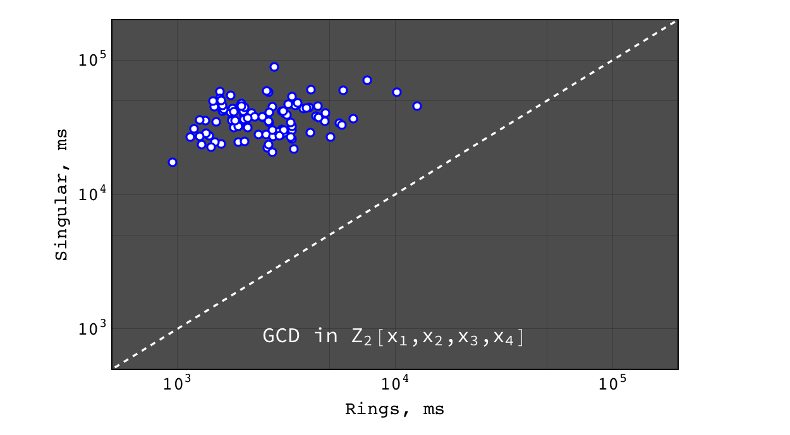

   ..

   |Rings| vs |Singular| performance of :math:`gcd(a g, b g)` for random polynomials :math:`(a, b, g) \in Z_2[x_1,x_2,x_3,x_4]` each with 40 terms and degree 20 in each variable

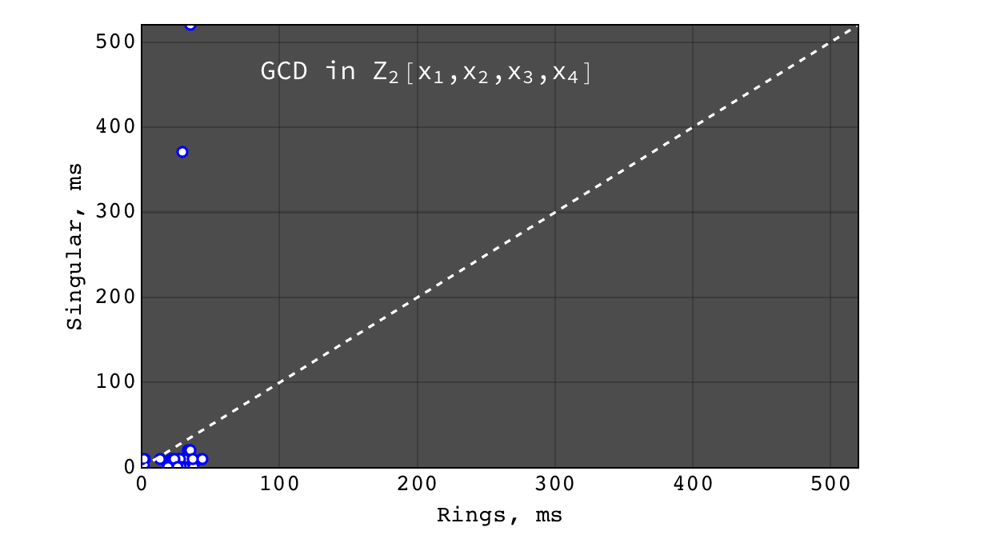

   ..

   |Rings| vs |Singular| performance of :math:`gcd(a g + 1, b g)` (coprime input) for random polynomials :math:`(a, b, g) \in Z_2[x_1,x_2,x_3,x_4]` each with 40 terms and degree 20 in each variable

GCD in :math:`Z_2[x_1,x_2,x_3,x_4, x_5]`
----------------------------------------

In all these tests |Singular| failed to obtain result within 500 seconds, while |Rings| calculated GCD within less than 5 seconds.

Multivariate GCD over :math:`Z`
^^^^^^^^^^^^^^^^^^^^^^^^^^^^^^^

GCD in :math:`Z[x,y,z]`
-----------------------

.. figure:: _static/gcd_z_3vars_rings_vs_singular.png
   :scale: 50%
   :align: center

   ..

   |Rings| vs |Singular| performance of :math:`gcd(a g, b g)` for random polynomials :math:`(a, b, g) \in Z[x,y,z]` each with 40 terms and degree 20 in each variable

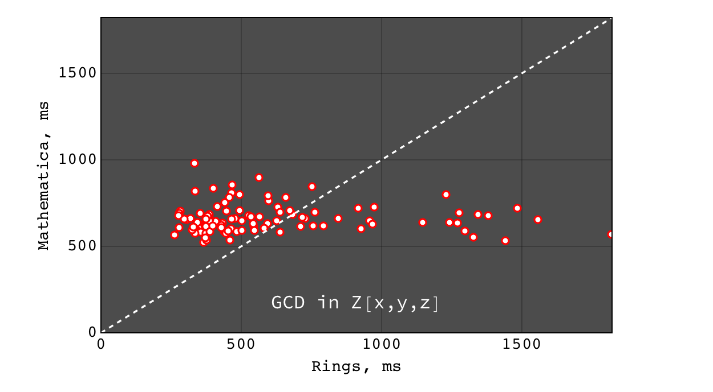
   
   ..

   |Rings| vs |Mathematica| performance of :math:`gcd(a g, b g)` for random polynomials :math:`(a, b, g) \in Z[x,y,z]` each with 40 terms and degree 20 in each variable

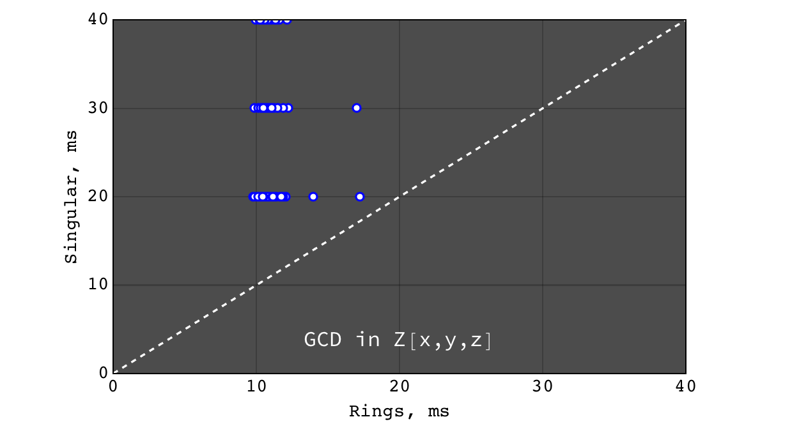

   ..

   |Rings| vs |Singular| performance of :math:`gcd(a g + 1, b g)` (coprime input) for random polynomials :math:`(a, b, g) \in Z[x,y,z]` each with 40 terms and degree 20 in each variable

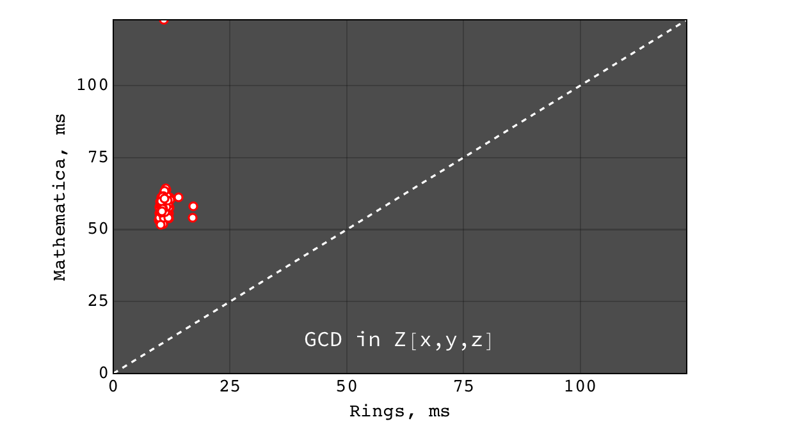
   
   ..

   |Rings| vs |Mathematica| performance of :math:`gcd(a g + 1, b g)` (coprime input) for random polynomials :math:`(a, b, g) \in Z[x,y,z]` each with 40 terms and degree 20 in each variable

GCD in :math:`Z[x_1,x_2,x_3,x_4]`
-----------------------------------

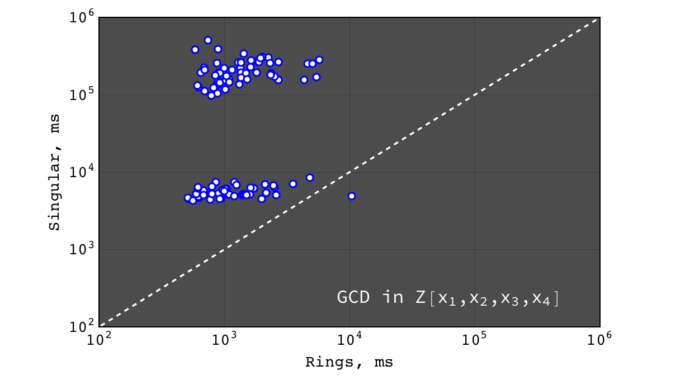

   ..

   |Rings| vs |Singular| performance of :math:`gcd(a g, b g)` for random polynomials :math:`(a, b, g) \in Z[x_1,x_2,x_3,x_4]` each with 40 terms and degree 20 in each variable

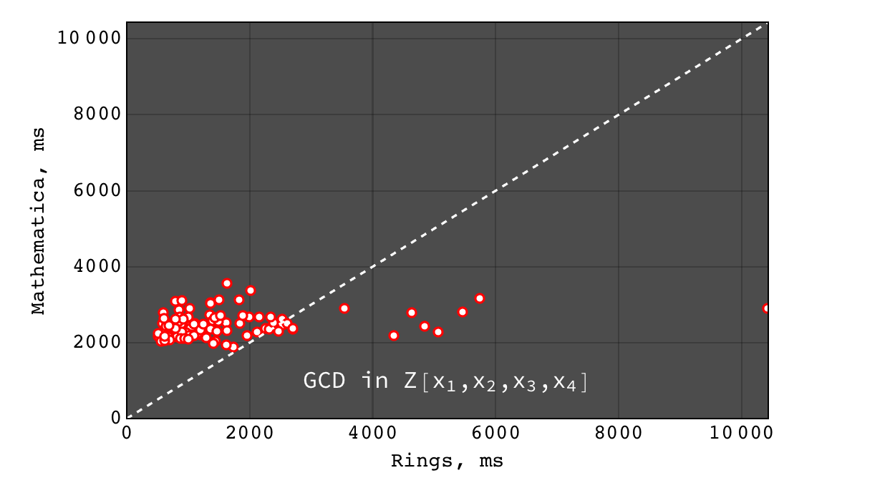
   
   ..

   |Rings| vs |Mathematica| performance of :math:`gcd(a g, b g)` for random polynomials :math:`(a, b, g) \in Z[x_1,x_2,x_3,x_4]` each with 40 terms and degree 20 in each variable

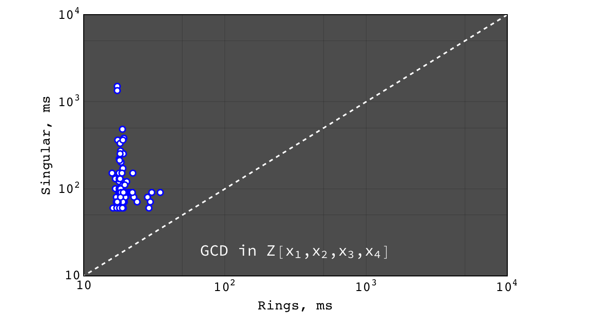

   ..

   |Rings| vs |Singular| performance of :math:`gcd(a g + 1, b g)` (coprime input) for random polynomials :math:`(a, b, g) \in Z[x_1,x_2,x_3,x_4]` each with 40 terms and degree 20 in each variable

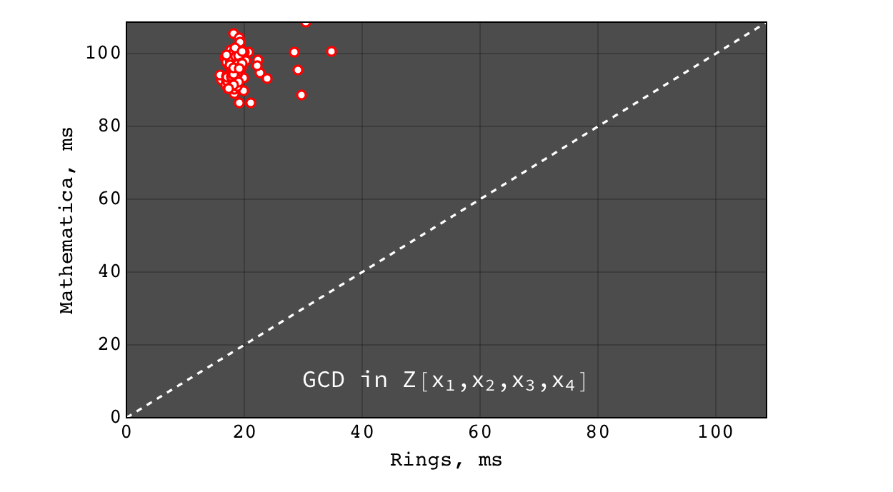
   
   ..

   |Rings| vs |Mathematica| performance of :math:`gcd(a g + 1, b g)` (coprime input) for random polynomials :math:`(a, b, g) \in Z[x_1,x_2,x_3,x_4]` each with 40 terms and degree 20 in each variable

GCD in :math:`Z[x_1,x_2,x_3,x_4,x_5]`
--------------------------------------

.. figure:: _static/gcd_z_5vars_rings_vs_singular.png
   :scale: 50%
   :align: center

   ..

   |Rings| vs |Singular| performance of :math:`gcd(a g, b g)` for random polynomials :math:`(a, b, g) \in Z[x_1,x_2,x_3,x_4,x_5]` each with 40 terms and degree 20 in each variable

.. figure:: _static/gcd_z_5vars_rings_vs_wolfram.png
   :scale: 50%
   :align: center
   
   ..

   |Rings| vs |Mathematica| performance of :math:`gcd(a g, b g)` for random polynomials :math:`(a, b, g) \in Z[x_1,x_2,x_3,x_4,x_5]` each with 40 terms and degree 20 in each variable

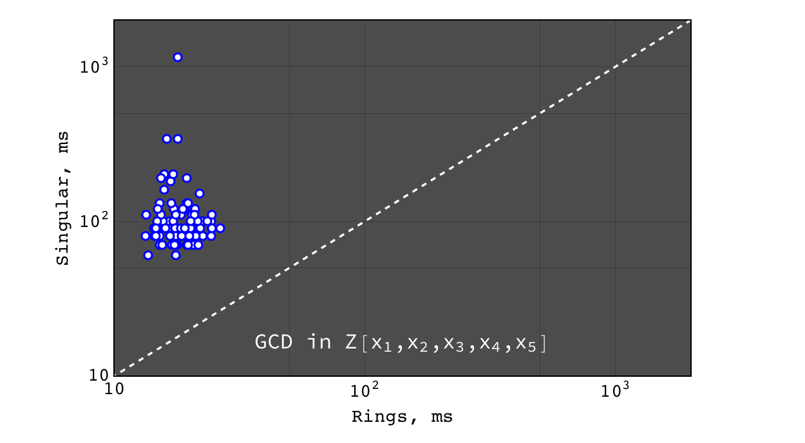
   
   ..

   |Rings| vs |Singular| performance of :math:`gcd(a g + 1, b g)` (coprime input) for random polynomials :math:`(a, b, g) \in Z[x_1,x_2,x_3,x_4,x_5]` each with 40 terms and degree 20 in each variable

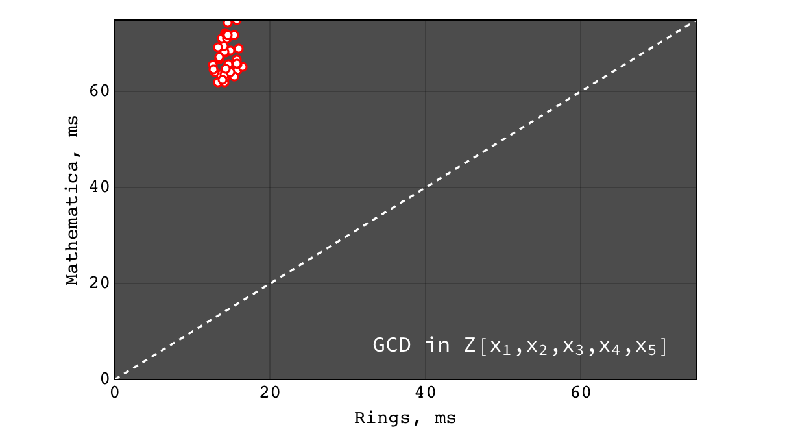
   
   ..

   |Rings| vs |Mathematica| performance of :math:`gcd(a g + 1, b g)` (coprime input) for random polynomials :math:`(a, b, g) \in Z[x_1,x_2,x_3,x_4,x_5]` each with 40 terms and degree 20 in each variable

GCD in :math:`Z[x_1,x_2,x_3,x_4,x_5,x_6]`
-----------------------------------------

In all these tests |Singular| failed to obtain result within 500 seconds, so we present only |Rings| vs |Mathematica| comparison.

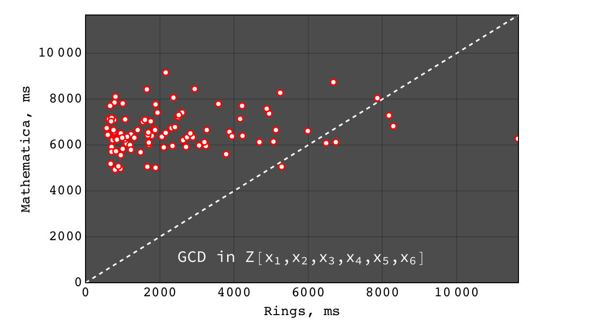
   
   ..

   |Rings| vs |Mathematica| performance of :math:`gcd(a g, b g)` for random polynomials :math:`(a, b, g) \in Z[x_1,x_2,x_3,x_4,x_5,x_6]` each with 40 terms and degree 20 in each variable

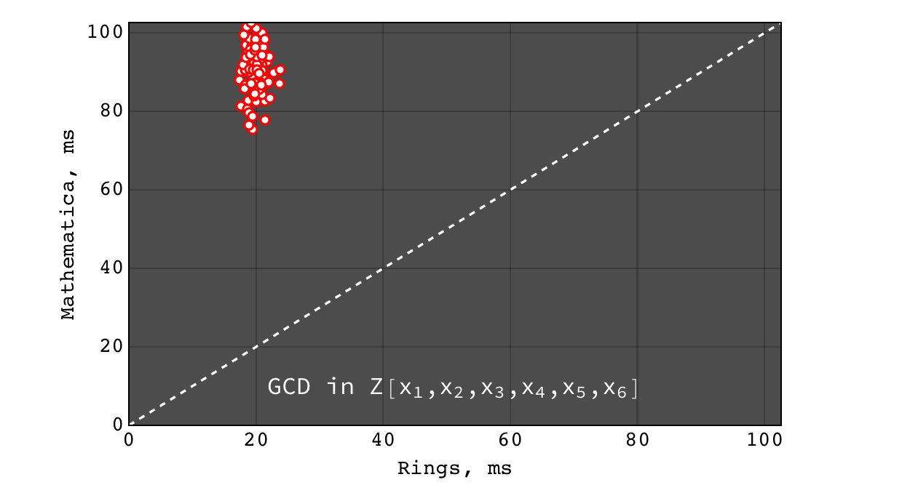
   
   ..

   |Rings| vs |Mathematica| performance of :math:`gcd(a g + 1, b g)` (coprime input) for random polynomials :math:`(a, b, g) \in Z[x_1,x_2,x_3,x_4,x_5,x_6]` each with 40 terms and degree 20 in each variable

Multivariate factorization
==========================

Multivariate factorization performance was tested on random polynomials in the following way. Three polynomials :math:`a`, :math:`b` and :math:`c` with 20 terms and degree 10 in each variable were generated at random. Then the factorizations of :math:`(a b c)` (should give at least three factors) and :math:`(a b c + 1)` (usually irreducible) were calculated.  So the input polynomials had about **~8000 terms** and **degree 30** in each variable. Tests were performed for polynomials in 3, 4, 5, 6 and 7 variables over :math:`Z`, :math:`Z_2` and :math:`Z_{524287}` ground rings. 

.. admonition:: Brief conclusion

   - for irreducible polynomials |Rings| are faster than |Singular|
   - |Rings| and |Singular| are comparably fast
   - |Rings| performs better on dense problems
   

Multivariate factorization over :math:`Z_2`
^^^^^^^^^^^^^^^^^^^^^^^^^^^^^^^^^^^^^^^^^^^

These tests were performed for |Rings| and |Singular| since |Mathematica| does not support multivariate factorization in finite fields.

Factorization in :math:`Z_2[x,y,z]`
-----------------------------------

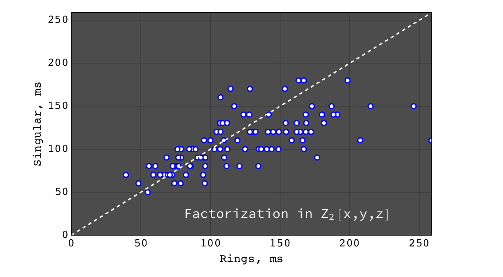

   ..

   |Rings| vs |Singular| performance of :math:`factor(a b c)` for random polynomials :math:`(a, b, c) \in Z_2[x,y,z]` each with 20 terms and degree 10 in each variable

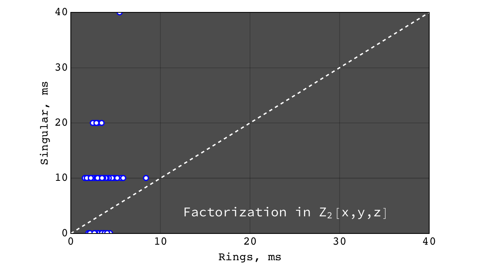
   
   ..

   |Rings| vs |Singular| performance of :math:`factor(a b c + 1)` (irreducible) for random polynomials :math:`(a, b, c) \in Z_2[x,y,z]` each with 20 terms and degree 10 in each variable

Factorization in :math:`Z_2[x_1,x_2,x_3,x_4]`
---------------------------------------------

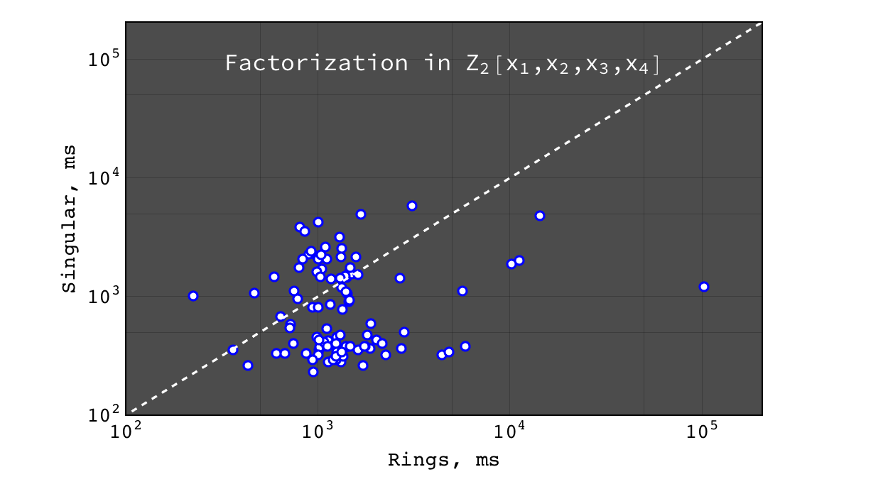

   ..

   |Rings| vs |Singular| performance of :math:`factor(a b c)` for random polynomials :math:`(a, b, c) \in Z_2[x_1,x_2,x_3,x_4]` each with 20 terms and degree 10 in each variable

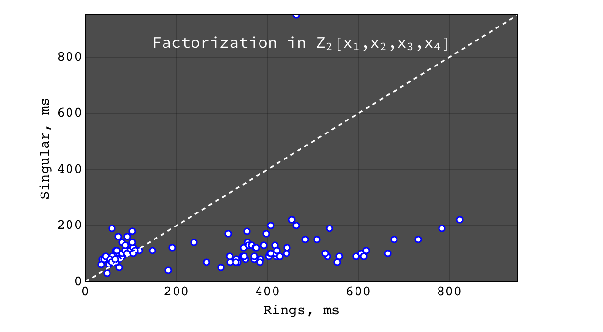
   
   ..

   |Rings| vs |Singular| performance of :math:`factor(a b c + 1)` (irreducible) for random polynomials :math:`(a, b, c) \in Z_2[x_1,x_2,x_3,x_4]` each with 20 terms and degree 10 in each variable

Factorization in :math:`Z_2[x_1,x_2,x_3,x_4,x_5]`
-------------------------------------------------

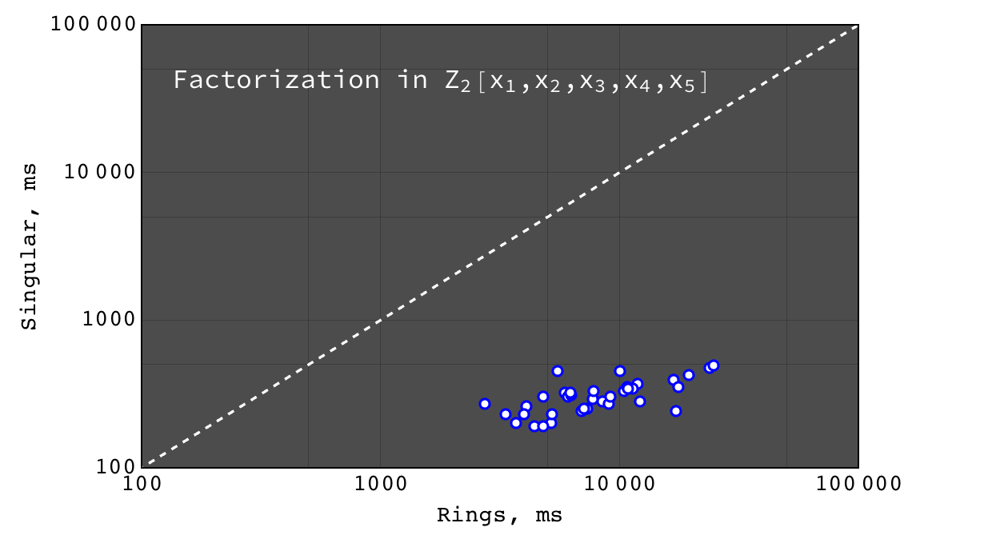

   ..

   |Rings| vs |Singular| performance of :math:`factor(a b c)` for random polynomials :math:`(a, b, c) \in Z_2[x_1,x_2,x_3,x_4,x_5]` each with 20 terms and degree 10 in each variable

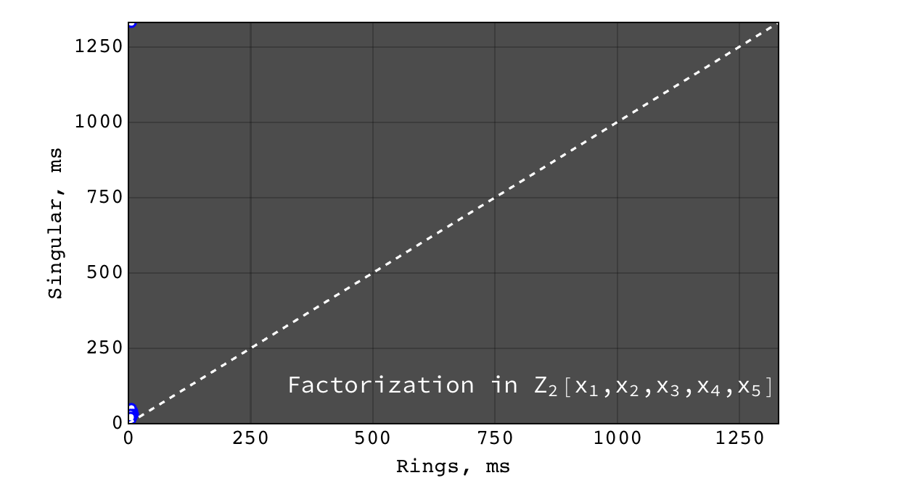
   
   ..

   |Rings| vs |Singular| performance of :math:`factor(a b c + 1)` (irreducible) for random polynomials :math:`(a, b, c) \in Z_2[x_1,x_2,x_3,x_4,x_5]` each with 20 terms and degree 10 in each variable

Factorization in :math:`Z_2[x_1,x_2,x_3,x_4,x_5,x_6]`
-----------------------------------------------------

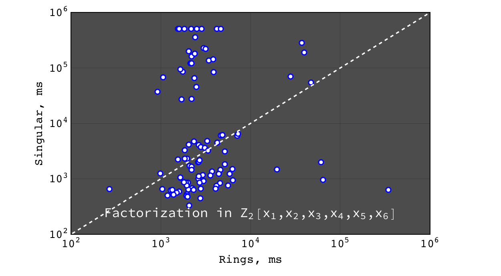

   ..

   |Rings| vs |Singular| performance of :math:`factor(a b c)` for random polynomials :math:`(a, b, c) \in Z_2[x_1,x_2,x_3,x_4,x_5,x_6]` each with 20 terms and degree 10 in each variable

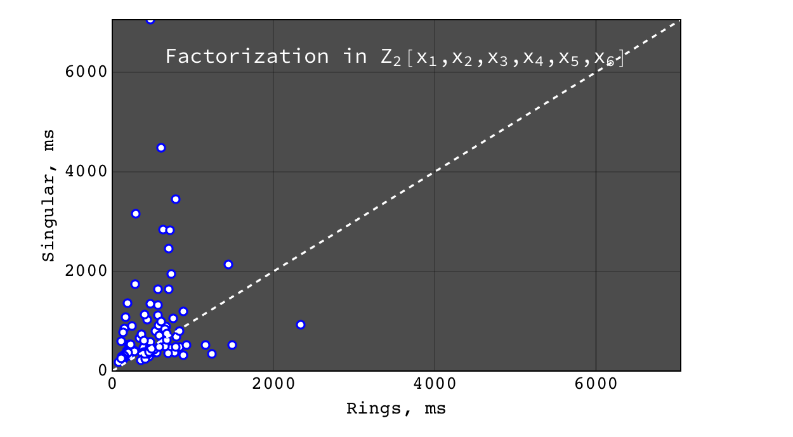
   
   ..

   |Rings| vs |Singular| performance of :math:`factor(a b c + 1)` (irreducible) for random polynomials :math:`(a, b, c) \in Z_2[x_1,x_2,x_3,x_4,x_5,x_6]` each with 20 terms and degree 10 in each variable

Factorization in :math:`Z_2[x_1,x_2,x_3,x_4,x_5,x_6,x_7]`
---------------------------------------------------------

.. figure:: _static/factor_z2_7vars_rings_vs_singular.png
   :scale: 50%
   :align: center

   ..

   |Rings| vs |Singular| performance of :math:`factor(a b c)` for random polynomials :math:`(a, b, c) \in Z_2[x_1,x_2,x_3,x_4,x_5,x_6,x_7]` each with 20 terms and degree 10 in each variable

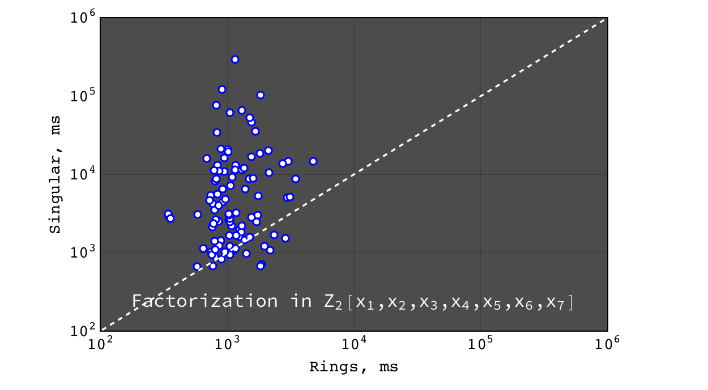
   
   ..

   |Rings| vs |Singular| performance of :math:`factor(a b c + 1)` (irreducible) for random polynomials :math:`(a, b, c) \in Z_2[x_1,x_2,x_3,x_4,x_5,x_6,x_7]` each with 20 terms and degree 10 in each variable

Multivariate factorization over :math:`Z_{524287}`
^^^^^^^^^^^^^^^^^^^^^^^^^^^^^^^^^^^^^^^^^^^^^^^^^^

Factorization in :math:`Z_{524287}[x,y,z]`
------------------------------------------

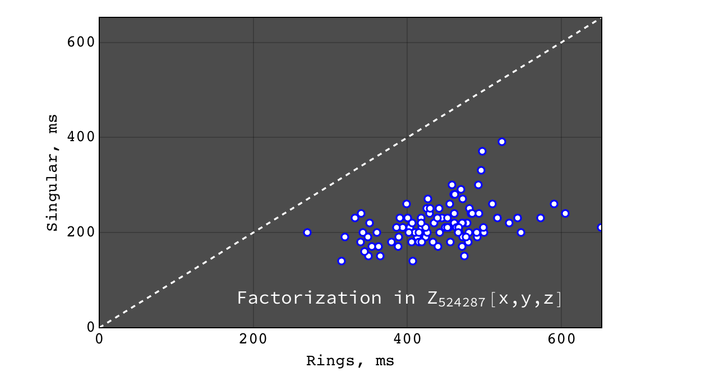

   ..

   |Rings| vs |Singular| performance of :math:`factor(a b c)` for random polynomials :math:`(a, b, c) \in Z_{524287}[x,y,z]` each with 20 terms and degree 10 in each variable

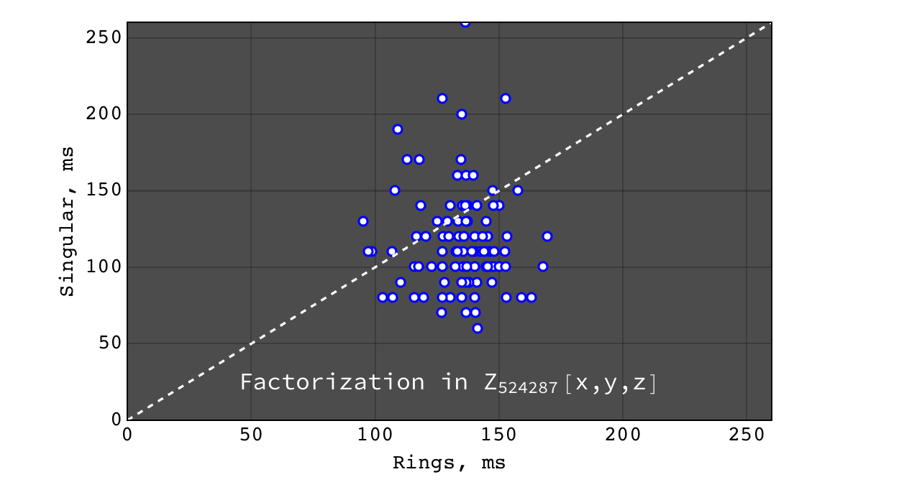
   
   ..

   |Rings| vs |Singular| performance of :math:`factor(a b c + 1)` (irreducible) for random polynomials :math:`(a, b, c) \in Z_{524287}[x,y,z]` each with 20 terms and degree 10 in each variable

Factorization in :math:`Z_{524287}[x_1,x_2,x_3,x_4]`
----------------------------------------------------

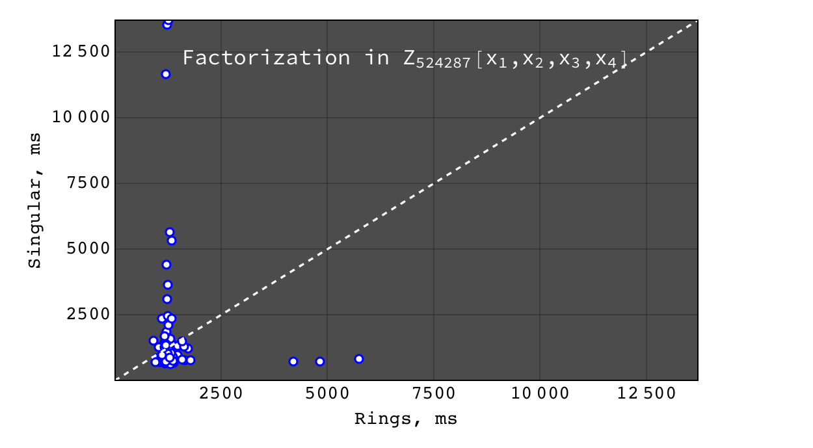

   ..

   |Rings| vs |Singular| performance of :math:`factor(a b c)` for random polynomials :math:`(a, b, c) \in Z_{524287}[x_1,x_2,x_3,x_4]` each with 20 terms and degree 10 in each variable

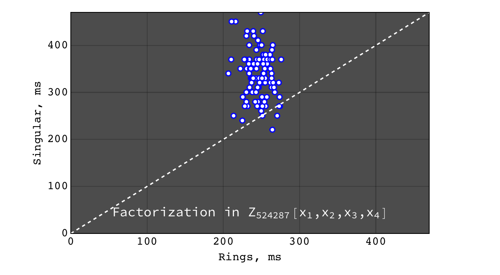
   
   ..

   |Rings| vs |Singular| performance of :math:`factor(a b c + 1)` (irreducible) for random polynomials :math:`(a, b, c) \in Z_{524287}[x_1,x_2,x_3,x_4]` each with 20 terms and degree 10 in each variable

Factorization in :math:`Z_{524287}[x_1,x_2,x_3,x_4,x_5]`
--------------------------------------------------------

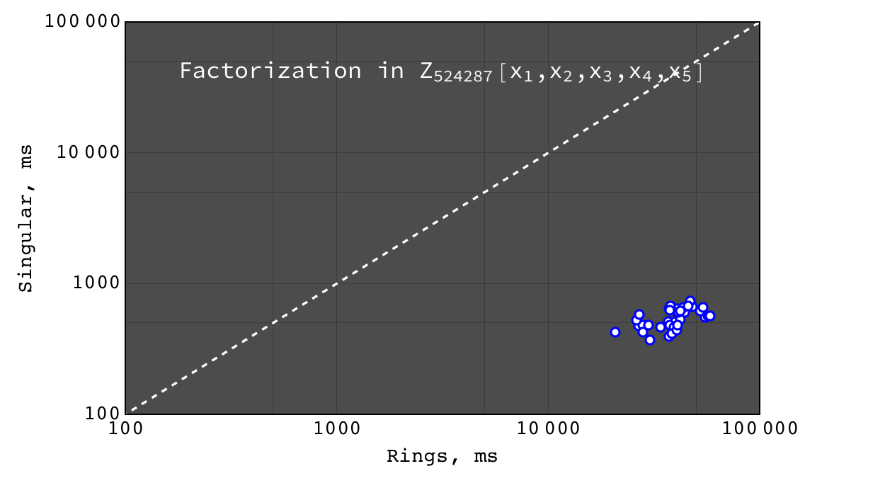

   ..

   |Rings| vs |Singular| performance of :math:`factor(a b c)` for random polynomials :math:`(a, b, c) \in Z_{524287}[x_1,x_2,x_3,x_4,x_5]` each with 20 terms and degree 10 in each variable

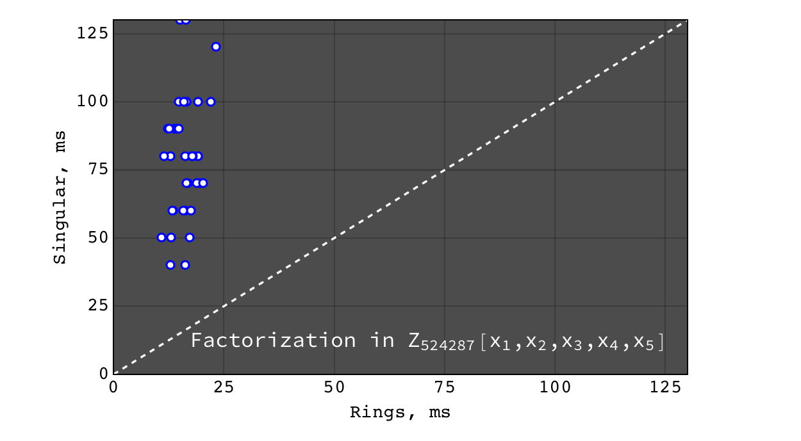
   
   ..

   |Rings| vs |Singular| performance of :math:`factor(a b c + 1)` (irreducible) for random polynomials :math:`(a, b, c) \in Z_{524287}[x_1,x_2,x_3,x_4,x_5]` each with 20 terms and degree 10 in each variable

Factorization in :math:`Z_{524287}[x_1,x_2,x_3,x_4,x_5,x_6]`
------------------------------------------------------------

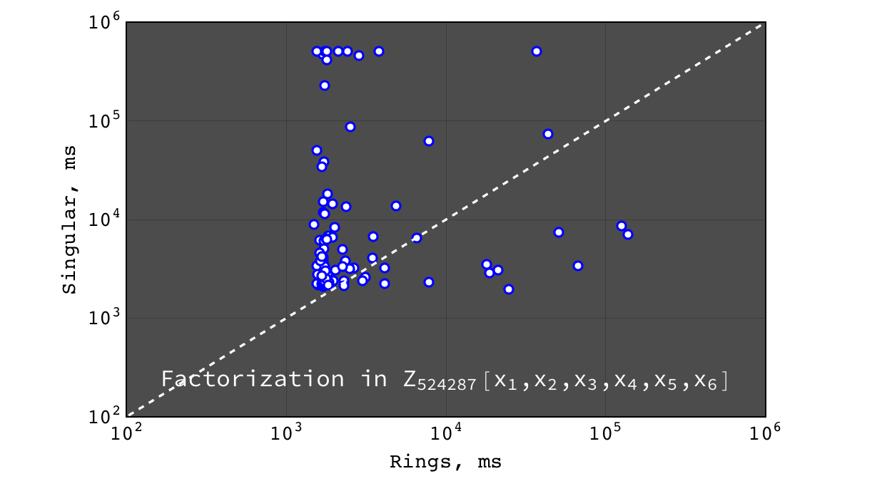

   ..

   |Rings| vs |Singular| performance of :math:`factor(a b c)` for random polynomials :math:`(a, b, c) \in Z_{524287}[x_1,x_2,x_3,x_4,x_5,x_6]` each with 20 terms and degree 10 in each variable

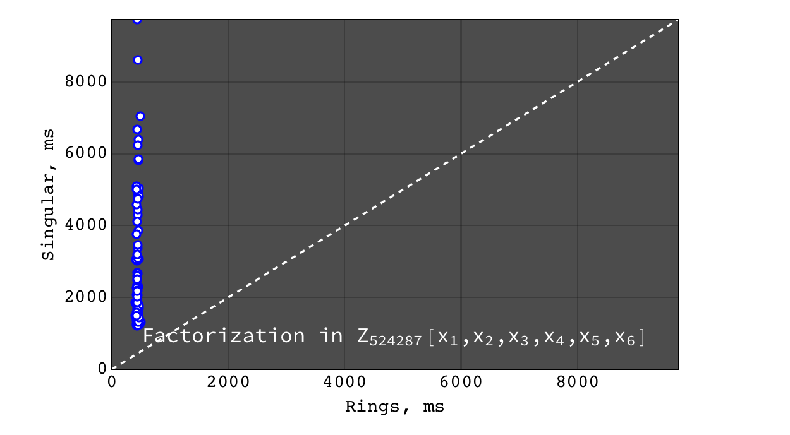
   
   ..

   |Rings| vs |Singular| performance of :math:`factor(a b c + 1)` (irreducible) for random polynomials :math:`(a, b, c) \in Z_{524287}[x_1,x_2,x_3,x_4,x_5,x_6]` each with 20 terms and degree 10 in each variable

Factorization in :math:`Z_{524287}[x_1,x_2,x_3,x_4,x_5,x_6,x_7]`
----------------------------------------------------------------

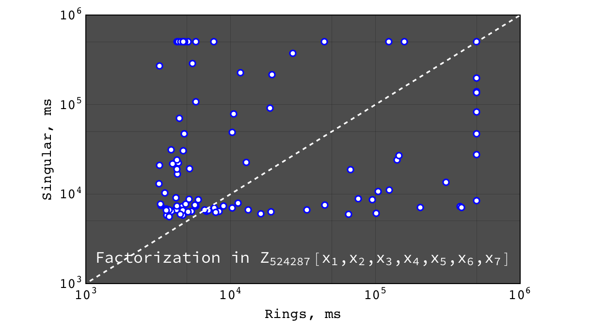

   ..

   |Rings| vs |Singular| performance of :math:`factor(a b c)` for random polynomials :math:`(a, b, c) \in Z_{524287}[x_1,x_2,x_3,x_4,x_5,x_6,x_7]` each with 20 terms and degree 10 in each variable

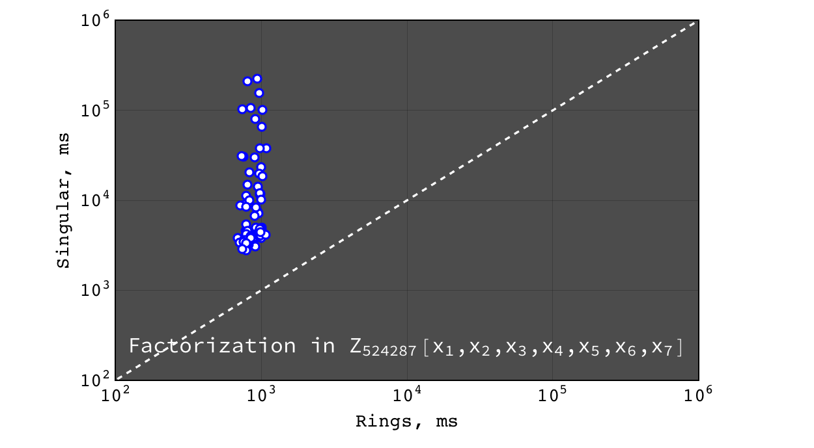
   
   ..

   |Rings| vs |Singular| performance of :math:`factor(a b c + 1)` (irreducible) for random polynomials :math:`(a, b, c) \in Z_{524287}[x_1,x_2,x_3,x_4,x_5,x_6,x_7]` each with 20 terms and degree 10 in each variable

Multivariate factorization over :math:`Z`
^^^^^^^^^^^^^^^^^^^^^^^^^^^^^^^^^^^^^^^^^

Factorization in :math:`Z[x,y,z]`
------------------------------------------

.. figure:: _static/factor_z_3vars_rings_vs_singular.png
   :scale: 50%
   :align: center

   ..

   |Rings| vs |Singular| performance of :math:`factor(a b c)` for random polynomials :math:`(a, b, c) \in Z[x,y,z]` each with 20 terms and degree 10 in each variable

.. figure:: _static/factor_z_3vars_rings_vs_wolfram.png
   :scale: 50%
   :align: center

   ..

   |Rings| vs |Mathematica| performance of :math:`factor(a b c)` for random polynomials :math:`(a, b, c) \in Z[x,y,z]` each with 20 terms and degree 10 in each variable

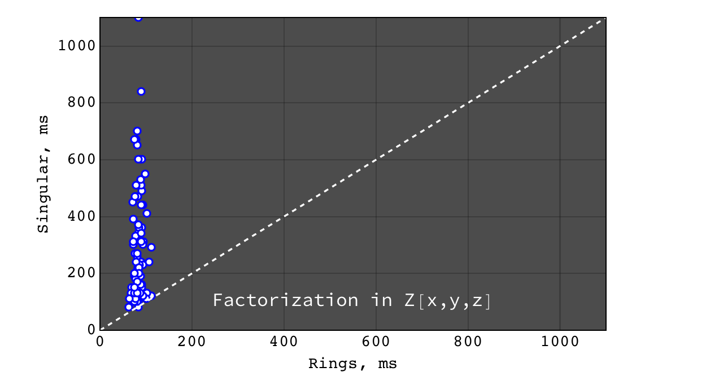

   ..

   |Rings| vs |Singular| performance of :math:`factor(a b c + 1)` (irreducible) for random polynomials :math:`(a, b, c) \in Z[x,y,z]` each with 20 terms and degree 10 in each variable

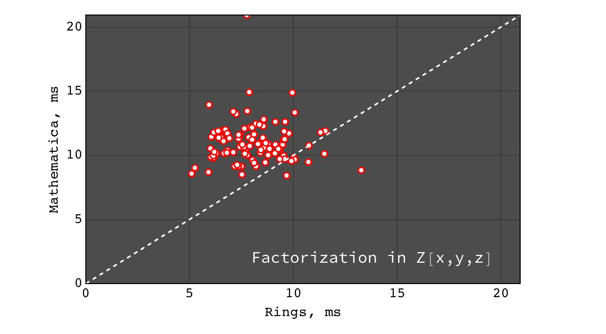

   ..

   |Rings| vs |Mathematica| performance of :math:`factor(a b c + 1)` (irreducible) for random polynomials :math:`(a, b, c) \in Z[x,y,z]` each with 20 terms and degree 10 in each variable

Factorization in :math:`Z[x_1,x_2,x_3,x_4]`
-------------------------------------------

For non-trivial factorization problems, |Mathematica| failed to obtain result in a reasonable time, so it is not shown here.

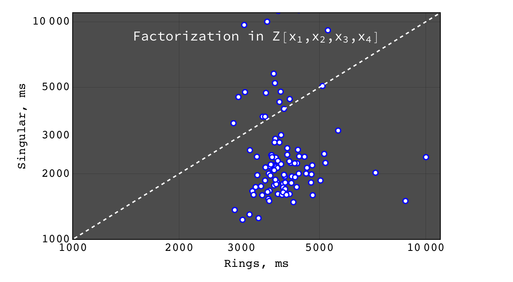

   ..

   |Rings| vs |Singular| performance of :math:`factor(a b c)` for random polynomials :math:`(a, b, c) \in Z[x_1,x_2,x_3,x_4]` each with 20 terms and degree 10 in each variable

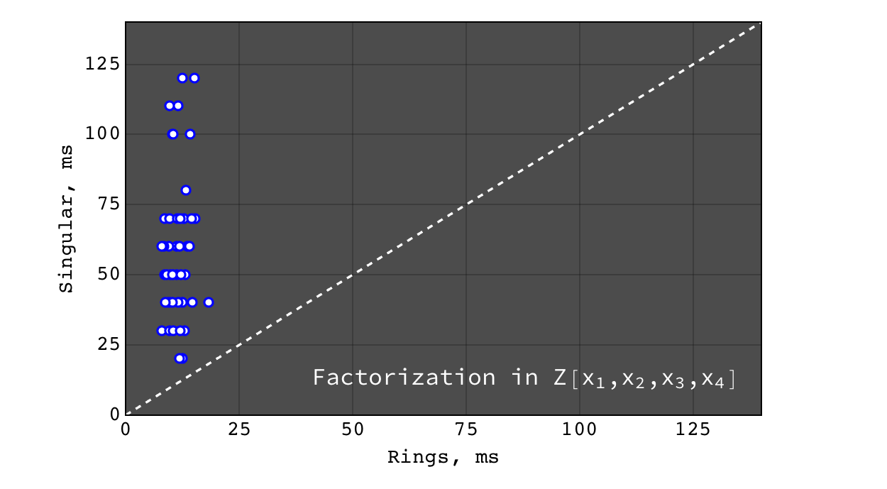

   ..

   |Rings| vs |Singular| performance of :math:`factor(a b c + 1)` (irreducible) for random polynomials :math:`(a, b, c) \in Z[x_1,x_2,x_3,x_4]` each with 20 terms and degree 10 in each variable

Factorization in :math:`Z[x_1,x_2,x_3,x_4,x_5]`
-----------------------------------------------

|Mathematica| failed to obtain result in a reasonable time, so it is not shown here.

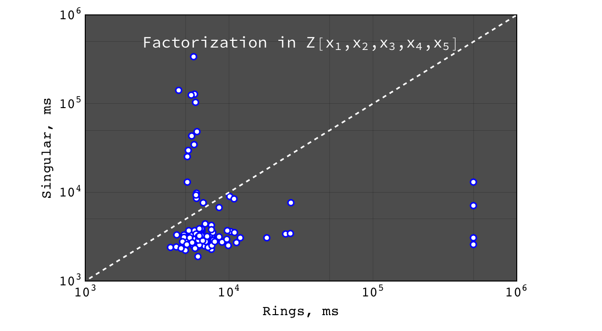

   ..

   |Rings| vs |Singular| performance of :math:`factor(a b c)` for random polynomials :math:`(a, b, c) \in Z[x_1,x_2,x_3,x_4,x_5]` each with 20 terms and degree 10 in each variable

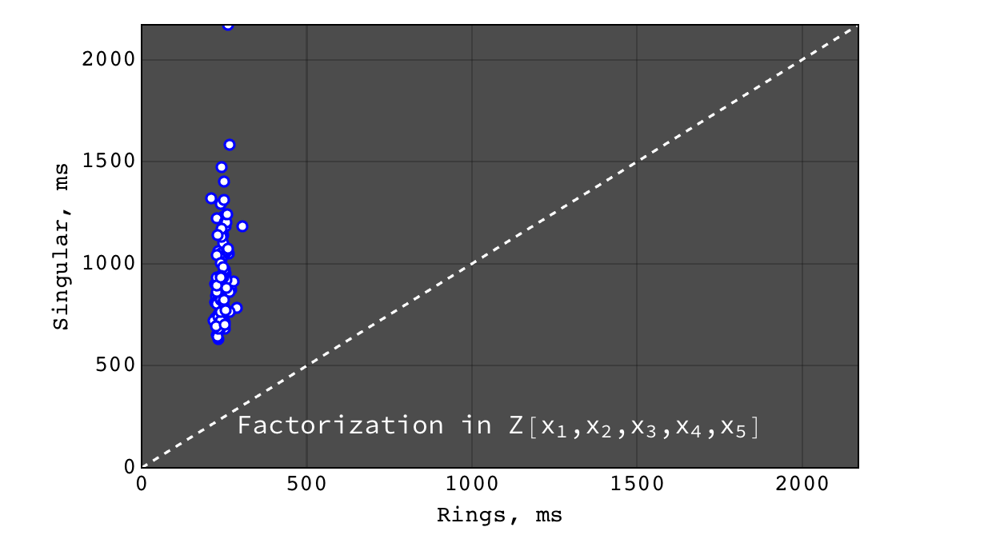

   ..

   |Rings| vs |Singular| performance of :math:`factor(a b c + 1)` (irreducible) for random polynomials :math:`(a, b, c) \in Z[x_1,x_2,x_3,x_4,x_5]` each with 20 terms and degree 10 in each variable

Factorization in :math:`Z[x_1,x_2,x_3,x_4,x_5,x_6]`
---------------------------------------------------

|Mathematica| failed to obtain result in a reasonable time, so it is not shown here.

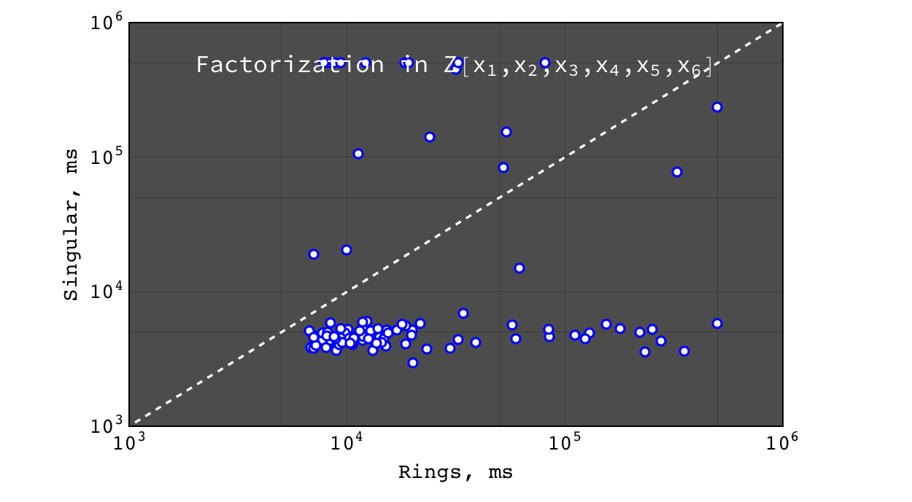

   ..

   |Rings| vs |Singular| performance of :math:`factor(a b c)` for random polynomials :math:`(a, b, c) \in Z[x_1,x_2,x_3,x_4,x_5,x_6]` each with 20 terms and degree 10 in each variable

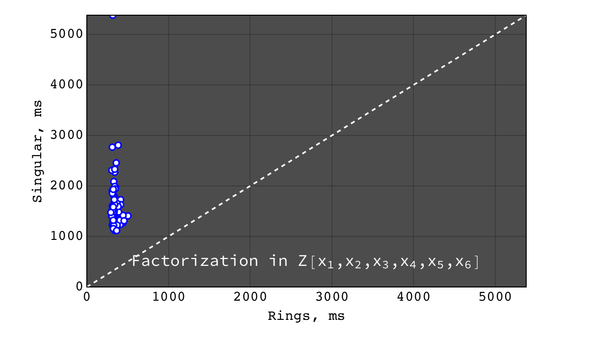

   ..

   |Rings| vs |Singular| performance of :math:`factor(a b c + 1)` (irreducible) for random polynomials :math:`(a, b, c) \in Z[x_1,x_2,x_3,x_4,x_5,x_6]` each with 20 terms and degree 10 in each variable

Factorization in :math:`Z[x_1,x_2,x_3,x_4,x_5,x_6,x_7]`
-------------------------------------------------------

|Mathematica| failed to obtain result in a reasonable time, so it is not shown here.

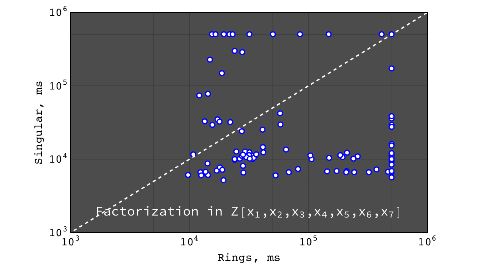

   ..

   |Rings| vs |Singular| performance of :math:`factor(a b c)` for random polynomials :math:`(a, b, c) \in Z[x_1,x_2,x_3,x_4,x_5,x_6,x_7]` each with 20 terms and degree 10 in each variable

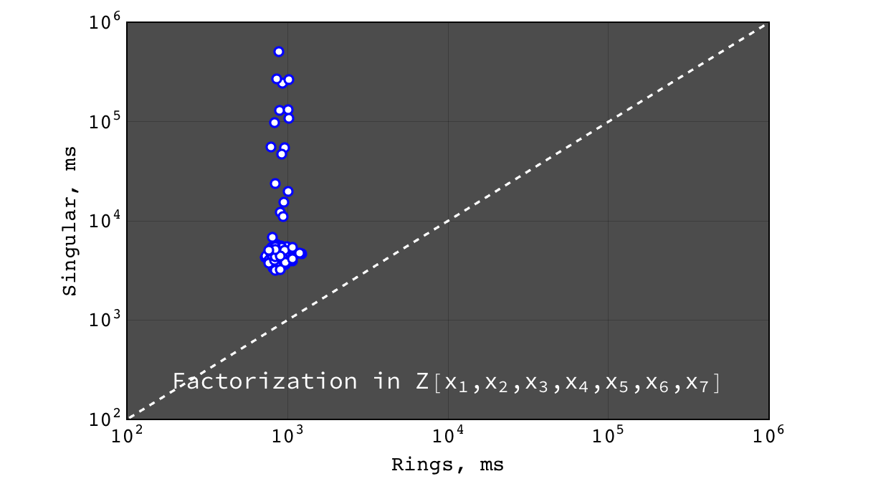

   ..

   |Rings| vs |Singular| performance of :math:`factor(a b c + 1)` (irreducible) for random polynomials :math:`(a, b, c) \in Z[x_1,x_2,x_3,x_4,x_5,x_6,x_7]` each with 20 terms and degree 10 in each variable

Multivariate factorization on large not very sparse polynomials
^^^^^^^^^^^^^^^^^^^^^^^^^^^^^^^^^^^^^^^^^^^^^^^^^^^^^^^^^^^^^^^

To check how the above plots obtained with random polynomials scale to a really huge and more dense input, the following factorizations were tested.

Factor

.. math::

   poly = (1 + 3 x_1 + 5 x_2 + 7 x_3 + 9 x_4 + 11 x_5 + 13 x_6 + 15 x_7)^{15} - 1

over :math:`Z`, :math:`Z_2` and :math:`Z_{524287}` coefficient rings:

+--------------------+---------+------------+---------------+
| Coefficient ring   | |Rings| | |Singular| | |Mathematica| |
+====================+=========+============+===============+
| :math:`Z`          |  55s    |  20s       |  271s         |
+--------------------+---------+------------+---------------+
| :math:`Z_2`        |  250ms  |  > 1 hour  |  N/A          |
+--------------------+---------+------------+---------------+
| :math:`Z_{524287}` |  28s    |  109s      |  N/A          |
+--------------------+---------+------------+---------------+

Factor

.. math::
   
   poly = (1 + 3ab + 5bc + 7cd + 9de + 11ef + 13fg + 15ga)^3\\
          \quad \times (1 + 3ac + 5bd + 7ce + 9fe + 11gf + 13fa + 15gb)^3\\
           \quad \quad \times (1 + 3ad + 5be + 7cf + 9fg + 11ga + 13fb + 15gc)^3\\
       \quad \quad \quad  -1

over :math:`Z`, :math:`Z_2` and :math:`Z_{524287}` coefficient rings:

+--------------------+---------+------------+---------------+
| Coefficient ring   | |Rings| | |Singular| | |Mathematica| |
+====================+=========+============+===============+
| :math:`Z`          | 23s     |  12s       |  206s         |
+--------------------+---------+------------+---------------+
| :math:`Z_2`        | 6s      |  3s        |  N/A          |
+--------------------+---------+------------+---------------+
| :math:`Z_{524287}` | 26s     |  9s        |  N/A          |
+--------------------+---------+------------+---------------+

Univariate factorization
========================

Performance of univariate factorization was compared to |NTL|, |FLINT| and |Mathematica|. Polynomials in :math:`Z_{17}[x]` of the form:

.. math::

   p_{deg} = 1 + \sum_{i = 1}^{i \leq deg} i \times x^i

were used. 

.. figure:: _static/bench_fac_uni_Zp_flint_ntl.png
   :scale: 50%
   :align: center

At small degrees the performance is identical, while at large degrees NTL and FLINT have much better asymptotic, probably due to more advanced algorithms for polynomial multiplication.
