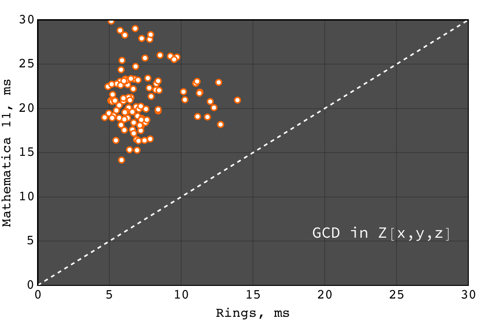
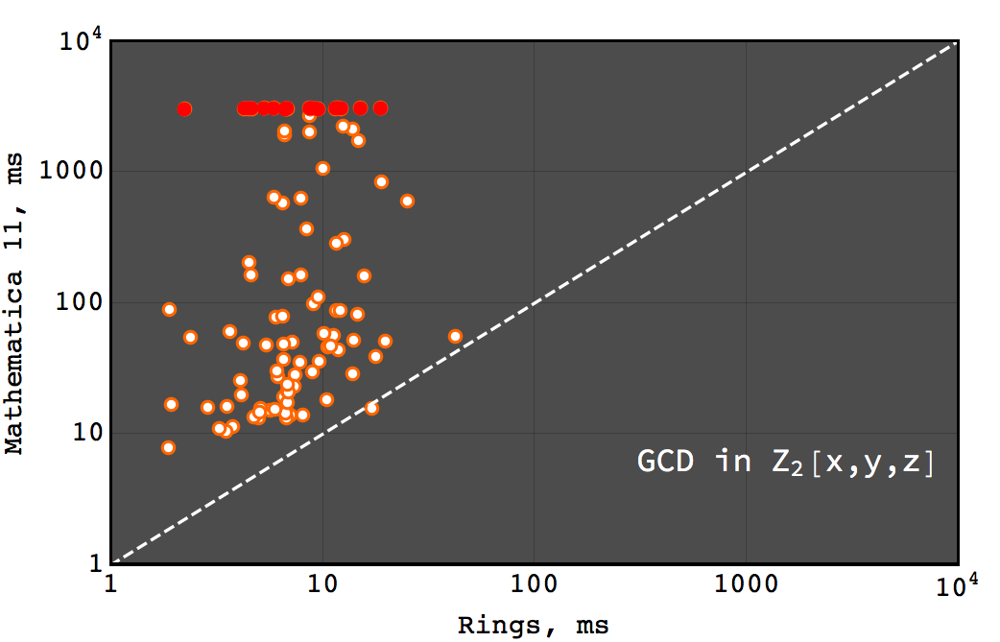
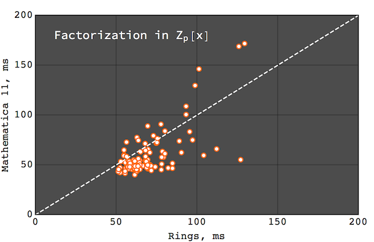
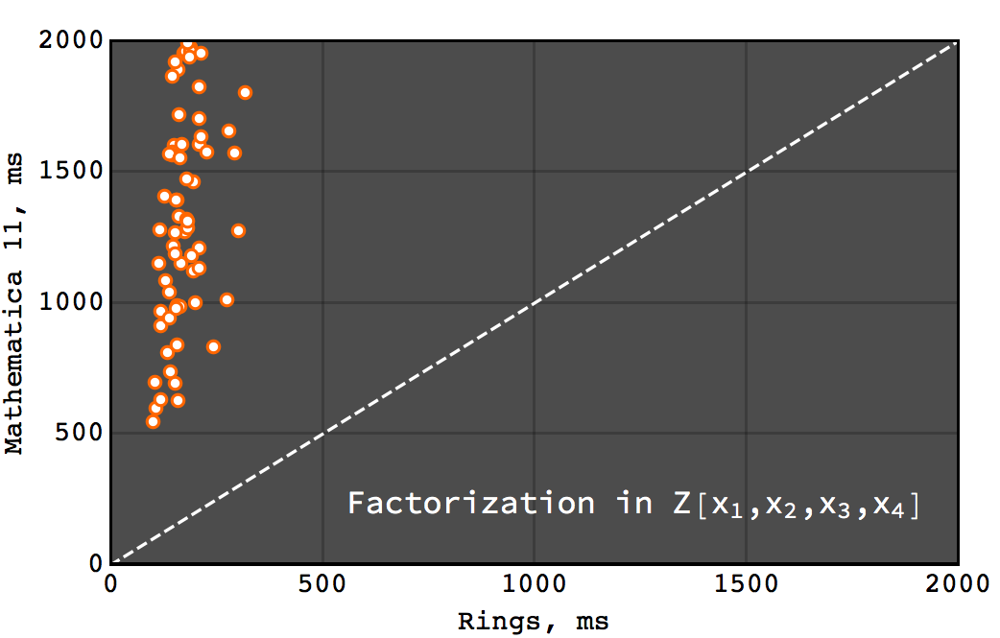

.. |br| raw:: html

    

.. _ref-quickstart:

==========
Quick Tour
==========

Set up
======

Interactive Rings shell
^^^^^^^^^^^^^^^^^^^^^^^

To taste what |Rings| can do, one can try interactive |Rings| session with `Ammonite REPL <http://ammonite.io>`_. Type the following commands at the prompt to install |Rings|\ *.repl*:

.. code-block:: bash

	$ sudo curl -L -o /usr/local/bin/amm https://git.io/v5Tct && sudo chmod +x /usr/local/bin/amm
	$ sudo curl -L -o /usr/local/bin/rings.repl https://git.io/vdQ6P && chmod +x /usr/local/bin/rings.repl

and run:

.. code-block:: scala

	$ rings.repl
	Loading...
	Rings 2.0: efficient Java/Scala library for polynomial rings

	@ implicit val ring = MultivariateRing(Z, Array("x", "y", "z"))
	ring: MultivariateRing[IntZ] = MultivariateRing(Z, Array("x", "y", "z"), LEX)

	@ val poly1 = ring("x + y - z").pow(8) 
	poly1: MultivariatePolynomial[IntZ] = z^8-8*y*z^7+28*y^2*z^6-56*y^3*z^5+70*y^4*z^4-56...

	@ val poly2 = ring("x - y + z").pow(8) 
	poly1: MultivariatePolynomial[IntZ] = z^8-8*y*z^7+28*y^2*z^6-56*y^3*z^5+70*y^4*z^4-56...

	@ Factor(poly1 - poly2)
	res13: FactorDecomposition[MultivariatePolynomial[IntZ]] = 16*x*(-z+y)*(z^2-2*y*z+y^2+x^2)*(z^4-4*y*z^3+6*y^2*z^2-4*y^3*z+y^4+6*x^2*z^2-12*x^2*y*z+6*x^2*y^2+x^4)

Java/Scala library
^^^^^^^^^^^^^^^^^^

|Rings| are currently available for Java and Scala. To get started with Scala SBT, simply add the following dependence to your ``build.sbt`` file:

.. code-block:: scala

	libraryDependencies += "cc.redberry" % "rings.scaladsl" % "2.0"

For using |Rings| solely in Java there is Maven artifact:

.. code-block:: xml

	<dependency>
	    <groupId>cc.redberry</groupId>
	    <artifactId>rings</artifactId>
	    <version>2.0</version>
	</dependency>

Examples: algebra, GCDs, factorization
======================================

Below examples can be evaluated directly in the |Rings|\ *.repl*. For Scala/Java the following preambula will import all required things from |Rings| library:

.. tabs::

   .. code-tab:: scala

   		import cc.redberry.rings

   		import rings.poly.PolynomialMethods._
		import rings.scaladsl._
		import syntax._

   .. code-tab:: java

		import cc.redberry.rings.*;
		import cc.redberry.rings.poly.*;
		import cc.redberry.rings.poly.univar.*;
		import cc.redberry.rings.poly.multivar.*;
		import cc.redberry.rings.bigint.BigInteger;

		import static cc.redberry.rings.poly.PolynomialMethods.*;
		import static cc.redberry.rings.Rings.*;

----

Do some algebra in Galois field :math:`GF(17^{9})`:

.. tabs::

   .. code-tab:: scala

   		// GF(17^9) (irreducible poly in Z/17[x] will be generated automaticaly)
   		implicit val ring = GF(17, 9, "x")

   		// some random element from ring
   		val a = ring.randomElement()
   		val b = a.pow(1000)
   		val c = 1 / b

   		assert ( b * c === 1)

   		// explicitly parse ring element from string
   		val d = ring("1 + x + x^2 + x^3 + 15*x^999")
   		// do some math ops
		val some = a / (b + c) + a.pow(6) - a * b * c * d

   .. code-tab:: java

   		// GF(17^9) (irreducible poly in Z/17[x] will be generated automaticaly)
		FiniteField<UnivariatePolynomialZp64> ring = GF(17, 9);

		// some random element from ring
		UnivariatePolynomialZp64 a = ring.randomElement();
		UnivariatePolynomialZp64 b = ring.pow(a, 1000);
		UnivariatePolynomialZp64 c = ring.reciprocal(b);

		assert ring.multiply(b, c).isOne();

		// explicitly parse ring element from string
		UnivariatePolynomialZp64 d = ring.parse("1 + x + x^2 + x^3 + 15*x^999");
		// do some math ops
		UnivariatePolynomialZp64 some = ring.add(
				ring.divideExact(a, ring.add(b, c)),
				ring.pow(a, 6),
				ring.negate(ring.multiply(a, b, c, d)));

----

Some math with multivariate polynomials from :math:`Z[x, y, z]`:

.. tabs::

   .. code-tab:: scala

		// Z[x, y, z]
		implicit val ring = MultivariateRing(Z, Array("x", "y", "z")) 

		val (x, y, z) = ring("x", "y", "z") 

		// do some math
		val a = (x + y + z).pow(2) - 1 
		val b = (x - y - z - 1).pow(2) + x + y + z - 1 
		val c = (a + b + 1).pow(9) - a - b - 1

		// reduce c modulo a and b (multivariate division with remainder)
		val (div1, div2, rem) = c /%/% (a, b)

   .. code-tab:: java

		// Z[x, y, z]
		MultivariateRing<MultivariatePolynomial<BigInteger>> ring = MultivariateRing(3, Z);

		MultivariatePolynomial<BigInteger>
		        x = ring.variable(0),
		        y = ring.variable(1),
		        z = ring.variable(2);

		// do some math
		MultivariatePolynomial<BigInteger> a = ring.decrement(ring.pow(ring.add(x, y, z), 2));
		MultivariatePolynomial<BigInteger> b = ring.add(
		        ring.pow(ring.add(x, ring.negate(y), ring.negate(z), ring.getNegativeOne()), 2),
		        x, y, z, ring.getNegativeOne());
		MultivariatePolynomial<BigInteger> c = ring.add(
		        ring.pow(ring.add(a, b, ring.getOne()), 9),
		        ring.negate(a), ring.negate(b), ring.getNegativeOne());

		// reduce c modulo a and b (multivariate division with remainder)
		MultivariatePolynomial<BigInteger>[] divRem = MultivariateDivision.divideAndRemainder(c, a, b);
		MultivariatePolynomial<BigInteger>
		        div1 = divRem[0],
		        div2 = divRem[1],
		        rem = divRem[2];

----

Univariate extended GCD in :math:`Z_{17}[x]`:

.. tabs::

   .. code-tab:: scala

   		// ring Z/17[x]
		implicit val ring = UnivariateRingZp64(17, "x")

		val x = ring("x")
		
		val poly1 = 1 + x + x.pow(2) + x.pow(3)
		val poly2 = 1 + 2 * x + 9 * x.pow(2)
		val (gcd, s, t) = PolynomialExtendedGCD(poly1, poly2).tuple3

		println((gcd, s, t))

   .. code-tab:: java

		UnivariatePolynomialZp64
		        a = UnivariatePolynomialZ64.create(1, 1, 1, 1).modulus(17),
		        b = UnivariatePolynomialZ64.create(1, 2, 9).modulus(17);

		UnivariatePolynomialZp64[] xgcd = PolynomialExtendedGCD(a, b);

		System.out.println(Arrays.toString(xgcd));

----

Multivariate GCD in :math:`Z[a, b, c]`:

.. tabs::

   .. code-tab:: scala

   		// ring Z[a, b, c]
		implicit val ring = MultivariateRing(Z, Array("a", "b", "c"))

		val poly1 = ring("-b-b*c-b^2+a+a*c+a^2")
		val poly2 = ring("b^2+b^2*c+b^3+a*b^2+a^2+a^2*c+a^2*b+a^3")

		val gcd   = PolynomialGCD(poly1, poly2)

		println(s"gcd: ${ring show gcd}")

   .. code-tab:: java

   		String[] vars = {"a", "b", "c"};
		MultivariatePolynomial<BigInteger>
		        a = MultivariatePolynomial.parse("-b-b*c-b^2+a+a*c+a^2", Rings.Z, vars),
		        b = MultivariatePolynomial.parse("b^2+b^2*c+b^3+a*b^2+a^2+a^2*c+a^2*b+a^3", Rings.Z, vars);

		MultivariatePolynomial<BigInteger> gcd = PolynomialGCD(a, b);

		System.out.println(gcd);

----

Factor polynomial in :math:`Z_{17}[x]`:

.. tabs::

   .. code-tab:: scala

		// ring Z/17[x]
		implicit val ring = UnivariateRingZp64(17, "x")x

		val poly = ring("4 + 8*x + 12*x^2 + 5*x^5 - x^6 + 10*x^7 + x^8")

		// factorize poly
		val factors = Factor(poly)

		println(factors)

   .. code-tab:: java

		// the modulus
		long modulus = 17;
		// parse univariate poly over Z/17 from string
		UnivariatePolynomialZp64 poly = UnivariatePolynomialZp64
		    .parse("4 + 8*x + 12*x^2 + 5*x^5 - x^6 + 10*x^7 + x^8", modulus);

		// factorize poly
		FactorDecomposition<UnivariatePolynomialZp64> factors = Factor(poly);

		System.out.println(factors);

Coefficient rings with arbitrary large characteristic are available:

.. tabs::

   .. code-tab:: scala

		// coefficient ring Z/1237940039285380274899124357 (the next prime to 2^100)
		val modulus = Z("1267650600228229401496703205653")
		val cfRing  = Zp(modulus)

		// ring Z/1237940039285380274899124357[x]
		implicit val ring = UnivariateRing(cfRing, "x")

		val poly = ring("4 + 8*x + 12*x^2 + 5*x^5 + 16*x^6 + 27*x^7 + 18*x^8")
		
		println(Factor(poly))

   .. code-tab:: java

		// coefficient ring Z/1237940039285380274899124357 (the next prime to 2^100)
		IntegersZp cfRing = Zp(new BigInteger("1267650600228229401496703205653"));

		UnivariatePolynomial<BigInteger> poly = UnivariatePolynomial
		    .parse("4 + 8*x + 12*x^2 + 5*x^5 - x^6 + 10*x^7 + x^8", cfRing);

		FactorDecomposition<UnivariatePolynomial<BigInteger>> factors 
				= Factor(poly);
		System.out.println(factors);

(large primes can be generated with ``BigPrimes.nextPrime`` method, see :ref:`ref-primes`).

----

Factor polynomial in :math:`Z_{2}[x, y, z]`:

.. tabs::

   .. code-tab:: scala

   		// ring Z/2[x, y, z]
		implicit val ring = MultivariateRingZp64(2, Array("x", "y", "z"))

		val (x, y, z) = ring("x", "y", "z")
		
		val factors = Factor(1 + (1 + x + y + z).pow(2) + (x + y + z).pow(4))

		println(factors)

   .. code-tab:: java

		// coefficient ring Z/2
		IntegersZp64 cfRing = new IntegersZp64(2);
		MultivariatePolynomialZp64
		        // create unit multivariate polynomial over
		        // 3 variables over Z/2 using LEX ordering
		        one = MultivariatePolynomialZp64.one(3, cfRing, MonomialOrder.LEX),
		        // create "x" polynomial
		        x = one.createMonomial(0, 1),
		        // create "y" polynomial
		        y = one.createMonomial(1, 1),
		        // create "z" polynomial
		        z = one.createMonomial(2, 1);

		// (1 + x + y + z)^2
		MultivariatePolynomialZp64 poly1 = one.copy().add(x, y, z);
		poly1 = polyPow(poly1, 2);

		// (x + y + z)^4
		MultivariatePolynomialZp64 poly2 = x.copy().add(y, z);
		poly2 = polyPow(poly2, 4);

		// 1 + (1 + x + y + z)^2 + (x + y + z)^4
		MultivariatePolynomialZp64 poly = one.copy().add(poly1, poly2);
		FactorDecomposition<MultivariatePolynomialZp64> factors = Factor(poly);
		System.out.println(factors);

----

Factor polynomial in :math:`Z[a, b, c]`:

.. tabs::

   .. code-tab:: scala

   		// ring Z[a, b, c]
		implicit val ring = MultivariateRing(Z, Array("a", "b", "c"))

		val (a, b, c) = ring("a", "b", "c")
		
		val factors = Factor(1 - (1 + a + b + c).pow(2) - (2 + a + b + c).pow(3))

		println(ring show factors)

   .. code-tab:: java

		MultivariatePolynomial<BigInteger>
		        // create unit multivariate polynomial over
		        // 3 variables over Z using LEX ordering
		        one = MultivariatePolynomial.one(3, Rings.Z, MonomialOrder.LEX),
		        // create "a" polynomial
		        a = one.createMonomial(0, 1),
		        // create "b" polynomial
		        b = one.createMonomial(1, 1),
		        // create "c" polynomial
		        c = one.createMonomial(2, 1);

		// (1 + a + b + c)^2
		MultivariatePolynomial<BigInteger> poly1 = one.copy().add(a, b, c);
		poly1 = polyPow(poly1, 2);

		// (2 + a + b + c)**3
		MultivariatePolynomial<BigInteger> poly2 = one.copy().multiply(2).add(a, b, c);
		poly2 = polyPow(poly2, 3);

		// 1 - (1 + a + b + c)^2 - (2 + a + b + c)**3
		MultivariatePolynomial<BigInteger> poly = one.copy().subtract(poly1, poly2);
		FactorDecomposition<MultivariatePolynomial<BigInteger>> factors 
				= Factor(poly);
		System.out.println(factors);

----

Factor polynomial in :math:`Q[x, y, z]`:

.. tabs::

   .. code-tab:: scala

   		// ring Q[x, y, z]
		implicit val ring = MultivariateRing(Q, Array("x", "y", "z"))

		val poly = ring(
		  """
		    |(1/6)*y*z + (1/6)*y^3*z^2 - (1/2)*y^6*z^5 - (1/2)*y^8*z^6
		    |-(1/3)*x*z - (1/3)*x*y^2*z^2 + x*y^5*z^5 + x*y^7*z^6
		    |+(1/9)*x^2*y^2*z - (1/3)*x^2*y^7*z^5 - (2/9)*x^3*y*z
		    |+(2/3)*x^3*y^6*z^5 - (1/2)*x^6*y - (1/2)*x^6*y^3*z
		    |+x^7 + x^7*y^2*z - (1/3)*x^8*y^2 + (2/3)*x^9*y
		  """.stripMargin)

		val factors = Factor(poly)

		println(factors)

   .. code-tab:: java

		MultivariatePolynomial<Rational<BigInteger>>
				poly = MultivariatePolynomial.parse(
					"(1/6)*y*z + (1/6)*y^3*z^2 - (1/2)*y^6*z^5 - (1/2)*y^8*z^6" +
			        "-(1/3)*x*z - (1/3)*x*y^2*z^2 + x*y^5*z^5 + x*y^7*z^6" +
			        "+(1/9)*x^2*y^2*z - (1/3)*x^2*y^7*z^5 - (2/9)*x^3*y*z" +
			        "+(2/3)*x^3*y^6*z^5 - (1/2)*x^6*y - (1/2)*x^6*y^3*z" +
			        "+x^7 + x^7*y^2*z - (1/3)*x^8*y^2 + (2/3)*x^9*y"
				, Q);

		System.out.println(Factor(poly));

----

Polynomial rings over :math:`Z` and :math:`Q`:

.. tabs::

	.. code-tab:: scala

		// Ring Z[x]
		UnivariateRing(Z, "x")
		// Ring Z[x, y, z]
		MultivariateRing(Z, Array("x", "y", "z"))
		// Ring Q[a, b, c]
		MultivariateRing(Q, Array("a", "b", "c"))

 	.. code-tab:: java

		// Ring Z[x]
		UnivariateRing(Z);
		// Ring Z[x, y, z]
		MultivariateRing(3, Z);
		// Ring Q[x, y, z]
		MultivariateRing(3, Q);

Polynomial rings over :math:`Z_p`:

.. tabs::

	.. code-tab:: scala

		// Ring Z/3[x]
		UnivariateRingZp64(3, "x")
		// Ring Z/3[x, y, z]
		MultivariateRingZp64(3, Array("x", "y", "z"))
		// Ring Z/p[x, y, z] with p = 2^107 - 1 (Mersenne prime)
		MultivariateRing(Zp(Z(2).pow(107) - 1), Array("x", "y", "z"))

	.. code-tab:: java

		// Ring Z/3[x]
		UnivariateRingZp64(3);
		// Ring Z/3[x, y, z]
		MultivariateRingZp64(3, 3);
		// Ring Z/p[x, y, z] with p = 2^107 - 1 (Mersenne prime)
		MultivariateRing(3, Zp(BigInteger.ONE.shiftLeft(107).decrement()));

Galois fields:

.. tabs::

   .. code-tab:: scala

		// Galois field with cardinality 7^10 
		// (irreducible polynomial will be generated automatically)
		GF(7, 10, "x")
		// GF(7^3) generated by irreducible polynomial "1 + 3*z + z^2 + z^3"
		GF(UnivariateRingZp64(7, "z")("1 + 3*z + z^2 + z^3"), "z")

   .. code-tab:: java

		// Galois field with cardinality 7^10 
		// (irreducible polynomial will be generated automatically)
		GF(7, 10);
		// GF(7^3) generated by irreducible polynomial "1 + 3*z + z^2 + z^3"
		GF(UnivariatePolynomialZ64.create(1, 3, 1, 1).modulus(7));

Fractional fields:

.. tabs::

   .. code-tab:: scala

		// Field of fractions of univariate polynomials Z[x]
		Frac(UnivariateRing(Z, "x"))
		// Field of fractions of multivariate polynomials Z/19[x, y, z]
		Frac(MultivariateRingZp64(19, Array("x", "y", "z")))

   .. code-tab:: java

		// Field of fractions of univariate polynomials Z[a]
		Frac(UnivariateRing(Z));
		// Field of fractions of multivariate polynomials Z/19[a, b, c]
		Frac(MultivariateRingZp64(3, 19));

----

Ring of univariate polynomials over elements of Galois field :math:`GF(7^{3})[x]`:

.. tabs::

   .. code-tab:: scala

		// Elements of GF(7^3) are represented as polynomials
		// over "z" modulo irreducible polynomial "1 + 3*z + z^2 + z^3"
		val cfRing = GF(UnivariateRingZp64(7, "z")("1 + 3*z + z^2 + z^3"), "z")

		assert(cfRing.characteristic().intValue() == 7)
		assert(cfRing.cardinality().intValue() == 343)

		// Ring GF(7^3)[x]
		implicit val ring = UnivariateRing(cfRing, "x")

		// Coefficients of polynomials in GF(7^3)[x] are elements of GF(7^3)
		val poly = ring("1 - (1 - z^3) * x^6 + (1 - 2*z) * x^33 + x^66")

		// factorize poly (in this examples there will be 9 factors)
		val factors = Factor(poly)
		println(s"${ring show factors}")

   .. code-tab:: java

		// Elements of GF(7^3) are represented as polynomials
		// modulo irreducible polynomial "1 + 3*z + z^2 + z^3"
		FiniteField<UnivariatePolynomialZp64> cfRing 
		        = GF(UnivariatePolynomialZ64.create(1, 3, 1, 1).modulus(7));
		assert cfRing.characteristic().intValue() == 7;
		assert cfRing.cardinality().intValue() == 343;

		// Ring GF(7^3)[a]
		UnivariateRing<UnivariatePolynomial<UnivariatePolynomialZp64>>
		        ring = UnivariateRing(cfRing);

		// Coefficients of polynomials in GF(7^3)[a] are elements of GF(7^3)
		UnivariatePolynomial<UnivariatePolynomialZp64> 
		        poly = ring.parse("1 - (1 - z^3) * x^6 + (1 - 2*z) * x^33 + x^66");

		// factorize poly (in this examples there will be 9 factors)
		FactorDecomposition<UnivariatePolynomial<UnivariatePolynomialZp64>> factors 
		        = Factor(poly);
		System.out.println(factors);

----

Ring of multivariate polynomials over elements of Galois field :math:`GF(7^{3})[x, y, z]`:

.. tabs::

   .. code-tab:: scala

		// Elements of GF(7^3) are represented as polynomials
		// over "z" modulo irreducible polynomial "1 + 3*z + z^2 + z^3"
		val cfRing = GF(UnivariateRingZp64(7, "z")("1 + 3*z + z^2 + z^3"), "z")
		// Ring GF(7^3)[x]
		implicit val ring = MultivariateRing(cfRing, Array("a", "b", "c"))

		// Coefficients of polynomials in GF(7^3)[x] are elements of GF(7^3)
		val poly = ring("1 - (1 - z^3) * a^6*b + (1 - 2*z) * c^33 + a^66")

   .. code-tab:: java

		// Elements of GF(7^3) are represented as polynomials
		// modulo irreducible polynomial "1 + 3*z + z^2 + z^3"
		FiniteField<UnivariatePolynomialZp64> cfRing
		        = GF(UnivariatePolynomialZ64.create(1, 3, 1, 1).modulus(7));
		assert cfRing.characteristic().intValue() == 7;
		assert cfRing.cardinality().intValue() == 343;

		// Ring GF(7^3)[a, b, c]
		MultivariateRing<MultivariatePolynomial<UnivariatePolynomialZp64>>
		        ring = MultivariateRing(3, cfRing);

		// Coefficients of polynomials in GF(7^3)[a, b, c] are elements of GF(7^3)
		MultivariatePolynomial<UnivariatePolynomialZp64>
		        poly = ring.parse("1 - (1 - z^3) * a^6*b + (1 - 2*z) * c^33 + a^66");

.. _ref-some-benchamrks:

Some benchmarks
===============

In the following plots performance of |Rings| is compared to Wolfram Mathematica 11. All tests were performed on MacBook Pro (15-inch, 2017), 3,1 GHz Intel Core i7, 16 GB 2133 MHz LPDDR3. The code of benchmarks can be found on GitHub. In all benchamrks random polynomials were used.

   Polynomial GCD performance on random sparse multivariate polynomials in :math:`Z[x, y, z]` with about 100 terms, and degree equal to 20 in each variable. |Rings| is about 3 times faster.

   Polynomial GCD performance on random sparse multivariate polynomials in :math:`Z_2[x, y, z]` with about 100 terms, and degree equal to 20 in each variable. Points marked with red color are those where Mathematica failed to obtain result in less than 3 minutes. |Rings| is about 100 times faster.

   Univariate factorization performance on random polynomials in :math:`Z_{32771}[x]` of degree 250. |Rings| is about 15% slower (this difference remains the same for polynomials of larger degrees).

   Multivariate factorization performance on random sparse polynomials in :math:`Z[x_1, x_2, x_3, x_4]` with at least 2 factors with size 100 and degree 10 in each variable.  |Rings| is about 9 times faster.
