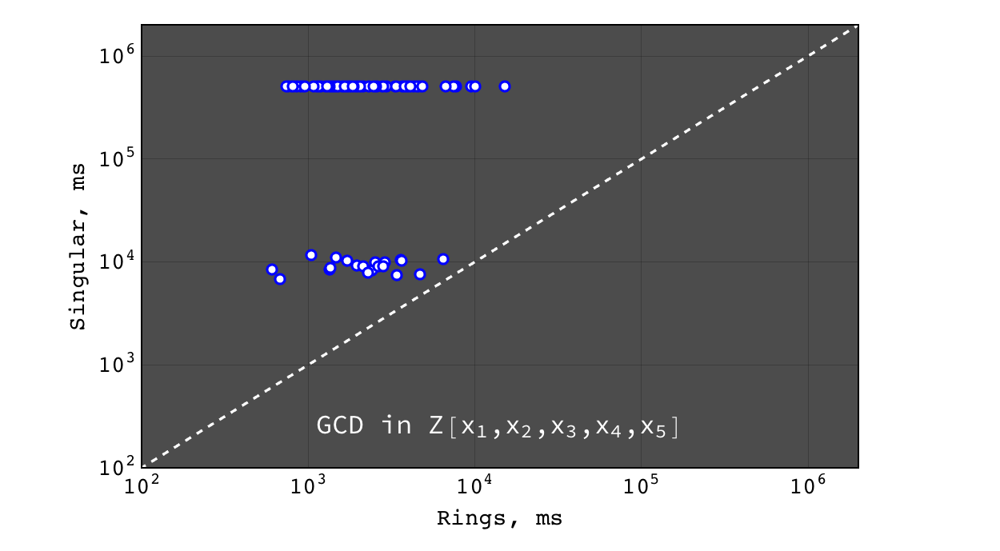
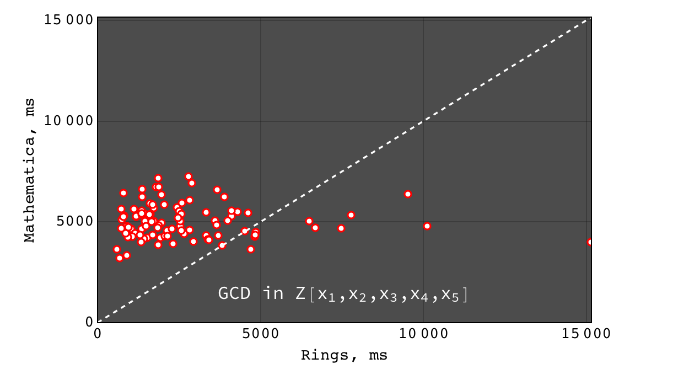
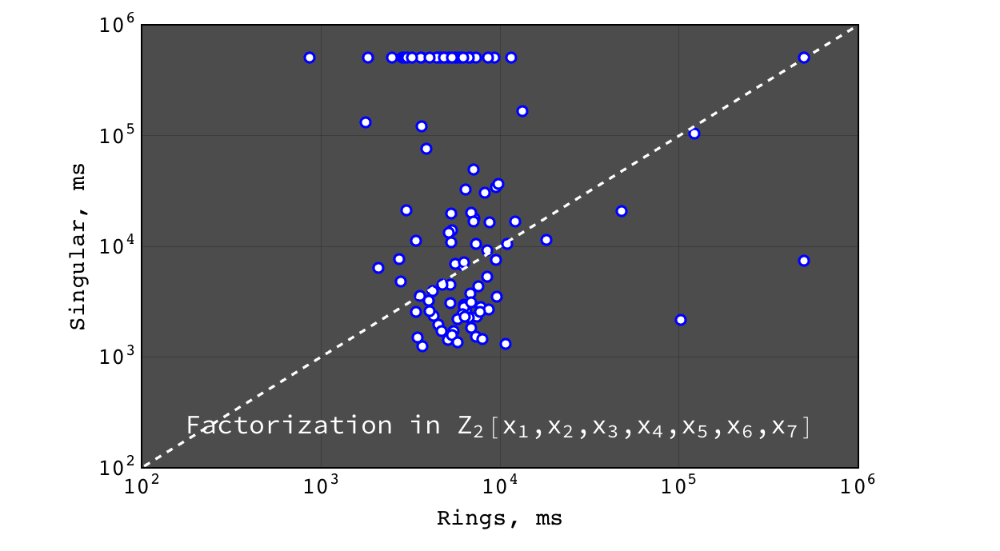
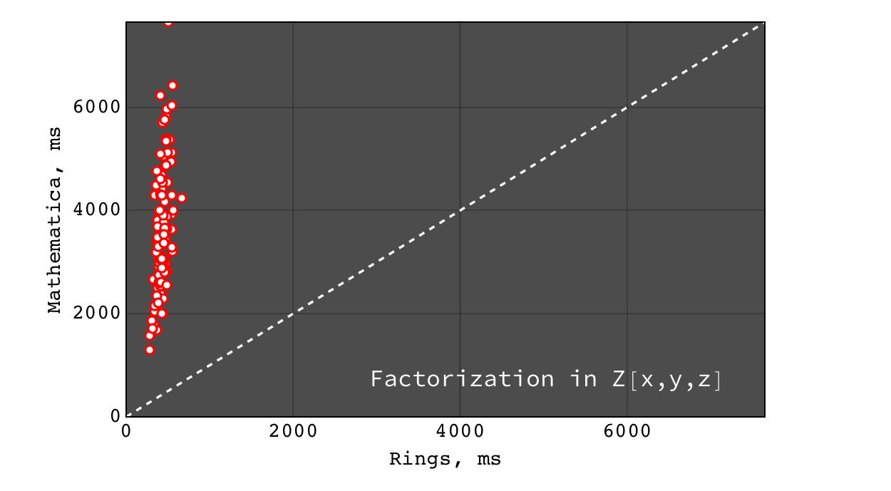
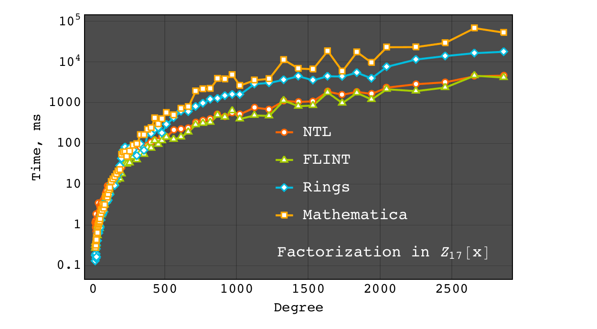

.. |br| raw:: html

    

.. |Groebner| raw:: html

   Gr&ouml;bner

.. _ref-quickstart:

==========
Quick Tour
==========

Set up
======

Interactive Rings shell
^^^^^^^^^^^^^^^^^^^^^^^

To taste what |Rings| can do, one can try interactive |Rings| session with `Ammonite REPL <http://ammonite.io>`_. One can install |Rings|\ *.repl* with Homebrew:

.. code-block:: bash

	$ brew install PoslavskySV/rings/rings.repl

or just by typing the following commands at the prompt:

.. code-block:: bash

	$ sudo curl -L -o /usr/local/bin/amm https://git.io/v5Tct && sudo chmod +x /usr/local/bin/amm
	$ sudo curl -L -o /usr/local/bin/rings.repl https://git.io/vd7EY && chmod +x /usr/local/bin/rings.repl

Now run |Rings|\ *.repl*:

.. code-block:: scala

	$ rings.repl
	Loading...
	Rings 2.3: efficient Java/Scala library for polynomial rings

	@ implicit val ring = MultivariateRing(Z, Array("x", "y", "z"))
	ring: MultivariateRing[IntZ] = MultivariateRing(Z, Array("x", "y", "z"), LEX)

	@ val poly1 = ring("x + y - z").pow(8) 
	poly1: MultivariatePolynomial[IntZ] = z^8-8*y*z^7+28*y^2*z^6-56*y^3*z^5+70*y^4*z^4-56...

	@ val poly2 = ring("x - y + z").pow(8) 
	poly1: MultivariatePolynomial[IntZ] = z^8-8*y*z^7+28*y^2*z^6-56*y^3*z^5+70*y^4*z^4-56...

	@ Factor(poly1 - poly2)
	res13: FactorDecomposition[MultivariatePolynomial[IntZ]] = 16*x*(-z+y)*(z^2-2*y*z+y^2+x^2)*(z^4-4*y*z^3+6*y^2*z^2-4*y^3*z+y^4+6*x^2*z^2-12*x^2*y*z+6*x^2*y^2+x^4)

Java/Scala library
^^^^^^^^^^^^^^^^^^

|Rings| is currently available for Java and Scala. To get started with Scala SBT, simply add the following dependence to your ``build.sbt`` file:

.. code-block:: scala

	libraryDependencies += "cc.redberry" %% "rings.scaladsl" % "2.3"

For using |Rings| solely in Java there is Maven artifact:

.. code-block:: xml

	<dependency>
	    <groupId>cc.redberry</groupId>
	    <artifactId>rings</artifactId>
	    <version>2.3</version>
	</dependency>

Examples: rings, ideals, |Groebner| bases, GCDs & factorization
===============================================================

Below examples can be evaluated directly in the |Rings|\ *.repl*. For Scala/Java the following preambula will import all required things from |Rings| library:

.. tabs::

   .. code-tab:: scala

   		import cc.redberry.rings

   		import rings.poly.PolynomialMethods._
		import rings.scaladsl._
		import syntax._

   .. code-tab:: java

		import cc.redberry.rings.*;
		import cc.redberry.rings.poly.*;
		import cc.redberry.rings.poly.univar.*;
		import cc.redberry.rings.poly.multivar.*;
		import cc.redberry.rings.bigint.BigInteger;

		import static cc.redberry.rings.poly.PolynomialMethods.*;
		import static cc.redberry.rings.Rings.*;

Some built-in rings
^^^^^^^^^^^^^^^^^^^

Polynomial rings over :math:`Z` and :math:`Q`:

.. tabs::

	.. code-tab:: scala

		// Ring Z[x]
		UnivariateRing(Z, "x")
		// Ring Z[x, y, z]
		MultivariateRing(Z, Array("x", "y", "z"))
		// Ring Q[a, b, c]
		MultivariateRing(Q, Array("a", "b", "c"))

 	.. code-tab:: java

		// Ring Z[x]
		UnivariateRing(Z);
		// Ring Z[x, y, z]
		MultivariateRing(3, Z);
		// Ring Q[x, y, z]
		MultivariateRing(3, Q);

Polynomial rings over :math:`Z_p`:

.. tabs::

	.. code-tab:: scala

		// Ring Z/3[x]
		UnivariateRingZp64(3, "x")
		// Ring Z/3[x, y, z]
		MultivariateRingZp64(3, Array("x", "y", "z"))
		// Ring Z/p[x, y, z] with p = 2^107 - 1 (Mersenne prime)
		MultivariateRing(Zp(Z(2).pow(107) - 1), Array("x", "y", "z"))

	.. code-tab:: java

		// Ring Z/3[x]
		UnivariateRingZp64(3);
		// Ring Z/3[x, y, z]
		MultivariateRingZp64(3, 3);
		// Ring Z/p[x, y, z] with p = 2^107 - 1 (Mersenne prime)
		MultivariateRing(3, Zp(BigInteger.ONE.shiftLeft(107).decrement()));

Galois fields:

.. tabs::

   .. code-tab:: scala

		// Galois field with cardinality 7^10 
		// (irreducible polynomial will be generated automatically)
		GF(7, 10, "x")
		// GF(7^3) generated by irreducible polynomial "1 + 3*z + z^2 + z^3"
		GF(UnivariateRingZp64(7, "z")("1 + 3*z + z^2 + z^3"), "z")

   .. code-tab:: java

		// Galois field with cardinality 7^10 
		// (irreducible polynomial will be generated automatically)
		GF(7, 10);
		// GF(7^3) generated by irreducible polynomial "1 + 3*z + z^2 + z^3"
		GF(UnivariatePolynomialZ64.create(1, 3, 1, 1).modulus(7));

Fields of rational functions:

.. tabs::

   .. code-tab:: scala

		// Field of fractions of univariate polynomials Z[x]
		Frac(UnivariateRing(Z, "x"))
		// Field of fractions of multivariate polynomials Z/19[x, y, z]
		Frac(MultivariateRingZp64(19, Array("x", "y", "z")))

   .. code-tab:: java

		// Field of fractions of univariate polynomials Z[a]
		Frac(UnivariateRing(Z));
		// Field of fractions of multivariate polynomials Z/19[a, b, c]
		Frac(MultivariateRingZp64(3, 19));

Univariate polynomials
^^^^^^^^^^^^^^^^^^^^^^

Some algebra in Galois field :math:`GF(17,9)`:

.. tabs::

   .. code-tab:: scala

   		// Galois field GF(17, 9) with irreducible 
   		// poly in Z/17[t] generated automaticaly
   		implicit val ring = GF(17, 9, "t")

   		// pick some random field element
   		val a = ring.randomElement()
   		// raise field element to the power of 1000
   		val b = a.pow(1000)
   		// reciprocal of field element
   		val c = 1 / b

   		assert ( b * c === 1)

   		// explicitly parse field element from string:
   		// input poly will be automatically converted to
   		// element of GF(17, 9) (reduced modulo field generator)
   		val d = ring("1 + t + t^2 + t^3 + 15 * t^999")
   		// do some arbitrary math ops in the field
		val some = a / (b + c) + a.pow(6) - a * b * c * d

   .. code-tab:: java

   		// Galois field GF(17, 9) with irreducible 
   		// poly in Z/17[t] generated automaticaly
   		FiniteField<UnivariatePolynomialZp64> ring = GF(17, 9);

		// pick some random field element
   		UnivariatePolynomialZp64 a = ring.randomElement();
		// raise field element to the power of 1000
   		UnivariatePolynomialZp64 b = ring.pow(a, 1000);
		// reciprocal of field element
   		UnivariatePolynomialZp64 c = ring.reciprocal(b);

		assert ring.multiply(b, c).isOne();

		// explicitly parse field element from string:
   		// input poly will be automatically converted to
   		// element of GF(17, 9) (reduced modulo field generator)
   		UnivariatePolynomialZp64 d = ring.parse("1 + x + x^2 + x^3 + 15*x^999");
		// do some arbitrary math ops in the field
		UnivariatePolynomialZp64 some = ring.add(
				ring.divideExact(a, ring.add(b, c)),
				ring.pow(a, 6),
				ring.negate(ring.multiply(a, b, c, d)));

----

Extended GCD in :math:`Z_{17}[x]`:

.. tabs::

   .. code-tab:: scala

   		// polynomial ring Z/17[x]
		implicit val ring = UnivariateRingZp64(17, "x")
		// parse ring element
		val x = ring("x")
		
		// construct some polynomials
		val poly1 = 1 + x + x.pow(2) + x.pow(3)
		val poly2 = 1 + 2 * x + 9 * x.pow(2)
		
		// compute (gcd, s, t) such that s * poly1 + t * poly2 = gcd
		val Array(gcd, s, t) = PolynomialExtendedGCD(poly1, poly2)
		assert (s * poly1 + t * poly2 == gcd)

		println((gcd, s, t))

   .. code-tab:: java

   		// construct polynomials in Z/17[x] given by arrays of coefficients 
		UnivariatePolynomialZp64
		        a = UnivariatePolynomialZ64.create(1, 1, 1, 1).modulus(17),
		        b = UnivariatePolynomialZ64.create(1, 2, 9).modulus(17);

		// compute xgcd array such that xgcd[1] * poly1 + xgcd[2] * poly2 = xgcd[0]
		UnivariatePolynomialZp64[] xgcd = PolynomialExtendedGCD(a, b);

		assert xgcd[0].equals(xgcd[1].clone().multiply(a).add(xgcd[2].clone().multiply(b)));
		System.out.println(Arrays.toString(xgcd));

----

Factor polynomial in :math:`Z_{17}[x]`:

.. tabs::

   .. code-tab:: scala

		// polynomial ring Z/17[x]
		implicit val ring = UnivariateRingZp64(17, "x")x

		// parse polynomial from string
		val poly = ring("4 + 8*x + 12*x^2 + 5*x^5 - x^6 + 10*x^7 + x^8")

		// factorize poly
		val factors = Factor(poly)
		println(factors)

   .. code-tab:: java

		// the modulus
		long modulus = 17;
		// parse univariate poly over Z/17 from string
		UnivariatePolynomialZp64 poly = UnivariatePolynomialZp64
		    .parse("4 + 8*x + 12*x^2 + 5*x^5 - x^6 + 10*x^7 + x^8", modulus);

		// factorize poly
		FactorDecomposition<UnivariatePolynomialZp64> factors = Factor(poly);
		System.out.println(factors);

Coefficient rings with arbitrary large characteristic are available:

.. tabs::

   .. code-tab:: scala

		// coefficient ring Z/1237940039285380274899124357 (the next prime to 2^100)
		val modulus = Z("1267650600228229401496703205653")
		val cfRing  = Zp(modulus)

		// ring Z/1237940039285380274899124357[x]
		implicit val ring = UnivariateRing(cfRing, "x")
		val poly = ring("4 + 8*x + 12*x^2 + 5*x^5 + 16*x^6 + 27*x^7 + 18*x^8")
		
		// factorize poly
		println(Factor(poly))

   .. code-tab:: java

		// coefficient ring Z/1237940039285380274899124357 (the next prime to 2^100)
		IntegersZp cfRing = Zp(new BigInteger("1267650600228229401496703205653"));

		UnivariatePolynomial<BigInteger> poly = UnivariatePolynomial
		    .parse("4 + 8*x + 12*x^2 + 5*x^5 - x^6 + 10*x^7 + x^8", cfRing);

		// factorize poly
		System.out.println(Factor(poly));

(large primes can be generated with ``BigPrimes.nextPrime`` method, see :ref:`ref-primes`).

----

Ring of univariate polynomials over elements of Galois field :math:`GF(7,3)[x]`:

.. tabs::

   .. code-tab:: scala

		// elements of coefficient field GF(7,3) are represented as polynomials
		// over "z" modulo irreducible polynomial "1 + 3*z + z^2 + z^3"
		val cfRing = GF(UnivariateRingZp64(7, "z")("1 + 3*z + z^2 + z^3"), "z")

		assert(cfRing.characteristic().intValue() == 7)
		assert(cfRing.cardinality().intValue() == 343)

		// polynomial ring GF(7^3)[x]
		implicit val ring = UnivariateRing(cfRing, "x")

		// parse poly in GF(7^3)[x] from string
		// coefficients of polynomials in GF(7,3)[x] are elements
		// of GF(7,3) that is polynomials over "z"
		val poly = ring("1 - (1 - z^3) * x^6 + (1 - 2*z) * x^33 + x^66")

		// factorize poly
		val factors = Factor(poly)
		println(s"${ring show factors}")

   .. code-tab:: java

		// elements of coefficient field GF(7,3) are represented as polynomials
		// over "z" modulo irreducible polynomial "1 + 3*z + z^2 + z^3"
		FiniteField<UnivariatePolynomialZp64> cfRing 
		        = GF(UnivariatePolynomialZ64.create(1, 3, 1, 1).modulus(7));
		assert cfRing.characteristic().intValue() == 7;
		assert cfRing.cardinality().intValue() == 343;

		// polynomial ring GF(7^3)[x]
		UnivariateRing<UnivariatePolynomial<UnivariatePolynomialZp64>>
		        ring = UnivariateRing(cfRing);

		// parse poly in GF(7^3)[x] from string
		// coefficients of polynomials in GF(7,3)[x] are elements
		// of GF(7,3) that is polynomials over "z"
		UnivariatePolynomial<UnivariatePolynomialZp64> 
		        poly = ring.parse("1 - (1 - z^3) * x^6 + (1 - 2*z) * x^33 + x^66");

		// factorize poly
		FactorDecomposition<UnivariatePolynomial<UnivariatePolynomialZp64>> factors = Factor(poly);
		System.out.println(factors);

Multivariate polynomials
^^^^^^^^^^^^^^^^^^^^^^^^

Some math with multivariate polynomials from :math:`Z[x, y, z]`:

.. tabs::

   .. code-tab:: scala

		// ring Z[x, y, z]
		implicit val ring = MultivariateRing(Z, Array("x", "y", "z")) 
		// parse some ring elements
		val (x, y, z) = ring("x", "y", "z") 

		// construct some polynomials using different math ops
		val a = (x + y + z).pow(2) - 1 
		val b = (x - y - z - 1).pow(2) + x + y + z - 1 
		val c = (a + b + 1).pow(9) - a - b - 1

		// reduce c modulo a and b (multivariate division with remainder)
		val (div1, div2, rem) = c /%/% (a, b)

   .. code-tab:: java

		// ring Z[x, y, z]
		MultivariateRing<MultivariatePolynomial<BigInteger>> ring = MultivariateRing(3, Z);
		// assign "x", "y" and "z" to variables
		MultivariatePolynomial<BigInteger>
		        x = ring.variable(0),
		        y = ring.variable(1),
		        z = ring.variable(2);

		// construct some polynomials
		MultivariatePolynomial<BigInteger> a = ring.decrement(ring.pow(ring.add(x, y, z), 2));
		MultivariatePolynomial<BigInteger> b = ring.add(
		        ring.pow(ring.add(x, ring.negate(y), ring.negate(z), ring.getNegativeOne()), 2),
		        x, y, z, ring.getNegativeOne());
		MultivariatePolynomial<BigInteger> c = ring.add(
		        ring.pow(ring.add(a, b, ring.getOne()), 9),
		        ring.negate(a), ring.negate(b), ring.getNegativeOne());

		// reduce c modulo a and b (multivariate division with remainder)
		MultivariatePolynomial<BigInteger>[] divRem = MultivariateDivision.divideAndRemainder(c, a, b);
		MultivariatePolynomial<BigInteger>
		        div1 = divRem[0],
		        div2 = divRem[1],
		        rem = divRem[2];

----

Multivariate GCD in :math:`Z[a, b, c]`:

.. tabs::

   .. code-tab:: scala

   		// ring Z[a, b, c]
		implicit val ring = MultivariateRing(Z, Array("a", "b", "c"))

		// parse polynomials from strings
		val poly1 = ring("-b-b*c-b^2+a+a*c+a^2")
		val poly2 = ring("b^2+b^2*c+b^3+a*b^2+a^2+a^2*c+a^2*b+a^3")

		// compute multivariate GCD
		val gcd   = PolynomialGCD(poly1, poly2)
		assert (poly1 % gcd === 0)
    	assert (poly2 % gcd === 0)
		println(gcd)

   .. code-tab:: java

   		String[] vars = {"a", "b", "c"};
		// parse polynomials from strings
		MultivariatePolynomial<BigInteger>
		        a = MultivariatePolynomial.parse("-b-b*c-b^2+a+a*c+a^2", Z, vars),
		        b = MultivariatePolynomial.parse("b^2+b^2*c+b^3+a*b^2+a^2+a^2*c+a^2*b+a^3",Z, vars);

		// compute multivariate GCD
		MultivariatePolynomial<BigInteger> gcd = PolynomialGCD(a, b);
		System.out.println(gcd);

----

Factor polynomial in :math:`Z_{2}[x, y, z]`:

.. tabs::

   .. code-tab:: scala

   		// ring Z/2[x, y, z]
		implicit val ring = MultivariateRingZp64(2, Array("x", "y", "z"))
		val (x, y, z) = ring("x", "y", "z")
		
		// factorize poly
		val factors = Factor(1 + (1 + x + y + z).pow(2) + (x + y + z).pow(4))
		println(factors)

   .. code-tab:: java

		// coefficient ring Z/2
		IntegersZp64 cfRing = new IntegersZp64(2);
		MultivariatePolynomialZp64
		        // create unit multivariate polynomial over
		        // 3 variables over Z/2 using LEX ordering
		        one = MultivariatePolynomialZp64.one(3, cfRing, MonomialOrder.LEX),
		        // create "x" polynomial
		        x = one.createMonomial(0, 1),
		        // create "y" polynomial
		        y = one.createMonomial(1, 1),
		        // create "z" polynomial
		        z = one.createMonomial(2, 1);

		// (1 + x + y + z)^2
		MultivariatePolynomialZp64 poly1 = one.copy().add(x, y, z);
		poly1 = polyPow(poly1, 2);

		// (x + y + z)^4
		MultivariatePolynomialZp64 poly2 = x.copy().add(y, z);
		poly2 = polyPow(poly2, 4);

		// 1 + (1 + x + y + z)^2 + (x + y + z)^4
		MultivariatePolynomialZp64 poly = one.copy().add(poly1, poly2);

		// factorize poly
		FactorDecomposition<MultivariatePolynomialZp64> factors = Factor(poly);
		System.out.println(factors);

----

Factor polynomial in :math:`Z[a, b, c]`:

.. tabs::

   .. code-tab:: scala

   		// ring Z[a, b, c]
		implicit val ring = MultivariateRing(Z, Array("a", "b", "c"))
		val (a, b, c) = ring("a", "b", "c")
		
		// factorize poly
		val factors = Factor(1 - (1 + a + b + c).pow(2) - (2 + a + b + c).pow(3))
		println(ring show factors)

   .. code-tab:: java

		MultivariatePolynomial<BigInteger>
		        // create unit multivariate polynomial over
		        // 3 variables over Z using LEX ordering
		        one = MultivariatePolynomial.one(3, Rings.Z, MonomialOrder.LEX),
		        // create "a" polynomial
		        a = one.createMonomial(0, 1),
		        // create "b" polynomial
		        b = one.createMonomial(1, 1),
		        // create "c" polynomial
		        c = one.createMonomial(2, 1);

		// (1 + a + b + c)^2
		MultivariatePolynomial<BigInteger> poly1 = one.copy().add(a, b, c);
		poly1 = polyPow(poly1, 2);

		// (2 + a + b + c)**3
		MultivariatePolynomial<BigInteger> poly2 = one.copy().multiply(2).add(a, b, c);
		poly2 = polyPow(poly2, 3);

		// 1 - (1 + a + b + c)^2 - (2 + a + b + c)**3
		MultivariatePolynomial<BigInteger> poly = one.copy().subtract(poly1, poly2);
		
		// factorize poly
		FactorDecomposition<MultivariatePolynomial<BigInteger>> factors = Factor(poly);
		System.out.println(factors);

----

Factor polynomial in :math:`Q[x, y, z]`:

.. tabs::

   .. code-tab:: scala

   		// ring Q[x, y, z]
		implicit val ring = MultivariateRing(Q, Array("x", "y", "z"))

		// parse some poly from string
		val poly = ring(
		  """
		    |(1/6)*y*z + (1/6)*y^3*z^2 - (1/2)*y^6*z^5 - (1/2)*y^8*z^6
		    |-(1/3)*x*z - (1/3)*x*y^2*z^2 + x*y^5*z^5 + x*y^7*z^6
		    |+(1/9)*x^2*y^2*z - (1/3)*x^2*y^7*z^5 - (2/9)*x^3*y*z
		    |+(2/3)*x^3*y^6*z^5 - (1/2)*x^6*y - (1/2)*x^6*y^3*z
		    |+x^7 + x^7*y^2*z - (1/3)*x^8*y^2 + (2/3)*x^9*y
		  """.stripMargin)

		// factorize poly
		val factors = Factor(poly)
		println(factors)

   .. code-tab:: java

		// parse some poly from string
		MultivariatePolynomial<Rational<BigInteger>>
				poly = MultivariatePolynomial.parse(
					"(1/6)*y*z + (1/6)*y^3*z^2 - (1/2)*y^6*z^5 - (1/2)*y^8*z^6" +
			        "-(1/3)*x*z - (1/3)*x*y^2*z^2 + x*y^5*z^5 + x*y^7*z^6" +
			        "+(1/9)*x^2*y^2*z - (1/3)*x^2*y^7*z^5 - (2/9)*x^3*y*z" +
			        "+(2/3)*x^3*y^6*z^5 - (1/2)*x^6*y - (1/2)*x^6*y^3*z" +
			        "+x^7 + x^7*y^2*z - (1/3)*x^8*y^2 + (2/3)*x^9*y"
				, Q);

		// factorize poly
		System.out.println(Factor(poly));

----

Ring of multivariate polynomials over elements of Galois field :math:`GF(7,3)[x, y, z]`:

.. tabs::

   .. code-tab:: scala

		// elements of GF(7,3) are represented as polynomials
		// over "z" modulo irreducible polynomial "1 + 3*z + z^2 + z^3"
		val cfRing = GF(UnivariateRingZp64(7, "z")("1 + 3*z + z^2 + z^3"), "z")
		// ring GF(7,3)[a,b,c]
		implicit val ring = MultivariateRing(cfRing, Array("a", "b", "c"))

		// parse poly in GF(7^3)[a,b,c] from string
		// coefficients of polynomials in GF(7,3)[a,b,c] are elements
		// of GF(7,3) that is polynomials over "z"
		val poly = ring("1 - (1 - z^3) * a^6*b + (1 - 2*z) * c^33 + a^66")

		//factorize poly
		println(Factor(poly))

   .. code-tab:: java

		// elements of GF(7,3) are represented as polynomials
		// over "z" modulo irreducible polynomial "1 + 3*z + z^2 + z^3"
		FiniteField<UnivariatePolynomialZp64> cfRing
		        = GF(UnivariatePolynomialZ64.create(1, 3, 1, 1).modulus(7));
		assert cfRing.characteristic().intValue() == 7;
		assert cfRing.cardinality().intValue() == 343;

		// ring GF(7,3)[a, b, c]
		MultivariateRing<MultivariatePolynomial<UnivariatePolynomialZp64>>
		        ring = MultivariateRing(3, cfRing);

		// parse poly in GF(7^3)[a,b,c] from string
		// coefficients of polynomials in GF(7,3)[a,b,c] are elements
		// of GF(7,3) that is polynomials over "z"
		MultivariatePolynomial<UnivariatePolynomialZp64>
		        poly = ring.parse("1 - (1 - z^3) * a^6*b + (1 - 2*z) * c^33 + a^66");

		//factorize poly
		System.out.println(Factor(poly));

Rational function arithmetic
^^^^^^^^^^^^^^^^^^^^^^^^^^^^

Define a field of rational functions :math:`Frac(Z[x,y,z])` and input some functions:

.. tabs::

    .. code-tab:: scala

        // Frac(Z[x,y,z])
        implicit val field = Frac(MultivariateRing(Z, Array("x", "y", "z")))

        // parse some math expression from string
        // it will be automatically reduced to a common denominator
        // with the gcd being automatically cancelled
        val expr1 = field("(x/y/(x - z) + (x + z)/(y - z))^2 - 1")

        // do some math ops programmatically
        val (x, y, z) = field("x", "y", "z")
        val expr2 = expr1.pow(2) + x / y - z

    .. code-tab:: java

        MultivariateRing<MultivariatePolynomial<BigInteger>> ring = MultivariateRing(3, Z);
        Rationals<MultivariatePolynomial<BigInteger>> field = Frac(ring);

        // Parser/stringifier of rational functions
        Coder<Rational<MultivariatePolynomial<BigInteger>>, ?, ?> coder
             = Coder.mkRationalsCoder(
                    field,
                    Coder.mkMultivariateCoder(ring, "x", "y", "z"));

        // parse some math expression from string
        // it will be automatically reduced to a common denominator
        // with the gcd being automatically cancelled
        Rational<MultivariatePolynomial<BigInteger>> expr1 = coder.parse("(x/y/(x - z) + (x + z)/(y - z))^2 - 1");

        // do some math ops programmatically
        Rational<MultivariatePolynomial<BigInteger>>
        x = new Rational<>(ring, ring.variable(0)),
        y = new Rational<>(ring, ring.variable(1)),
        z = new Rational<>(ring, ring.variable(2));

        Rational<MultivariatePolynomial<BigInteger>> expr2 = field.add(
                field.pow(expr1, 2),
                field.divideExact(x, y),
                field.negate(z));

Greatest common divisors of numerators and denominators are always cancelled automatically. 

Use ``Coder`` to parse more complicated expressions:

.. tabs::

    .. code-tab:: scala

        // bind expr1 and expr2 to variables to use them further in parser
        field.coder.bind("expr1", expr1)
        field.coder.bind("expr2", expr2)

        // parse some complicated expression from string
        // it will be automatically reduced to a common denominator
        // with the gcd being automatically cancelled
        val expr3 = field(
          """
             expr1 / expr2 - (x*y - z)/(x-y)/expr1
             + x / expr2 - (x*z - y)/(x-y)/expr1/expr2
             + x^2*y^2 - z^3 * (x - y)^2
          """)

        // export expression to string
        println(field.stringify(expr3))

        // take numerator and denominator
        val num = expr3.numerator()
        val den = expr3.denominator()
        // common GCD is always cancelled automatically
        assert( field.ring.gcd(num, den).isOne )

    .. code-tab:: java

        // bind expr1 and expr2 to variables to use them further in parser
        coder.bind("expr1", expr1);
        coder.bind("expr2", expr2);

        // parse some complicated expression from string
        // it will be automatically reduced to a common denominator
        // with the gcd being automatically cancelled
        Rational<MultivariatePolynomial<BigInteger>> expr3 = coder.parse(
                  " expr1 / expr2 - (x*y - z)/(x-y)/expr1"
                + " + x / expr2 - (x*z - y)/(x-y)/expr1/expr2"
                + "+ x^2*y^2 - z^3 * (x - y)^2");

        // export expression to string
        System.out.println(coder.stringify(expr3));

        // take numerator and denominator
        MultivariatePolynomial<BigInteger> num = expr3.numerator();
        MultivariatePolynomial<BigInteger> den = expr3.denominator();

        // common GCD is always cancelled automatically
        assert field.ring.gcd(num, den).isOne();

Compute unique factor decomposition of rational function:

.. tabs::

    .. code-tab:: scala

		// compute unique factor decomposition of expression
		val factors = field.factor(expr3)
		println(field.stringify(factors))

    .. code-tab:: java

		// compute unique factor decomposition of expression
		FactorDecomposition<Rational<MultivariatePolynomial<BigInteger>>> factors = field.factor(expr3);
		System.out.println(factors.toString(coder));

Ideals and |Groebner| bases
^^^^^^^^^^^^^^^^^^^^^^^^^^^

Construct some ideal and check its properties:

.. tabs::

    .. code-tab:: scala

    	// ring Z/17[x,y,z]
        implicit val ring = MultivariateRingZp64(17, Array("x", "y", "z"))
        val (x, y, z) = ring("x", "y", "z")

        // create ideal with two generators using GREVLEX monomial order for underlying Groebner basis
        val I = Ideal(ring, Seq(x.pow(2) + y.pow(12) - z, x.pow(2) * z + y.pow(2) - 1), GREVLEX)
        // I is proper ideal
        assert(I.isProper)

        // get computed Groebner basis
        val gb = I.groebnerBasis
        println(gb)

        // check some ideal properties
        assert(I.dimension == 1)
        assert(I.degree == 36)

    .. code-tab:: java

        MultivariateRing<MultivariatePolynomialZp64> ring = MultivariateRingZp64(3, 17);

        // create ideal with two generators using GREVLEX monomial order for underlying Groebner basis
        Ideal<MonomialZp64, MultivariatePolynomialZp64> I = Ideal.create(Arrays.asList(
            ring.parse("x^2 + y^12 - z"),
            ring.parse("x^2 * z + y^2 - 1")), GREVLEX);
        // I is proper ideal
        assert I.isProper();

        // get computed Groebner basis
        List<MultivariatePolynomialZp64> gb = I.getGroebnerBasis();
        System.out.println(gb);

        // check some ideal properties
        assert I.dimension() == 1;
        assert I.degree() == 36;

Unions, intersections and quotients of ideals:

.. tabs::

    .. code-tab:: scala

        // create another ideal with only one generator
        val J = Ideal(ring, Seq(x.pow(4) * y.pow(4) + 1), GREVLEX)
        // J is principal ideal
        assert(J.isPrincipal)
        

        val union = I union J
        // union is zero dimensional ideal
        assert(union.dimension == 0)
        

        val intersection = I intersection J
        // intersection is still 2-dimensional
        assert(intersection.dimension == 2)
        

        // yet another ideal
        val K = Ideal(ring, Seq(z * x.pow(4) - z * y.pow(14) + y * z.pow(16), (x + y + z).pow(4)), GREVLEX)
        // compute complicated quotient ideal
        val quot = (I * J * K) :/ times
        assert(quot == K) 

    .. code-tab:: java

        // create another ideal with only one generator
        Ideal<MonomialZp64, MultivariatePolynomialZp64> J = Ideal.create(Arrays.asList(
            ring.parse("x^4 * y^4 + 1")), GREVLEX);
        // J is principal ideal
        assert J.isPrincipal();
        

        Ideal<MonomialZp64, MultivariatePolynomialZp64> union = I.union(J);
        // union is zero dimensional ideal
        assert union.dimension() == 0;
        

        Ideal<MonomialZp64, MultivariatePolynomialZp64> intersection = I.intersection(J);
        // intersection is still 2-dimensional
        assert intersection.dimension() == 2;
        

        // yet another ideal
        Ideal<MonomialZp64, MultivariatePolynomialZp64> K = Ideal.create(Arrays.asList(
            ring.parse("z * x^4 - z * y^14 + y * z^16"),
            ring.pow(ring.parse("x + y + z"), 4)), GREVLEX);
        // compute complicated quotient ideal
        Ideal<MonomialZp64, MultivariatePolynomialZp64> quot = (I.multiply(J).multiply(K)).quotient(times);
        assert quot.equals(K);

----

Construct lexicographic |Groebner| basis to solve a system of equations:

.. tabs::

    .. code-tab:: scala

		// ring Q[a, b, c]
		implicit val ring = MultivariateRing(Q, Array("x", "y", "z"))

		// parse some polynomials from strings
		val a = ring("8*x^2*y^2 + 5*x*y^3 + 3*x^3*z + x^2*y*z")
		val b = ring("x^5 + 2*y^3*z^2 + 13*y^2*z^3 + 5*y*z^4")
		val c = ring("8*x^3 + 12*y^3 + x*z^2 + 3")
		val d = ring("7*x^2*y^4 + 18*x*y^3*z^2 + y^3*z^3")

		// construct ideal with Groebner basis in LEX order
		val ideal = Ideal(ring, Seq(a, b, c, d), LEX)
		// it is very simple: <z^2, x, 1+4*y^3>
		println(ideal)

    .. code-tab:: java

		String[] vars = {"x", "y", "z"};
		// parse some polynomials from strings
		MultivariatePolynomial<BigInteger>
		    a = parse("8*x^2*y^2 + 5*x*y^3 + 3*x^3*z + x^2*y*z", Z, vars),
		    b = parse("x^5 + 2*y^3*z^2 + 13*y^2*z^3 + 5*y*z^4", Z, vars),
		    c = parse("8*x^3 + 12*y^3 + x*z^2 + 3", Z, vars),
		    d = parse("7*x^2*y^4 + 18*x*y^3*z^2 + y^3*z^3", Z, vars);
		List<MultivariatePolynomial<BigInteger>> gens = Arrays.asList(a, b, c, d);

		// construct ideal with Groebner basis in LEX order
		Ideal<Monomial<BigInteger>, MultivariatePolynomial<BigInteger>> gb = Ideal.create(gens, LEX);
		// Groebner bases is very simple: <x, z^2, 1 + 4*y^3>
		System.out.println(gb);

Programming
^^^^^^^^^^^

Implement generic function for solving linear Diophantine equations:

.. tabs::

   .. code-tab:: scala

	/**
	  * Solves equation \sum f_i s_i  = gcd(f_1, \dots, f_N) for given f_i and unknown s_i
	  * @return a tuple (gcd, solution)
	  */
	def solveDiophantine[E](fi: Seq[E])(implicit ring: Ring[E]) =
	  fi.foldLeft((ring(0), Seq.empty[E])) { case ((gcd, seq), f) =>
	    val xgcd = ring.extendedGCD(gcd, f)
	    (xgcd(0), seq.map(_ * xgcd(1)) :+ xgcd(2))
	  }

Implement generic function for computing partial fraction decomposition:

.. tabs::

   .. code-tab:: scala

	/** Computes partial fraction decomposition of given rational */
	def apart[E](frac: Rational[E]) = {
	  implicit val ring: Ring[E] = frac.ring
	  val factors = ring.factor(frac.denominator).map {case (f, exp) => f.pow(exp)}
	  val (gcd,  nums) = solveDiophantine(factors.map(frac.denominator / _))
	  val (ints, rats) = (nums zip factors)
	    .map { case (num, den) => Rational(frac.numerator * num, den * gcd) }
	    .flatMap(_.normal)       // extract integral parts from fractions
	    .partition(_.isIntegral) // separate integrals and fractions
	  rats :+ ints.foldLeft(Rational(ring(0)))(_ + _)
	}

Apply that function to elements of different rings:

.. tabs::

   .. code-tab:: scala

	// partial fraction decomposition for rationals
	// gives List(184/479, (-10)/13, 1/8, (-10)/47, 1)
	val qFracs = apart( Q("1234213 / 2341352"))

	// partial fraction decomposition for rational functions
	val ufRing = Frac(UnivariateRingZp64(17, "x"))
	// gives List(4/(16+x), 1/(10+x), 15/(1+x), (14*x)/(15+7*x+x^2))
	val pFracs = apart( ufRing("1 / (3 - 3*x^2 - x^3 + x^5)") )

----

Implement Lagrange method for univariate interpolation:

.. math::
	
	p(x) = \sum_i p(x_i) \Pi_{j \ne i} \frac{x_{\phantom{i}} - x_j}{x_i -x_j}

.. tabs::

   .. code-tab:: scala

	/** Lagrange polynomial interpolation formula */
	def interpolate[Poly <: IUnivariatePolynomial[Poly], Coef]
	    (points: Seq[(Coef, Coef)])
	    (implicit ring: IUnivariateRing[Poly, Coef]) = {
	      // implicit coefficient ring (setups algebraic operators on type Coef)
	      implicit val cfRing: Ring[Coef] = ring.cfRing
	      if (!cfRing.isField) throw new IllegalArgumentException
	      points.indices
	        .foldLeft(ring(0)) { case (sum, i) =>
	          sum + points.indices
	            .filter(_ != i)
	            .foldLeft(ring(points(i)._2)) { case (product, j) =>
	              product * (ring.`x` - points(j)._1) / (points(i)._1 - points(j)._1)
	            }
	        }
	    }

Interpolate polynomial from :math:`Frac(Z_{13}[a,b,c])[x]`:

.. tabs::

   .. code-tab:: scala

	// coefficient ring Frac(Z/13[a,b,c])
    val cfRing = Frac(MultivariateRingZp64(2, Array("a", "b", "c")))
    val (a, b, c) = cfRing("a", "b", "c")

    implicit val ring = UnivariateRing(cfRing, "x")
    // interpolate with Lagrange formula
    val data = Seq(a -> b, b -> c, c -> a)
    val poly = interpolate(data)
    assert(data.forall { case (p, v) => poly.eval(p) == v })

.. _ref-some-benchamrks:

Highlighted benchmarks
======================

Full benchmarks can be found at :ref:`ref-benchmarks` page. Benchmarks presented below were executed on MacBook Pro (15-inch, 2017), 3,1 GHz Intel Core i7, 16 GB 2133 MHz LPDDR3. The complete source code of benchmarks can be found at `GitHub <https://github.com/PoslavskySV/rings/tree/develop/rings.benchmarks>`_. The following software were used:

 - `Mathematica <http://www.wolfram.com/mathematica>`_ (version 11.1.1.0)
 - `Singular <https://www.singular.uni-kl.de>`_ (version 4.1.0)
 - `NTL <http://www.shoup.net/ntl/>`_ (version 10.4.0)
 - `FLINT <http://www.flintlib.org>`_ (version 2.5.2_1)

   ..

   |Rings| vs |Singular| performance of :math:`gcd(a g, b g)` for random polynomials :math:`(a, b, g) \in Z[x_1,x_2,x_3,x_4,x_5]` each with 40 terms and degree 20 in each variable

   
   ..

   |Rings| vs |Mathematica| performance of :math:`gcd(a g, b g)` for random polynomials :math:`(a, b, g) \in Z[x_1,x_2,x_3,x_4,x_5]` each with 40 terms and degree 20 in each variable

   ..

   |Rings| vs |Singular| performance of :math:`factor(a b c)` for random polynomials :math:`(a, b, c) \in Z_2[x_1,x_2,x_3,x_4,x_5,x_6,x_7]` each with 20 terms and degree 10 in each variable

   ..

   |Rings| vs |Mathematica| performance of :math:`factor(a b c)` for random polynomials :math:`(a, b, c) \in Z[x,y,z]` each with 20 terms and degree 10 in each variable

   ..

   Univariate factorization performance on polynomials of the form :math:`(1 + \sum_{i = 1}^{i \leq deg} i \times x^i)` in :math:`Z_{17}[x]`. At small degrees the performance is identical, while at large degrees |NTL| and |FLINT| have much better asymptotic (probably due to more advanced algorithms for polynomial multiplication).
